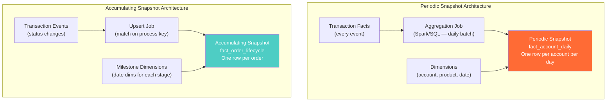
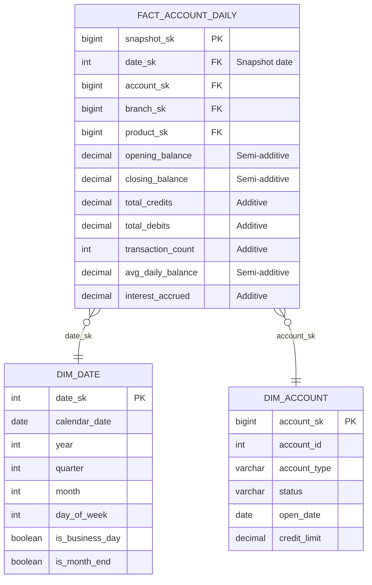
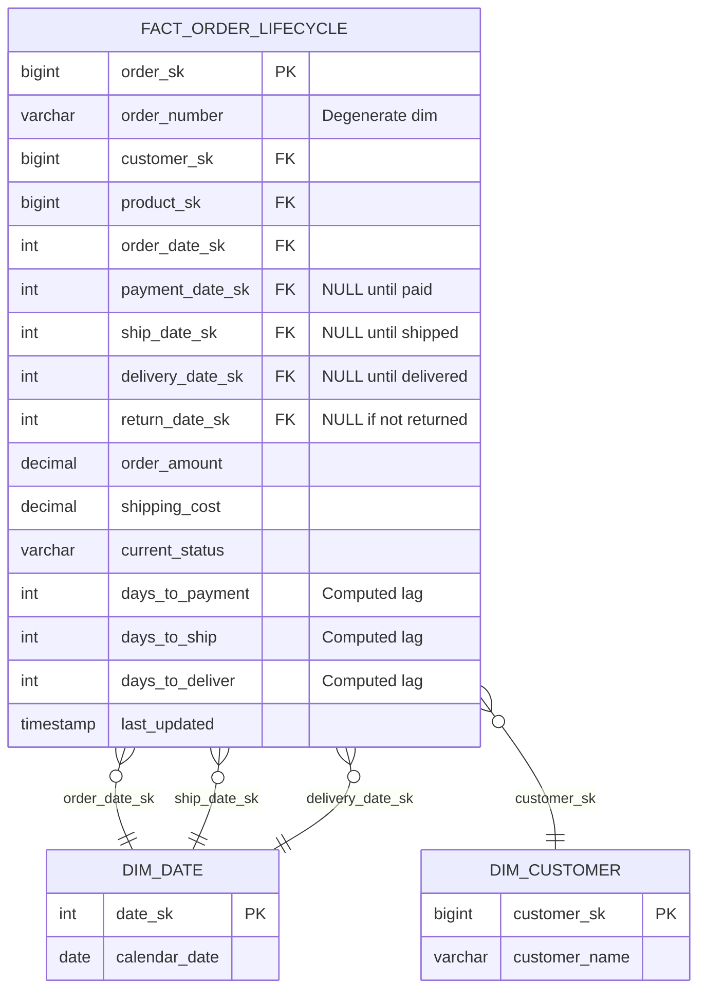
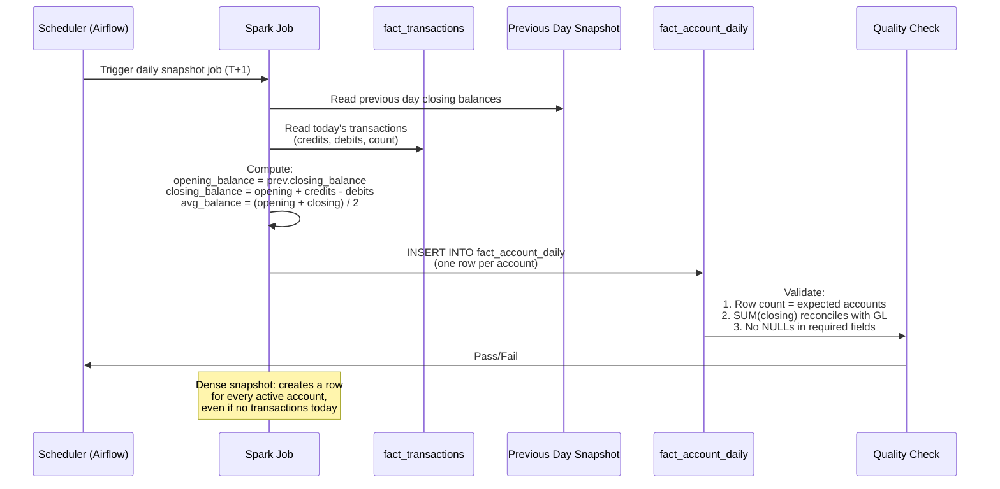
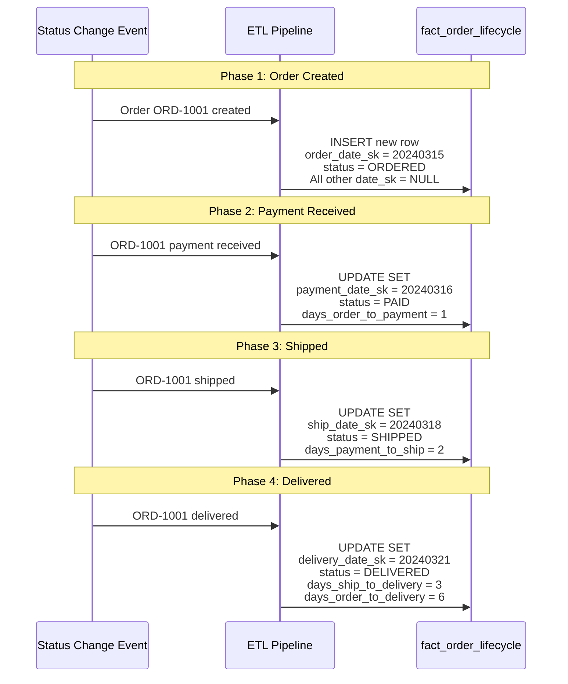
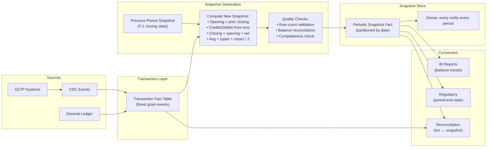
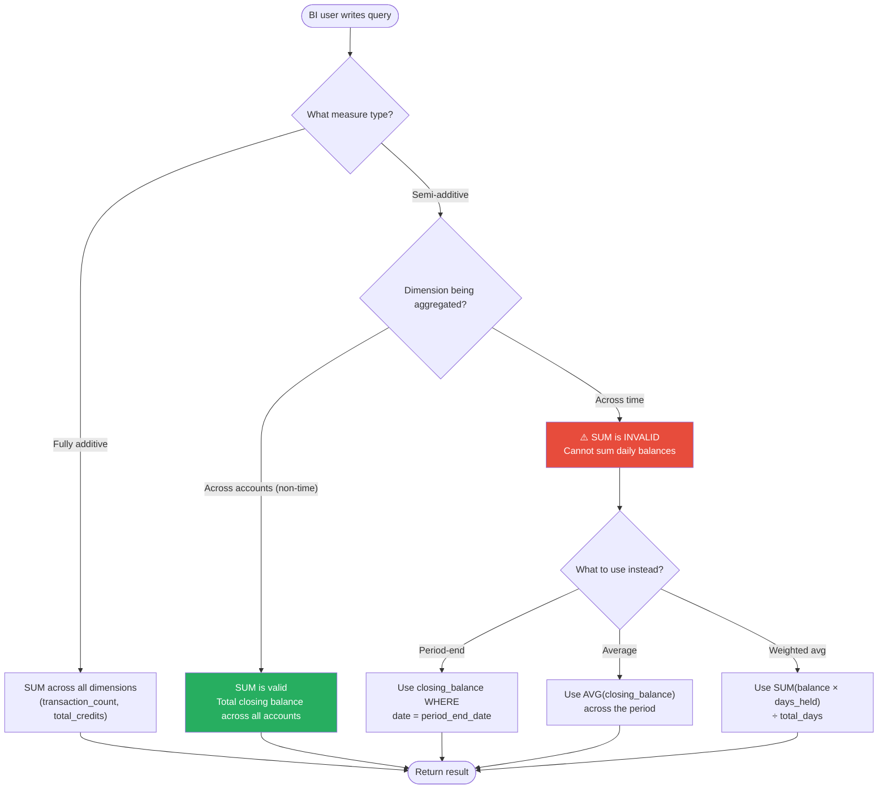

# Snapshot Fact Tables — How It Works (Deep Internals)

> HLD, ER diagrams, DDL table structures, sequence diagrams, and data flow.

---

## High-Level Design — Periodic vs Accumulating Snapshots



---

## ER Diagram — Periodic Snapshot: Daily Account Balance



## ER Diagram — Accumulating Snapshot: Order Lifecycle



---

## Table Structures

### Periodic Snapshot — Daily Account Balance

```sql
-- ============================================================
-- Periodic snapshot: one row per account per day
-- Semi-additive measures: can SUM across accounts, NOT across days
-- ============================================================

CREATE TABLE fact_account_daily (
    snapshot_sk         BIGINT GENERATED ALWAYS AS IDENTITY PRIMARY KEY,
    
    -- Grain: account + date
    date_sk             INT            NOT NULL REFERENCES dim_date(date_sk),
    account_sk          BIGINT         NOT NULL REFERENCES dim_account(account_sk),
    
    -- Dimension FKs
    branch_sk           BIGINT         REFERENCES dim_branch(branch_sk),
    product_sk          BIGINT         REFERENCES dim_product(product_sk),
    
    -- Semi-additive measures (DO NOT SUM across time)
    opening_balance     DECIMAL(18,2)  NOT NULL,
    closing_balance     DECIMAL(18,2)  NOT NULL,
    avg_daily_balance   DECIMAL(18,2),
    
    -- Fully additive measures (CAN SUM across time and other dims)
    total_credits       DECIMAL(18,2)  DEFAULT 0,
    total_debits        DECIMAL(18,2)  DEFAULT 0,
    transaction_count   INT            DEFAULT 0,
    interest_accrued    DECIMAL(12,4)  DEFAULT 0,
    
    -- Metadata
    snapshot_date       DATE           NOT NULL,
    loaded_at           TIMESTAMP      DEFAULT CURRENT_TIMESTAMP,
    
    -- Uniqueness constraint on grain
    CONSTRAINT uq_account_daily UNIQUE (date_sk, account_sk)
    
) PARTITION BY RANGE (snapshot_date);

-- Create monthly partitions
CREATE TABLE fact_account_daily_2024_01 PARTITION OF fact_account_daily
    FOR VALUES FROM ('2024-01-01') TO ('2024-02-01');
CREATE TABLE fact_account_daily_2024_02 PARTITION OF fact_account_daily
    FOR VALUES FROM ('2024-02-01') TO ('2024-03-01');
-- ... repeat per month

-- Indexes
CREATE INDEX idx_fad_account ON fact_account_daily(account_sk, snapshot_date);
CREATE INDEX idx_fad_date ON fact_account_daily(date_sk);
```

### Accumulating Snapshot — Order Lifecycle

```sql
-- ============================================================
-- Accumulating snapshot: one row per order, updated at each milestone
-- Multiple date FKs, lag measures computed on each update
-- ============================================================

CREATE TABLE fact_order_lifecycle (
    order_sk            BIGINT GENERATED ALWAYS AS IDENTITY PRIMARY KEY,
    
    -- Process instance key
    order_number        VARCHAR(30)    NOT NULL UNIQUE,  -- degenerate dim
    
    -- Entity dimensions
    customer_sk         BIGINT         NOT NULL REFERENCES dim_customer(customer_sk),
    product_sk          BIGINT         NOT NULL REFERENCES dim_product(product_sk),
    channel_sk          BIGINT         REFERENCES dim_channel(channel_sk),
    
    -- Milestone date dimensions (NULL until milestone is reached)
    order_date_sk       INT            NOT NULL REFERENCES dim_date(date_sk),
    payment_date_sk     INT            REFERENCES dim_date(date_sk),
    pick_date_sk        INT            REFERENCES dim_date(date_sk),
    ship_date_sk        INT            REFERENCES dim_date(date_sk),
    delivery_date_sk    INT            REFERENCES dim_date(date_sk),
    return_date_sk      INT            REFERENCES dim_date(date_sk),
    
    -- Measures
    order_amount        DECIMAL(12,2)  NOT NULL,
    shipping_cost       DECIMAL(10,2)  DEFAULT 0,
    discount_amount     DECIMAL(10,2)  DEFAULT 0,
    return_amount       DECIMAL(12,2)  DEFAULT 0,
    
    -- Status
    current_status      VARCHAR(20)    NOT NULL,  -- ORDERED, PAID, PICKED, SHIPPED, DELIVERED, RETURNED
    
    -- Computed lags (days between milestones)
    days_order_to_payment   INT,
    days_payment_to_ship    INT,
    days_ship_to_delivery   INT,
    days_order_to_delivery  INT,
    
    -- Metadata
    last_updated        TIMESTAMP      DEFAULT CURRENT_TIMESTAMP
);

CREATE INDEX idx_fol_status ON fact_order_lifecycle(current_status);
CREATE INDEX idx_fol_order_date ON fact_order_lifecycle(order_date_sk);
```

---

## Sequence Diagram — Periodic Snapshot Generation



---

## Sequence Diagram — Accumulating Snapshot Update



---

## Data Flow Diagram — Snapshot Pipeline



---

## Activity Diagram — Semi-Additive Measure Handling


