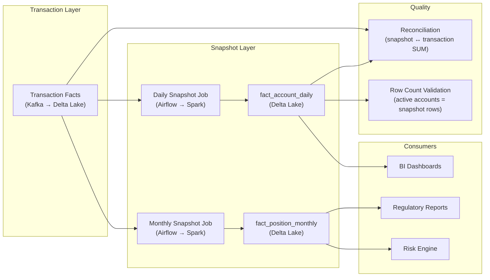

# Snapshot Fact Tables — Hands-On Examples

> Production-grade SQL, PySpark, and configuration examples for snapshot fact tables.

---

## Table Structures — Physical DDL

### Periodic Snapshot — Monthly Portfolio Positions

```sql
-- ============================================================
-- Monthly portfolio position snapshot
-- Grid: account × instrument × month-end date
-- Semi-additive: position values, NOT to be summed across months
-- ============================================================

CREATE TABLE fact_position_monthly (
    position_snap_sk    BIGINT GENERATED ALWAYS AS IDENTITY PRIMARY KEY,
    
    -- Grain: account + instrument + month-end
    snapshot_date_sk    INT            NOT NULL REFERENCES dim_date(date_sk),
    account_sk          BIGINT         NOT NULL REFERENCES dim_account(account_sk),
    instrument_sk       BIGINT         NOT NULL REFERENCES dim_instrument(instrument_sk),
    
    -- Dimension FKs
    portfolio_sk        BIGINT         REFERENCES dim_portfolio(portfolio_sk),
    currency_sk         INT            REFERENCES dim_currency(currency_sk),
    
    -- Semi-additive position measures
    quantity            DECIMAL(18,4)  NOT NULL,
    avg_cost_basis      DECIMAL(18,6),
    market_price        DECIMAL(18,6),
    market_value        DECIMAL(20,2),
    unrealized_pnl      DECIMAL(20,2),
    
    -- Additive measures (can sum across time periods)
    realized_pnl_mtd    DECIMAL(20,2)  DEFAULT 0,
    dividends_mtd       DECIMAL(18,2)  DEFAULT 0,
    fees_mtd            DECIMAL(18,2)  DEFAULT 0,
    
    -- Metadata
    snapshot_date       DATE           NOT NULL,
    loaded_at           TIMESTAMP      DEFAULT CURRENT_TIMESTAMP,
    
    CONSTRAINT uq_position_monthly 
        UNIQUE (snapshot_date_sk, account_sk, instrument_sk)
        
) PARTITION BY RANGE (snapshot_date);

-- Monthly partitions
CREATE TABLE fact_position_monthly_2024_03 PARTITION OF fact_position_monthly
    FOR VALUES FROM ('2024-03-01') TO ('2024-04-01');

-- Indexes
CREATE INDEX idx_fpm_account ON fact_position_monthly(account_sk, snapshot_date);
CREATE INDEX idx_fpm_instrument ON fact_position_monthly(instrument_sk);
```

### Accumulating Snapshot — Insurance Claim Lifecycle

```sql
-- ============================================================
-- Accumulating snapshot: one row per claim
-- Updated at each milestone (filed → assessed → approved → paid)
-- ============================================================

CREATE TABLE fact_claim_lifecycle (
    claim_sk            BIGINT GENERATED ALWAYS AS IDENTITY PRIMARY KEY,
    
    -- Process instance key
    claim_number        VARCHAR(30)    NOT NULL UNIQUE,
    
    -- Entity dimensions
    policyholder_sk     BIGINT         NOT NULL,
    policy_sk           BIGINT         NOT NULL,
    adjuster_sk         BIGINT,
    claim_type_sk       INT,
    
    -- Milestone date FKs (NULL until reached)
    filed_date_sk       INT            NOT NULL REFERENCES dim_date(date_sk),
    acknowledged_date_sk INT           REFERENCES dim_date(date_sk),
    assessed_date_sk    INT            REFERENCES dim_date(date_sk),
    approved_date_sk    INT            REFERENCES dim_date(date_sk),
    paid_date_sk        INT            REFERENCES dim_date(date_sk),
    closed_date_sk      INT            REFERENCES dim_date(date_sk),
    reopened_date_sk    INT            REFERENCES dim_date(date_sk),
    
    -- Measures
    claim_amount        DECIMAL(14,2)  NOT NULL,
    assessed_amount     DECIMAL(14,2),
    approved_amount     DECIMAL(14,2),
    paid_amount         DECIMAL(14,2),
    
    -- Computed lags (days)
    days_to_acknowledge INT,
    days_to_assess      INT,
    days_to_approve     INT,
    days_to_pay         INT,
    days_filed_to_close INT,
    
    -- Status
    current_status      VARCHAR(20)    NOT NULL,
    
    -- Metadata
    last_updated        TIMESTAMP      DEFAULT CURRENT_TIMESTAMP
);
```

---

## Code Examples — Periodic Snapshot Generation

### SQL: Daily Account Balance Snapshot

```sql
-- ============================================================
-- Generate daily account balance snapshot from transaction facts
-- Run daily at T+1 (after close of business)
-- ============================================================

INSERT INTO fact_account_daily (
    date_sk, account_sk, branch_sk, product_sk,
    opening_balance, closing_balance, avg_daily_balance,
    total_credits, total_debits, transaction_count,
    snapshot_date
)
WITH prev_day AS (
    -- Previous day's closing balance
    SELECT account_sk, closing_balance
    FROM fact_account_daily
    WHERE snapshot_date = CURRENT_DATE - INTERVAL '1 day'
),
today_txns AS (
    -- Today's transactions aggregated per account
    SELECT 
        ft.account_sk,
        SUM(CASE WHEN ft.txn_type = 'CREDIT' THEN ft.amount ELSE 0 END) AS credits,
        SUM(CASE WHEN ft.txn_type = 'DEBIT' THEN ft.amount ELSE 0 END) AS debits,
        COUNT(*) AS txn_count
    FROM fact_transactions ft
    JOIN dim_date d ON ft.date_sk = d.date_sk
    WHERE d.calendar_date = CURRENT_DATE
    GROUP BY ft.account_sk
)
SELECT 
    d.date_sk,
    a.account_sk,
    a.branch_sk,
    a.product_sk,
    COALESCE(p.closing_balance, 0)                              AS opening_balance,
    COALESCE(p.closing_balance, 0) + COALESCE(t.credits, 0) 
        - COALESCE(t.debits, 0)                                 AS closing_balance,
    (COALESCE(p.closing_balance, 0) + 
     COALESCE(p.closing_balance, 0) + COALESCE(t.credits, 0) 
        - COALESCE(t.debits, 0)) / 2.0                         AS avg_daily_balance,
    COALESCE(t.credits, 0)                                      AS total_credits,
    COALESCE(t.debits, 0)                                       AS total_debits,
    COALESCE(t.txn_count, 0)                                    AS transaction_count,
    CURRENT_DATE                                                AS snapshot_date
FROM dim_account a
JOIN dim_date d ON d.calendar_date = CURRENT_DATE
LEFT JOIN prev_day p ON a.account_sk = p.account_sk
LEFT JOIN today_txns t ON a.account_sk = t.account_sk
WHERE a.is_current = TRUE AND a.status = 'ACTIVE';

-- NOTE: This is a DENSE snapshot — every active account gets a row,
-- even if no transactions today (credits = 0, debits = 0).
```

### PySpark: Monthly Position Snapshot

```python
from pyspark.sql import SparkSession, Window
from pyspark.sql import functions as F

spark = SparkSession.builder \
    .appName("monthly_position_snapshot") \
    .getOrCreate()

def generate_monthly_position_snapshot(snapshot_date: str):
    """
    Generate month-end position snapshot from trade transactions.
    
    For each account × instrument, compute:
    - Quantity: net of all buys and sells through snapshot_date
    - Market value: quantity × closing price on snapshot_date
    - Unrealized P&L: market_value - cost_basis
    """
    
    # 1. Net position from all trades up to snapshot date
    positions = spark.sql(f"""
        SELECT 
            account_id,
            instrument_id,
            SUM(CASE 
                WHEN trade_type = 'BUY' THEN quantity 
                WHEN trade_type = 'SELL' THEN -quantity 
                ELSE 0 
            END) AS net_quantity,
            SUM(CASE 
                WHEN trade_type = 'BUY' THEN quantity * price 
                ELSE 0 
            END) / NULLIF(SUM(CASE 
                WHEN trade_type = 'BUY' THEN quantity 
                ELSE 0 
            END), 0) AS avg_cost_basis
        FROM fact_trades
        WHERE trade_date <= '{snapshot_date}'
        GROUP BY account_id, instrument_id
        HAVING net_quantity > 0
    """)
    
    # 2. Get closing prices on snapshot date
    prices = spark.sql(f"""
        SELECT instrument_id, close_price
        FROM dim_market_data
        WHERE price_date = '{snapshot_date}'
    """)
    
    # 3. Compute market value and P&L
    snapshot = positions.join(prices, "instrument_id", "left") \
        .withColumn("market_value", 
            F.col("net_quantity") * F.col("close_price")) \
        .withColumn("unrealized_pnl", 
            F.col("market_value") - (F.col("net_quantity") * F.col("avg_cost_basis"))) \
        .withColumn("snapshot_date", F.lit(snapshot_date))
    
    # 4. Write to snapshot table (append mode — never overwrite history)
    snapshot.write \
        .format("delta") \
        .mode("append") \
        .partitionBy("snapshot_date") \
        .save("/data/fact_position_monthly")
    
    return snapshot

# Generate EOM snapshot
generate_monthly_position_snapshot("2024-03-31")
```

---

## Before vs After — Aggregating Transactions vs Using Snapshots

### ❌ Before: Aggregate Transactions at Query Time

```sql
-- BAD: Calculate account balance by summing all transactions
-- For an account open since 2015, this scans 9 years of data
SELECT 
    account_id,
    SUM(CASE WHEN txn_type = 'CREDIT' THEN amount ELSE -amount END) AS balance
FROM fact_transactions
WHERE account_id = 12345
  AND transaction_date <= '2024-03-31'
GROUP BY account_id;
-- Scans: 2.1M transaction rows for this account
-- Execution time: 12 seconds
```

### ✅ After: Read from Periodic Snapshot

```sql
-- GOOD: Single row lookup from pre-computed snapshot
SELECT account_id, closing_balance
FROM fact_account_daily
WHERE account_id = 12345
  AND snapshot_date = '2024-03-31';
-- Scans: 1 row
-- Execution time: 3ms
-- Speedup: 4000x
```

---

## Integration Diagram — Snapshot in a Modern Data Platform



---

## Runnable Exercise — Build a Snapshot Pipeline

```bash
# 1. Create the schema (PostgreSQL)
psql -h localhost -U postgres -c "
CREATE TABLE fact_transactions (
    txn_id SERIAL PRIMARY KEY,
    account_id INT NOT NULL,
    txn_date DATE NOT NULL,
    txn_type VARCHAR(10) NOT NULL,
    amount DECIMAL(12,2) NOT NULL
);

CREATE TABLE fact_account_daily (
    snap_id SERIAL PRIMARY KEY,
    account_id INT NOT NULL,
    snapshot_date DATE NOT NULL,
    opening_balance DECIMAL(12,2),
    closing_balance DECIMAL(12,2),
    credits DECIMAL(12,2) DEFAULT 0,
    debits DECIMAL(12,2) DEFAULT 0,
    UNIQUE (account_id, snapshot_date)
);
"

# 2. Insert sample transactions
psql -h localhost -U postgres -c "
INSERT INTO fact_transactions (account_id, txn_date, txn_type, amount) VALUES
(1, '2024-03-01', 'CREDIT', 1000.00),
(1, '2024-03-05', 'DEBIT', 200.00),
(1, '2024-03-15', 'CREDIT', 500.00),
(1, '2024-03-25', 'DEBIT', 100.00);
"

# 3. Generate the March 31 snapshot using the SQL from above
# 4. Query: SELECT * FROM fact_account_daily WHERE account_id = 1;
# Expected: opening=0, closing=1200, credits=1500, debits=300
```
