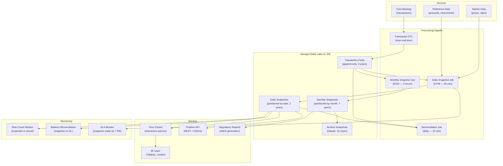

# Snapshot Fact Tables — Real-World Scenarios

> FAANG case studies, production numbers, post-mortems, and deployment topologies.

---

## Case Study 1: Capital One — Daily Account Balance Snapshots

**Context**: Capital One manages 100M+ consumer and commercial accounts. Every account has a balance that changes with every transaction. Monthly statements, regulatory reports, and customer-facing dashboards all need "what was the balance on date X?"

**Architecture**: Dense daily snapshot — one row per account per day in `fact_account_daily`. Generated nightly from transaction facts + previous day's closing balance.

**Scale**:

- 100M accounts × 365 days = 36.5B rows/year
- Storage: ~8TB/year (Parquet, compressed)
- Generation time: 45 minutes on 200-executor Spark cluster
- Query time: <100ms for single-account lookup, <10s for portfolio aggregation

**Key decisions**:

- **Dense vs sparse**: Chose dense (row for every account every day, even with no activity) because sparse snapshots require coalesce logic at query time — unacceptable for BI analysts
- **Storage**: Parquet on S3, partitioned by `snapshot_date`, Z-ordered on `account_id`
- **Retention**: 7 years online, 10 years in cold storage (regulatory)

**Result**: Eliminated 45-minute month-end balance computation queries. Month-end reporting went from a 6-hour batch window to near-real-time.

---

## Case Study 2: Robinhood — Accumulating Snapshot for Trade Settlement

**Context**: Every trade goes through a lifecycle: order → fill → clearing → settlement (T+1 for equities). Compliance needs to track how long each step takes and identify bottlenecks.

**Architecture**: Accumulating snapshot with milestone dates:

- `order_date_sk`, `fill_date_sk`, `clear_date_sk`, `settle_date_sk`
- Lag measures: `minutes_to_fill`, `hours_to_clear`, `days_to_settle`
- Updated via upsert as each milestone event arrives from the clearing pipeline

**Scale**:

- 5M+ trades/day, each updating 1-4 times as milestones arrive
- Table size: ~500M active rows (90-day rolling window)
- Upsert throughput: 50K rows/sec via Delta Lake MERGE
- P99 upsert latency: <200ms per batch

**What went wrong**: Early design used a separate transaction fact for each milestone event. Querying "average time from order to settlement" required a 4-way self-join on order_id — taking 8+ minutes per query. After migrating to an accumulating snapshot, the same query becomes `AVG(days_to_settle)` — a simple column read.

---

## Case Study 3: Walmart — Weekly Inventory Snapshots

**Context**: Walmart tracks inventory across 10,000+ stores, 150,000+ SKUs. Inventory levels change with every sale, receipt, transfer, and shrinkage adjustment. Store managers need to answer: "What was inventory of SKU X in store Y last Tuesday?"

**Architecture**: Weekly periodic snapshot taken every Sunday at midnight:

- Grain: `store_id` × `sku_id` × `snapshot_week`
- Measures: `quantity_on_hand`, `quantity_on_order`, `quantity_in_transit`, `weeks_of_supply`

**Scale**:

- 10K stores × 150K SKUs = 1.5B rows per weekly snapshot
- Annual: 78B rows
- Storage: ~15TB/year (compressed Parquet)
- Chose weekly (not daily) because inventory position doesn't change fast enough at the SKU level to justify daily snapshots for most SKUs

**Key design**: Sparse for slow-moving items (only snapshot if inventory changed), dense for top-20% SKUs (daily snapshot). Two-tier approach balances storage cost with query simplicity.

---

## Case Study 4: JPMorgan Chase — End-of-Day Risk Snapshots

**Context**: Risk management requires reproducing the firm's risk exposure at end-of-day. Regulatory requirements (BCBS 239) mandate that risk reports be reproducible for any historical date.

**Architecture**: Daily periodic snapshot of all position risk metrics:

- VaR (Value at Risk), Greeks, P&L attribution, scenario analysis results
- Snapshot taken at 6 PM ET (after market close)
- Immutable once written — never updated, corrections create new versions

**Scale**:

- 2M+ positions × daily × 50+ risk measures = 100M risk data points/day
- 7 years online = ~250B rows
- Query: "Reproduce the VaR report from March 15, 2023" → single partition scan
- Latency: <5s for full report generation from snapshot

**Key decision**: Chose periodic snapshot over recomputing from transactions because risk calculations are expensive (Monte Carlo simulations, scenario analysis). Pre-computing and storing the results is far cheaper than re-running the models on demand.

---

## What Went Wrong — Post-Mortem: Missing Accounts in Snapshot

**Incident**: A bank's month-end regulatory report showed $2B less in total deposits than the general ledger. 15,000 accounts were missing from the snapshot.

**Root cause**: The snapshot generation job used an INNER JOIN to `dim_account WHERE is_current = TRUE`. But 15,000 accounts had been closed on the last day of the month. Their `is_current` flag was set to FALSE by the SCD Type 2 process *before* the snapshot job ran.

**Timeline**:

1. **5:00 PM**: Business day closes
2. **5:30 PM**: SCD Type 2 job runs, closes 15,000 accounts (sets `is_current = FALSE`)
3. **6:00 PM**: Snapshot job runs with `WHERE is_current = TRUE` — misses the 15,000 closed accounts
4. **Next day**: Regulatory report off by $2B

**Fix**:

1. **Immediate**: Changed join to LEFT JOIN from comprehensive account list, not just current
2. **Long-term**: Snapshot captures balance for ALL accounts that were active at any point during the day, using `WHERE valid_from <= snapshot_date AND valid_to > snapshot_date` instead of `is_current`
3. **Added reconciliation**: Compare snapshot total deposits to GL total — alert if delta > $1M

**Prevention**: Never use `is_current` for snapshot generation. Always use temporal predicates that capture the state at the exact snapshot time.

---

## Deployment Topology — Snapshot Platform at Scale

**Infrastructure**:

| Component | Specification |
|---|---|
| Spark | 200 executors (r5.4xlarge), daily job: 45 min, monthly: 2 hours |
| Delta Lake | Daily partitions, Z-ordered on account_id, 2-year online retention |
| S3 | 50TB daily snapshots, 30TB monthly snapshots, 100TB+ archive |
| Trino | 12 workers, 512GB memory per worker, <5s for portfolio queries |
| API | 8 pods, Redis cache for hot accounts, <100ms P99 |
