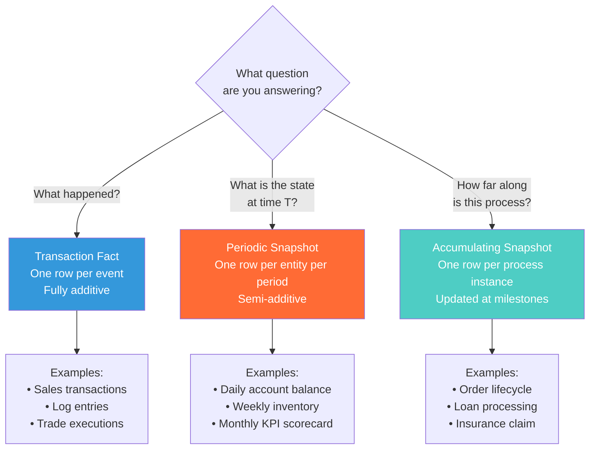

# Snapshot Fact Tables — Interview Angle

> How this appears in Principal-level interviews, sample questions, and what they're really testing.

---

## How This Appears

Snapshot fact tables appear in **data modeling deep dives**, especially for financial services, inventory management, and any domain with "balance" or "level" semantics. The interviewer typically describes a reporting requirement that implies state-over-time, not just events:

- "Design the data model for account balance reporting"
- "How would you track inventory levels across 10,000 stores?"
- "Design a system to monitor order fulfillment pipeline health"

If you model everything as a transaction fact and propose aggregation at query time, you'll be pushed on performance. A Principal candidate identifies the snapshot grain pattern and articulates the semi-additive measure constraints.

---

## Sample Questions

### Question 1: "Design the data model for an account balance reporting system"

**Weak answer (Senior)**:
> "I'd create a transaction fact table with all debits and credits, and aggregate them at query time to get the balance."

**Strong answer (Principal)**:
> "Transaction fact for events, periodic snapshot for state. The reporting requirement 'what was the balance on date X' is a state query, not an event query. Aggregating all transactions from account inception to date X could scan millions of rows per account.
>
> I'd create a daily periodic snapshot: `fact_account_daily` with grain = account_id × snapshot_date. One row per account per day. The snapshot job runs nightly: opening_balance = previous day's closing, closing = opening + credits - debits.
>
> Key design decisions:
>
> 1. **Dense snapshot**: Every active account gets a row every day, even with no activity. This avoids fill-forward logic at query time.
> 2. **Semi-additive measures**: closing_balance cannot be SUMmed across days; it CAN be SUMmed across accounts. I'd enforce this in the semantic layer (Looker/dbt metrics).
> 3. **Reconciliation**: Daily check that SUM(closing_balance) across all accounts matches the general ledger. Alert if delta > threshold.
> 4. **Partitioning**: Partition by snapshot_date (monthly), index on account_id. This gives O(1) partition pruning for 'balance on date X' queries."

**What they're really testing**: Do you know the three Kimball fact types? Do you understand semi-additive constraints? Do you think about data quality (reconciliation)?

---

### Question 2: "What are semi-additive measures and why do they matter?"

**Weak answer (Senior)**:
> "Semi-additive measures are measures that can be aggregated in some ways but not others."

**Strong answer (Principal)**:
> "Semi-additive measures can be summed across some dimensions but not across time. The canonical example is balance.
>
> If I have 100 accounts each with $1,000 closing balance on March 31: SUM(closing_balance) across accounts = $100,000. That's correct — it's the total deposits.
>
> But SUM(closing_balance) across March 1 to March 31 for one account = $31,000. That's meaningless — you've summed the same balance 31 times.
>
> This matters because BI tools default to SUM. If a Tableau user drags 'closing balance' into a chart grouped by month, Tableau will SUM across the days within each month. The chart shows inflated numbers, and the user might not notice.
>
> **How I handle it**:
>
> 1. In the semantic layer (dbt metrics, LookML), define closing_balance with `aggregate: last` or `aggregate: avg`, never `sum`
> 2. In the data dictionary, explicitly document which measures are additive vs semi-additive
> 3. In the snapshot table, provide both: `closing_balance` (semi-additive, take last) and `total_credits`/`total_debits` (fully additive, safe to SUM)"

**What they're really testing**: Can you explain aggregation constraints precisely? Do you think about downstream consumption (BI tool behavior)?

---

### Question 3: "Design an accumulating snapshot for order fulfillment monitoring"

**Weak answer (Senior)**:
> "I'd create a table with columns for each order status and update it when the status changes."

**Strong answer (Principal)**:
> "An accumulating snapshot has one row per order, with a date_sk foreign key for each lifecycle milestone: order → payment → pick → ship → deliver → return.
>
> ```
> fact_order_lifecycle:
>   order_number (degenerate dim)
>   customer_sk, product_sk
>   order_date_sk (NOT NULL)
>   payment_date_sk (NULL until paid)
>   ship_date_sk (NULL until shipped)
>   delivery_date_sk (NULL until delivered)
>   days_order_to_ship (computed lag)
>   current_status
> ```
>
> The key characteristic: **this row is updated in place** as milestones are reached. This is the only Kimball fact type where UPDATE is expected.
>
> **Operational queries**: 'How many orders are waiting for shipment?' = `WHERE ship_date_sk IS NULL AND payment_date_sk IS NOT NULL`. This is a single predicate on the snapshot — no complex join logic.
>
> **Analytics queries**: 'Average days from order to delivery' = `AVG(days_order_to_delivery)`. Again, trivial.
>
> **The tricky part**: Late-arriving milestone events. If a delivery confirmation arrives 3 days late, the snapshot must handle idempotent upserts — update only if the new milestone date is earlier than what's already recorded (to handle out-of-order events)."

**What they're really testing**: Do you understand the update semantics of accumulating snapshots? Can you handle out-of-order events? Do you know the NULL milestone pattern?

---

### Question 4: "Your daily snapshot job takes 3 hours and must complete by 7 AM. How do you optimize it?"

**Weak answer (Senior)**:
> "Add more Spark executors."

**Strong answer (Principal)**:
> "First, I'd profile to find the bottleneck. Common causes:
>
> **1. Full recomputation instead of incremental**: If the job recomputes all accounts from transactions, replace with incremental: `closing = prev_closing + today_credits - today_debits`. This reduces the scan from all-time to one day's transactions plus the previous snapshot.
>
> **2. Shuffle-heavy joins**: The join between previous-day snapshot and today's transactions can cause massive shuffles. Co-partition both tables on account_id. Use broadcast join for the smaller table if it fits in memory.
>
> **3. Dense snapshot with many inactive accounts**: If 80% of accounts have no activity on a given day, the job still writes rows for all of them. Consider a hybrid approach: sparse snapshot for inactive accounts (carry forward), dense for active.
>
> **4. Write amplification**: If the job overwrites the entire partition, switch to MERGE/upsert that only touches changed rows.
>
> **5. Downstream blocking**: If quality checks run sequentially after snapshot generation, parallelize them or run on a sample first.
>
> In practice, switching from full recomputation to incremental typically cuts runtime by 80%+. Adding co-partitioning eliminates the shuffle. The combination usually brings a 3-hour job under 30 minutes."

**What they're really testing**: Can you diagnose performance bottlenecks methodically? Do you understand incremental computation vs full recomputation?

---

## Follow-Up Questions

| After Question... | Follow-Up | What They're Probing |
|---|---|---|
| Q1 (Account balance) | "What if accounts can be backdated — opened last week but loaded today?" | late-arriving data handling in snapshots — need to regenerate affected dates |
| Q2 (Semi-additive) | "How would you compute weighted average balance for interest calculation?" | `SUM(daily_balance × days) / total_days` — weighted average, not simple AVG |
| Q3 (Accumulating) | "What if an order can be returned AND reordered?" | The row needs to handle re-entry into the pipeline — reopened_date_sk, cyclic state |
| Q4 (Performance) | "What if the snapshot must be real-time, not batch?" | Materialized view with incremental refresh, or streaming aggregation (Kafka Streams / Flink) |

---

## Whiteboard Exercise — Draw in 5 Minutes

**Draw**: The three Kimball fact types and a decision tree:



**Key points to call out while drawing**:

- Transaction: INSERT only, fully additive
- Periodic snapshot: INSERT only (one per period), semi-additive
- Accumulating snapshot: INSERT then UPDATE (milestones), multiple date FKs
- Most warehouses need all three types, not one-size-fits-all
