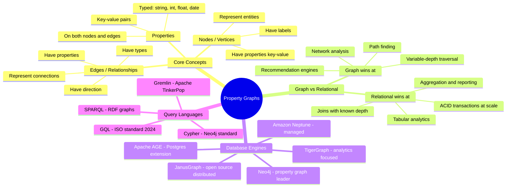

# Property Graphs — Concept Overview

> What they are, why they exist, and when to reach for a graph model instead of relational.

---

## Why This Exists

**Origin**: Graph theory dates to Euler (1736), but property graph databases emerged in the 2000s with Neo4j (2007). The property graph model formalizes the idea that **relationships are first-class citizens**, not afterthoughts joined via foreign keys.

**The problem it solves**: In relational databases, a "friend-of-friend-of-friend" query requires 3 self-JOINs on a potentially massive table. Each additional hop multiplies the JOIN cost. A graph database traverses these relationships in O(1) per hop — following pointers, not scanning indexes. At LinkedIn scale (1B+ members, 10B+ connections), the relational approach is computationally infeasible beyond 2 hops.

**Core insight for a data architect**: Graphs are not a replacement for relational. They excel at **relationship-dense, variable-depth traversal** problems. If your query says "find all paths between X and Y" or "what's the shortest path" or "which nodes are most connected" — that's a graph problem. If your query says "SUM revenue by region" — that's a relational/analytical problem.

## Mindmap

## When To Use / When NOT To Use

| Scenario | Graph? | Why |
|---|---|---|
| Social network: friend-of-friend-of-friend | ✅ Yes | Variable-depth traversal, O(1) per hop |
| Fraud detection: find rings of connected accounts | ✅ Yes | Pattern matching across multiple entity types |
| Knowledge graphs: entity relationships | ✅ Yes | Flexible schema, rich relationship types |
| Recommendation engine: users who bought X also bought Y | ✅ Yes | Collaborative filtering via graph traversal |
| Monthly revenue by product category | ❌ No | Aggregation problem — use star schema |
| Time-series IoT sensor data | ❌ No | Append-only sequential data, not relationship-driven |
| Simple CRUD app with known entity relationships | ❌ No | Relational DB handles fixed-depth joins fine |

## Key Terminology

| Term | Precise Definition |
|---|---|
| **Node (Vertex)** | An entity in the graph with a label and key-value properties |
| **Edge (Relationship)** | A directed connection between two nodes with a type and optional properties |
| **Label** | A classification tag on a node (e.g., `:Person`, `:Company`, `:Product`) |
| **Property** | A key-value attribute on a node or edge (e.g., `name: "Alice"`, `since: 2020`) |
| **Traversal** | Walking the graph by following edges from node to node |
| **Index-Free Adjacency** | Each node directly references its neighbors — no index lookup needed for traversal |
| **Cypher** | Neo4j's declarative graph query language: `MATCH (a)-[:KNOWS]->(b) RETURN b` |
| **Degree** | The number of edges connected to a node (in-degree + out-degree) |
| **Super Node** | A node with an extremely high degree (millions of edges) — a performance problem |
