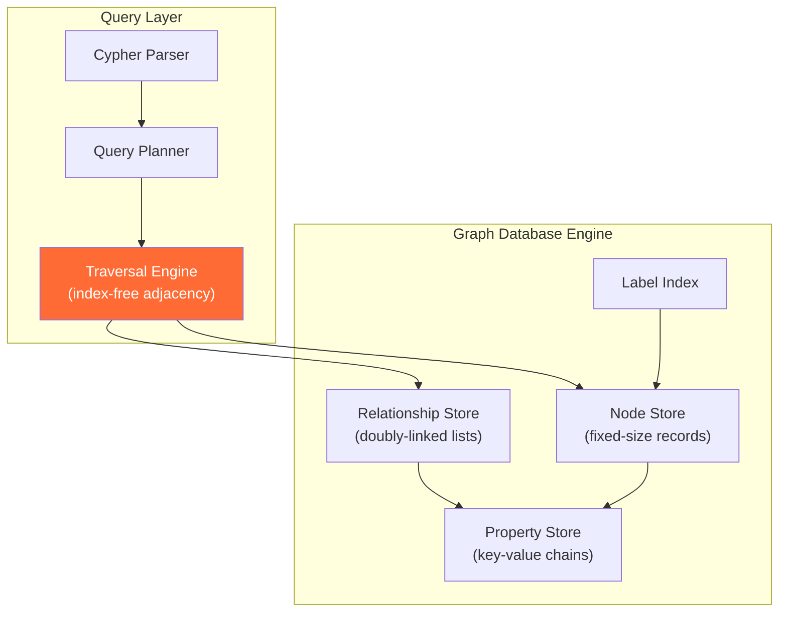
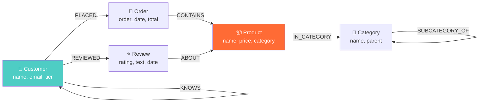

# Property Graphs — How It Works, Examples, War Stories, Pitfalls, Interview, References

---

## HLD — Property Graph Architecture



## ER Equivalent — Social Network as Graph vs Relational

### Relational (3 JOINs for friend-of-friend-of-friend)

```sql
-- Find 3rd-degree connections: SLOW at scale
SELECT DISTINCT f3.friend_id
FROM friendships f1
JOIN friendships f2 ON f1.friend_id = f2.user_id
JOIN friendships f3 ON f2.friend_id = f3.user_id
WHERE f1.user_id = 12345
  AND f3.friend_id != 12345;
-- At 1B users × 500 avg friends: this query can take MINUTES
```

### Graph (Cypher: same query, milliseconds)

```cypher
// Find 3rd-degree connections: FAST
MATCH (me:Person {id: 12345})-[:KNOWS*3]->(fof:Person)
WHERE fof <> me
RETURN DISTINCT fof.name
// At 1B users × 500 avg friends: milliseconds (follows pointers)
```

## Property Graph Schema Example — E-Commerce



## Cypher Query Patterns

```cypher
// Pattern 1: Recommendation — "customers who bought X also bought"
MATCH (c:Customer)-[:PLACED]->(:Order)-[:CONTAINS]->(p:Product {name:"iPhone 16"})
MATCH (c)-[:PLACED]->(:Order)-[:CONTAINS]->(other:Product)
WHERE other.name <> "iPhone 16"
RETURN other.name, COUNT(DISTINCT c) AS co_purchasers
ORDER BY co_purchasers DESC
LIMIT 10;

// Pattern 2: Shortest path between two entities
MATCH path = shortestPath(
  (a:Person {name:"Alice"})-[:KNOWS*..6]-(b:Person {name:"Bob"})
)
RETURN path, length(path) AS hops;

// Pattern 3: Community detection — highly connected subgraphs
CALL gds.louvain.stream('social-graph')
YIELD nodeId, communityId
RETURN gds.util.asNode(nodeId).name AS name, communityId
ORDER BY communityId;
```

## Performance: Graph vs Relational at Depth

| Query Depth | Relational (1B nodes) | Graph (1B nodes) |
|---|---|---|
| 1 hop (direct friends) | 10ms | 2ms |
| 2 hops (FOAF) | 200ms | 5ms |
| 3 hops | 30 seconds | 15ms |
| 4 hops | 10+ minutes or timeout | 50ms |
| 5 hops | Infeasible | 200ms |
| 6 hops | Infeasible | 800ms |

**Why**: Relational performance degrades as O(n^d) where d=depth. Graph stays O(m) where m=edges traversed, independent of total graph size.

## War Story: LinkedIn — Economic Graph

LinkedIn's "People You May Know" (PYMK) is a graph problem:

- 1B+ members, 10B+ connections
- PYMK computes 2nd and 3rd degree connections weighted by mutual connections, company, school, industry
- They moved from relational to a custom graph engine because a 3-hop relational query hit 15+ minute response times
- Graph engine: sub-second response for 3-hop traversals across 1B nodes

## War Story: Panama Papers — Investigative Journalism

The ICIJ used Neo4j to analyze 11.5M documents (2.6TB) from Mossack Fonseca. The graph model revealed:

- Shell company ownership chains (10+ levels deep)
- Circular ownership patterns hiding beneficial owners
- Common directors across hundreds of shell companies
- These patterns were INVISIBLE in spreadsheets or relational queries — only graph traversal exposed them

## Pitfalls

| Pitfall | Fix |
|---|---|
| Using a graph DB for aggregation/reporting | Use it for traversal, export to relational/columnar for analytics |
| No constraints on node properties | Define uniqueness constraints: `CREATE CONSTRAINT ON (p:Person) ASSERT p.id IS UNIQUE` |
| Unbounded traversals (`[:KNOWS*]` without depth limit) | Always specify max depth: `[:KNOWS*..5]` — unbounded = full graph scan |
| Ignoring super nodes (celebrity with 10M followers) | See [../03_Super_Nodes](../03_Super_Nodes/) — partition or cap traversals |
| Treating graph as a relational schema with edges as FKs | Model relationships as first-class: add properties to edges, use multiple edge types |

## Interview

### Q: "When would you add a graph database to your data architecture?"

**Strong Answer**: "When the core access pattern involves variable-depth traversal or path-finding across relationships. Three signals: (1) self-referencing entities (social connections, org hierarchies), (2) queries with unknown depth ('find all paths between A and B'), (3) pattern matching across multiple entity types (fraud rings). I'd use the graph for traversal queries and materialize results into the analytical DW for reporting. Graph DBs are terrible at aggregation — that's still relational/columnar territory."

### Q: "How does index-free adjacency work?"

**Strong Answer**: "Each node physically stores pointers to its adjacent nodes — it's a linked list in storage. When you traverse an edge, you follow a pointer directly to the neighbor node, without consulting a global index. This is O(1) per hop regardless of total graph size. In contrast, relational JOINs use index lookups that are O(log n) per hop and degrade as the table grows."

## References

| Resource | Link |
|---|---|
| *Graph Databases* 2nd Ed. | Ian Robinson, Jim Webber, Emil Eifrem (O'Reilly) |
| [Neo4j Graph Data Science](https://github.com/neo4j/graph-data-science) | Algorithms library for Neo4j |
| [GQL ISO Standard](https://www.iso.org/standard/76120.html) | ISO/IEC 39075:2024 — Graph Query Language |
| [Apache TinkerPop](https://tinkerpop.apache.org/) | Open-source graph computing framework |
| Cross-ref: Fraud Schemas | [../02_Fraud_Detection_Schemas](../02_Fraud_Detection_Schemas/) |
| Cross-ref: Super Nodes | [../03_Super_Nodes](../03_Super_Nodes/) |
