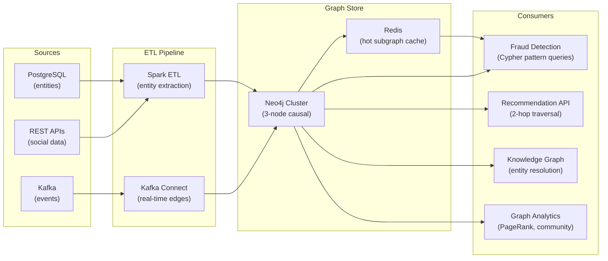

# Property Graphs — Hands-On Examples

> Production-grade Cypher, Gremlin, PySpark GraphFrames, and configuration examples.

---

## Code Examples — Cypher (Neo4j)

### Create a Graph Schema

```cypher
// ============================================================
// Create constraints and indexes first (production best practice)
// ============================================================

// Unique constraints (also create indexes)
CREATE CONSTRAINT person_id IF NOT EXISTS FOR (p:Person) REQUIRE p.person_id IS UNIQUE;
CREATE CONSTRAINT company_id IF NOT EXISTS FOR (c:Company) REQUIRE c.company_id IS UNIQUE;
CREATE CONSTRAINT product_id IF NOT EXISTS FOR (p:Product) REQUIRE p.product_id IS UNIQUE;

// Additional indexes for common lookups
CREATE INDEX person_name IF NOT EXISTS FOR (p:Person) ON (p.name);
CREATE INDEX person_email IF NOT EXISTS FOR (p:Person) ON (p.email);
CREATE INDEX company_name IF NOT EXISTS FOR (c:Company) ON (c.name);

// Full-text index for search
CREATE FULLTEXT INDEX person_search IF NOT EXISTS FOR (p:Person) ON EACH [p.name, p.email];
```

### Bulk-Load Nodes and Edges

```cypher
// ============================================================
// Load nodes from CSV (production-scale import)
// ============================================================

// Load Person nodes
LOAD CSV WITH HEADERS FROM 'file:///persons.csv' AS row
CREATE (p:Person {
    person_id: toInteger(row.id),
    name: row.name,
    email: row.email,
    city: row.city,
    created_at: datetime(row.created_at)
});

// Load Company nodes
LOAD CSV WITH HEADERS FROM 'file:///companies.csv' AS row
CREATE (c:Company {
    company_id: toInteger(row.id),
    name: row.name,
    industry: row.industry,
    founded: toInteger(row.founded),
    employee_count: toInteger(row.employees)
});

// Load WORKS_AT relationships
LOAD CSV WITH HEADERS FROM 'file:///employment.csv' AS row
MATCH (p:Person {person_id: toInteger(row.person_id)})
MATCH (c:Company {company_id: toInteger(row.company_id)})
CREATE (p)-[:WORKS_AT {
    since: date(row.start_date),
    role: row.role,
    department: row.department
}]->(c);

// Load KNOWS relationships
LOAD CSV WITH HEADERS FROM 'file:///connections.csv' AS row
MATCH (p1:Person {person_id: toInteger(row.person_id_1)})
MATCH (p2:Person {person_id: toInteger(row.person_id_2)})
CREATE (p1)-[:KNOWS {since: date(row.connected_date)}]->(p2);
```

### Common Query Patterns

```cypher
// ============================================================
// 1. Friends-of-friends (2-hop traversal)
// ============================================================
MATCH (me:Person {name: 'Alice'})-[:KNOWS]->(friend)-[:KNOWS]->(fof)
WHERE fof <> me AND NOT (me)-[:KNOWS]->(fof)
RETURN DISTINCT fof.name, COUNT(friend) AS mutual_friends
ORDER BY mutual_friends DESC
LIMIT 10;

// ============================================================
// 2. Shortest path between two people
// ============================================================
MATCH path = shortestPath(
    (a:Person {name: 'Alice'})-[:KNOWS*..6]-(b:Person {name: 'Zara'})
)
RETURN path, length(path) AS hops;

// ============================================================
// 3. Find all coworkers (same company, different person)
// ============================================================
MATCH (me:Person {name: 'Alice'})-[:WORKS_AT]->(c:Company)<-[:WORKS_AT]-(coworker)
WHERE coworker <> me
RETURN coworker.name, c.name AS company;

// ============================================================
// 4. Community detection — triangle counting
// ============================================================
MATCH (a:Person)-[:KNOWS]->(b:Person)-[:KNOWS]->(c:Person)-[:KNOWS]->(a)
WHERE id(a) < id(b) AND id(b) < id(c)
RETURN a.name, b.name, c.name AS triangle;

// ============================================================
// 5. Graph analytics — degree centrality
// ============================================================
MATCH (p:Person)-[r:KNOWS]-()
RETURN p.name, COUNT(r) AS degree
ORDER BY degree DESC
LIMIT 20;
```

---

## Gremlin (Apache TinkerPop)

```groovy
// Friends-of-friends in Gremlin
g.V().has('Person', 'name', 'Alice')
  .out('KNOWS')
  .out('KNOWS')
  .dedup()
  .has('name', neq('Alice'))
  .values('name')
  .toList()

// Shortest path
g.V().has('Person', 'name', 'Alice')
  .repeat(out('KNOWS').simplePath())
  .until(has('name', 'Zara'))
  .path()
  .limit(1)

// Degree centrality
g.V().hasLabel('Person')
  .project('name', 'degree')
  .by('name')
  .by(bothE('KNOWS').count())
  .order().by('degree', desc)
  .limit(20)
```

---

## PySpark GraphFrames

```python
from pyspark.sql import SparkSession
from graphframes import GraphFrame

spark = SparkSession.builder \
    .appName("property_graph_analytics") \
    .config("spark.jars.packages", "graphframes:graphframes:0.8.3-spark3.5-s_2.12") \
    .getOrCreate()

# Create nodes DataFrame
nodes = spark.createDataFrame([
    ("1", "Alice", "Person", "Seattle"),
    ("2", "Bob", "Person", "Portland"),
    ("3", "Carol", "Person", "Seattle"),
    ("4", "Acme", "Company", "San Francisco"),
], ["id", "name", "label", "city"])

# Create edges DataFrame
edges = spark.createDataFrame([
    ("1", "2", "KNOWS"),
    ("1", "3", "KNOWS"),
    ("2", "3", "KNOWS"),
    ("1", "4", "WORKS_AT"),
    ("2", "4", "WORKS_AT"),
], ["src", "dst", "relationship"])

# Create GraphFrame
g = GraphFrame(nodes, edges)

# 1. Find triangles (closed triads)
triangles = g.triangleCount()
triangles.select("id", "name", "count").show()

# 2. PageRank
pagerank = g.pageRank(resetProbability=0.15, maxIter=10)
pagerank.vertices.select("id", "name", "pagerank").orderBy("pagerank", ascending=False).show()

# 3. Connected components
components = g.connectedComponents()
components.select("id", "name", "component").show()

# 4. BFS: Find shortest path from Alice to Carol
bfs_result = g.bfs(
    fromExpr="name = 'Alice'",
    toExpr="name = 'Carol'",
    edgeFilter="relationship = 'KNOWS'",
    maxPathLength=3
)
bfs_result.show()
```

---

## Before vs After — Relational vs Graph for Multi-Hop Queries

### ❌ Before: SQL Self-Joins for Friends-of-Friends

```sql
-- BAD: 3-hop traversal in SQL requires 3 self-joins
-- Performance degrades exponentially with hop count
SELECT DISTINCT p3.name AS friend_of_friend_of_friend
FROM connections c1
JOIN connections c2 ON c1.person_id_2 = c2.person_id_1
JOIN connections c3 ON c2.person_id_2 = c3.person_id_1
JOIN persons p3 ON c3.person_id_2 = p3.person_id
WHERE c1.person_id_1 = 12345;

-- connections table: 500M rows
-- 3-way self-join: 500M × 500M × 500M potential combinations
-- Even with indexes: 45 seconds, 12GB temp space
```

### ✅ After: Cypher Traversal

```cypher
// GOOD: 3-hop traversal in Cypher
// Index-free adjacency: O(k^3) where k = avg degree, NOT table size
MATCH (me:Person {person_id: 12345})-[:KNOWS*3]->(fofof:Person)
RETURN DISTINCT fofof.name;

// Average degree k = 150 (LinkedIn)
// 150^3 = 3.3M nodes visited
// Execution time: <200ms
```

---

## Integration Diagram — Property Graph in a Data Platform



---

## Runnable Exercise — Build a Social Graph (Neo4j Docker)

```bash
# 1. Start Neo4j
docker run -d --name neo4j-lab \
  -p 7474:7474 -p 7687:7687 \
  -e NEO4J_AUTH=neo4j/password123 \
  neo4j:5-community

# 2. Open browser: http://localhost:7474
# Login: neo4j / password123

# 3. Run in Neo4j Browser:

# Create persons
CREATE (alice:Person {name: 'Alice', age: 35, city: 'Seattle'})
CREATE (bob:Person {name: 'Bob', age: 30, city: 'Portland'})
CREATE (carol:Person {name: 'Carol', age: 28, city: 'Seattle'})
CREATE (dave:Person {name: 'Dave', age: 32, city: 'Denver'})
CREATE (eve:Person {name: 'Eve', age: 29, city: 'Portland'})

# Create companies
CREATE (acme:Company {name: 'Acme Corp', industry: 'Tech'})
CREATE (globex:Company {name: 'Globex', industry: 'Finance'})

# Create relationships
CREATE (alice)-[:KNOWS {since: date('2020-01-01')}]->(bob)
CREATE (alice)-[:KNOWS]->(carol)
CREATE (bob)-[:KNOWS]->(carol)
CREATE (bob)-[:KNOWS]->(dave)
CREATE (carol)-[:KNOWS]->(eve)
CREATE (alice)-[:WORKS_AT {role: 'Engineer'}]->(acme)
CREATE (bob)-[:WORKS_AT {role: 'Manager'}]->(acme)
CREATE (carol)-[:WORKS_AT]->(globex)

# 4. Try queries from the examples above
```
