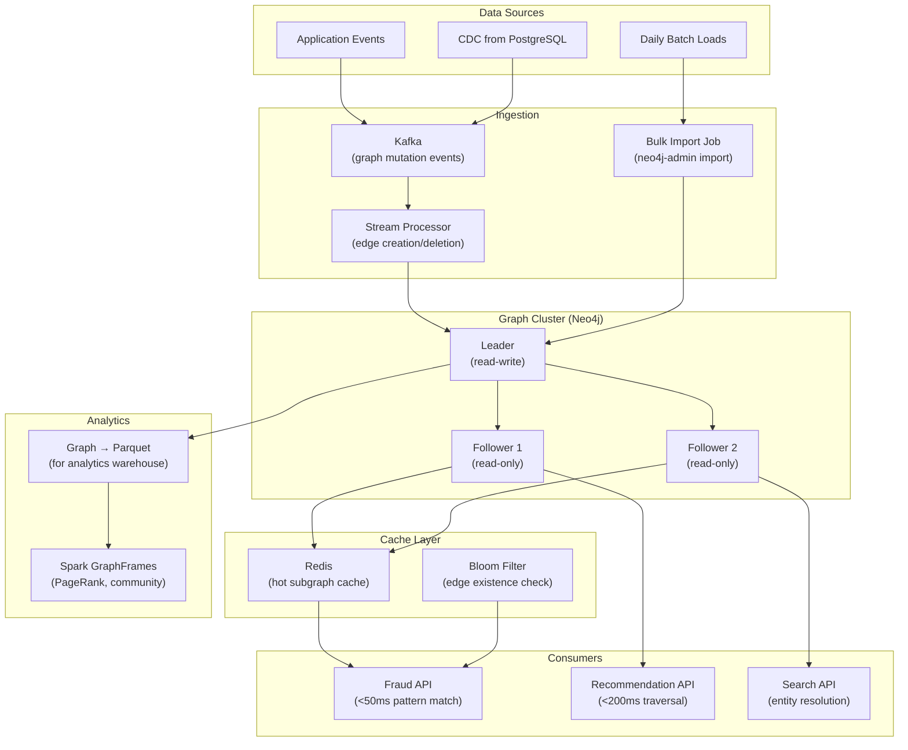

# Property Graphs — Real-World Scenarios

> FAANG case studies, production numbers, post-mortems, and deployment topologies.

---

## Case Study 1: LinkedIn — Social Graph (People You May Know)

**Context**: LinkedIn's core product is built on a graph of 900M+ members connected by professional relationships, company affiliations, school alumni networks, and endorsements.

**Architecture**: Custom in-house graph database (not Neo4j) optimized for 2-3 hop traversals:

- Nodes: Members, Companies, Schools, Skills, Posts
- Edges: CONNECTED_TO, WORKS_AT, ATTENDED, ENDORSED, LIKED
- 300+ edge types

**Scale**:

- 900M+ member nodes
- 15B+ edges (connections, interactions, affiliations)
- "People You May Know" = 3-hop traversal + scoring
- Query latency: <200ms for PYMK recommendations
- 50M+ PYMK recommendations served daily

**Key design**: LinkedIn uses a tiered graph strategy:

- **Hot graph (in-memory)**: Active members (last 90 days) + their 1st/2nd degree connections
- **Warm graph (SSD)**: All members with recent edges
- **Cold graph (HDFS)**: Full historical graph for analytics

**Result**: PYMK is LinkedIn's #1 engagement driver. The graph-based approach produces 10x more accepted connections than simple collaborative filtering.

---

## Case Study 2: PayPal — Fraud Detection Graph

**Context**: PayPal processes $1.5T+ in annual payment volume. Fraudsters create networks of fake accounts, shared devices, and money mule chains. Detecting these patterns requires graph analysis.

**Architecture**: Real-time fraud detection graph:

- Nodes: Accounts, Devices, IP Addresses, Phone Numbers, Credit Cards
- Edges: OWNS_DEVICE, LOGGED_IN_FROM, TRANSACTED_WITH, SHARES_PHONE
- Pattern matching: Find cycles (money laundering loops), shared device clusters (account farms), and fan-out patterns (mule networks)

**Scale**:

- 400M+ account nodes
- 2B+ device/IP/card nodes
- 10B+ edges
- Real-time graph updates: 100K edges/second
- Fraud pattern query: <50ms for single-transaction risk scoring

**Key design**: PayPal uses a hybrid approach:

- **Real-time layer**: In-memory graph (TigerGraph) for transaction-time pattern matching
- **Batch layer**: Neo4j for deep analysis, community detection, and new pattern discovery
- **Feature extraction**: Graph features (degree centrality, clustering coefficient, shortest path to known fraud) fed into ML models

**Result**: Graph-based fraud detection catches 30% more fraud than rule-based systems alone. False positive rate reduced by 40%.

---

## Case Study 3: Google — Knowledge Graph

**Context**: Google's Knowledge Graph powers the knowledge panels you see in search results (e.g., search "Barack Obama" → structured info card). It connects 500B+ facts about 5B+ entities.

**Architecture**: RDF-like triple store (not pure property graph) with a custom query engine:

- Entities: People, Places, Things, Concepts
- Relationships: born_in, married_to, ceo_of, located_in, instance_of
- Properties: name, description, image_url, Wikipedia_link

**Scale**:

- 5B+ entities (nodes)
- 500B+ facts (edges/properties)
- 100K+ entity types
- Query latency: <10ms for single entity lookup
- Updated continuously from web crawling + human curation

**Key design**: Google uses a layered knowledge architecture:

1. **Raw extraction**: NLP pipeline extracts entities and relationships from web pages
2. **Entity resolution**: Merge duplicate entities (fuzzy matching on name, context, co-occurrence)
3. **Knowledge fusion**: Resolve conflicting facts from multiple sources (voting, source reliability)
4. **Serving**: Pre-computed knowledge panels cached at CDN edge

---

## Case Study 4: Uber — Trip Routing Graph

**Context**: Uber's routing engine models the road network as a graph. Every intersection is a node, every road segment is an edge with properties (distance, speed limit, traffic, turn restrictions).

**Architecture**: Weighted property graph for routing:

- Nodes: Intersections, Points of Interest
- Edges: Road segments with properties (distance_m, speed_limit_kph, traffic_speed_kph, restrictions)
- Algorithm: Modified Dijkstra / Contraction Hierarchies for shortest path

**Scale**:

- 500M+ intersection nodes (global)
- 1B+ road segment edges
- Edge properties updated every 5 minutes (real-time traffic)
- Route calculation: <100ms for 95th percentile
- 20M+ route calculations per day

---

## What Went Wrong — Post-Mortem: Super Node Meltdown

**Incident**: A social platform's "mutual friends" feature started timing out after a celebrity account reached 5M followers. The feature calculated mutual friends between two users — a 2-hop traversal.

**Root cause**: The celebrity account was a **super node** — a node with 5M edges. The mutual friends query between any user and the celebrity required traversing all 5M FOLLOWS edges, then intersecting with the second user's follows. This O(5M) operation overwhelmed the graph database.

**Timeline**:

1. **Day 0**: Celebrity reaches 5M followers
2. **Day 1**: "Mutual friends" queries involving the celebrity start timing out (>30s)
3. **Day 2**: Cascading timeouts cause connection pool exhaustion on the graph cluster
4. **Day 3**: Full outage of the mutual friends feature for all users

**Fix**:

1. **Immediate**: Added query timeout (5s max) and circuit breaker
2. **Short-term**: Pre-computed mutual friend counts for accounts with >100K edges
3. **Long-term**: Implemented super node partitioning — split the celebrity's edge list into shards, traverse only the relevant shard based on the second user's community

**Prevention**: Monitor node degree distribution. Alert when any node exceeds 100K edges. Design queries with degree-aware limits (`LIMIT` on intermediate traversals).

---

## Deployment Topology — Graph Platform at Scale

**Infrastructure**:

| Component | Specification |
|---|---|
| Neo4j Cluster | 3-node causal cluster (r5.8xlarge), 256GB RAM, 2TB NVMe per node |
| Kafka | 6 brokers, graph.mutations topic, 7-day retention |
| Redis | 64GB cluster, hot subgraph (top 1M accounts + 2-hop neighborhood) |
| Spark GraphFrames | 50 executors, weekly PageRank/community detection jobs |
| graph size | 500M nodes, 5B edges, total store: ~1.5TB |
