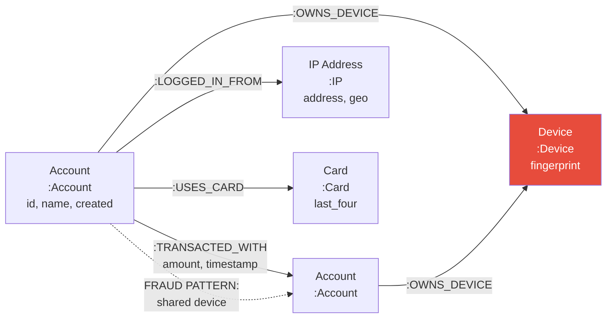

# Property Graphs — Interview Angle

> How this appears in Principal-level interviews, sample questions, and what they're really testing.

---

## How This Appears

Property graphs appear in **system design** interviews when the problem involves relationships as a first-class concern. The interviewer won't say "use a graph database" — they'll describe requirements that imply it:

- "Design a fraud detection system that identifies suspicious transaction patterns"
- "Design the backend for a social network's 'People You May Know' feature"
- "How would you build an impact analysis tool for microservice dependencies?"

A Senior candidate might model everything relationally with JOINs. A Principal candidate identifies the graph-native query patterns and articulates when a graph database is the right architectural choice.

---

## Sample Questions

### Question 1: "Design a system to detect fraudulent transaction rings"

**Weak answer (Senior)**:
> "I'd build rules that flag transactions above a threshold or from suspicious locations. Maybe use a decision tree."

**Strong answer (Principal)**:
> "Fraud rings are structural patterns in a transaction graph — cycles, fan-out networks, and shared device clusters. Rule-based systems catch individual anomalies but miss coordinated fraud.
>
> I'd model this as a property graph:
>
> - **Nodes**: Account, Device, IP Address, Phone Number, Card
> - **Edges**: TRANSACTED_WITH, OWNS_DEVICE, LOGGED_IN_FROM, SHARES_PHONE
>
> The graph enables three detection layers:
>
> 1. **Real-time pattern matching**: At transaction time, traverse 2-3 hops from the sender. Check for cycles (money back to sender), shared devices with flagged accounts, or fan-out to >5 new recipients in 24 hours.
> 2. **Batch community detection**: Weekly, run connected components and Louvain community detection. Flag communities with anomalous fund flow patterns.
> 3. **ML feature extraction**: Extract graph features — degree centrality, betweenness, clustering coefficient, shortest path to known fraud — and feed into a gradient boosted model.
>
> For the graph layer, I'd use TigerGraph or Neo4j with a tiered architecture: in-memory for real-time scoring, on-disk for batch analytics. The key design constraint is that real-time queries must complete in <50ms (within the payment authorization window)."

**What they're really testing**: Can you identify graph-native patterns (cycles, communities)? Do you think in layers (real-time + batch)? Do you know the latency constraint for payment authorization?

---

### Question 2: "When would you choose a graph database over a relational database?"

**Weak answer (Senior)**:
> "When you have lots of relationships between entities."

**Strong answer (Principal)**:
> "The decision hinges on the primary query pattern, not the data structure.
>
> **Choose graph when**: The dominant query pattern is multi-hop traversal or structural pattern matching. Specifically:
>
> - Friends-of-friends, N-hop recommendations: Each hop in SQL requires a self-join (O(n²) per hop). In a graph, each hop is O(k) where k = node degree — independent of graph size.
> - Cycle detection: Finding loops in SQL requires recursive CTEs with unpredictable depth. In a graph, it's a native pattern match.
> - Impact analysis: 'What breaks if X goes down' is a dependency graph traversal.
>
> **Stay relational when**: The dominant pattern is aggregation (SUM, COUNT, GROUP BY), tabular reporting, or high-volume CRUD. Graph databases lack columnar storage, vectorized execution, and partition pruning.
>
> **The crossover point**: If your query involves ≤2 JOINs and no recursive patterns, relational wins. At 3+ self-joins or any recursive traversal, graph wins — often by 100-1000x.
>
> In practice, most architectures use both: relational for transactional data and reporting, graph for relationship-heavy queries. Connect them via CDC (relational → graph) or dual writes."

**What they're really testing**: Can you articulate the performance crossover point? Do you avoid the trap of "graph for everything"?

---

### Question 3: "How does index-free adjacency work, and why does it matter?"

**Weak answer (Senior)**:
> "It means you don't need indexes to traverse the graph."

**Strong answer (Principal)**:
> "Index-free adjacency means each node physically stores direct pointers to its adjacent nodes/edges in the storage engine. When you traverse from node A to node B via an edge, the database follows a pointer — it doesn't look up an index or scan a table.
>
> In Neo4j's native format, a node record (15 bytes) contains a pointer to its first relationship record. Each relationship record (34 bytes) contains pointers to the next relationship for both the start and end nodes — forming a doubly-linked list per node.
>
> **Why it matters**:
>
> - Traversal cost is O(k) per hop where k = node degree — independent of total graph size
> - A 3-hop query on a 1B-node graph has the same per-hop cost as on a 1M-node graph
> - Contrast with relational: a JOIN requires an index lookup (O(log n)) or hash build (O(n)) — cost grows with table size
>
> **Caveat**: Index-free adjacency makes traversal fast but global queries expensive. `MATCH (p:Person) RETURN COUNT(p)` requires scanning all node records — there's no aggregate index. Graph databases trade global scan performance for local traversal performance."

**What they're really testing**: Do you understand the storage-level mechanism? Can you articulate the performance implication? Do you know the trade-off?

---

### Question 4: "You have a graph with 500M nodes and a celebrity node with 10M edges. How do you handle this?"

**Weak answer (Senior)**:
> "Use pagination to limit results."

**Strong answer (Principal)**:
> "This is the super node problem — a node with disproportionately high degree that breaks traversal performance. A 2-hop query from a super node traverses 10M × average_degree = potentially billions of nodes.
>
> My approach, in order of impact:
>
> 1. **Query-level guards**: Add `LIMIT` to intermediate traversal steps. Instead of `MATCH (celeb)-[:FOLLOWS]->(f)`, use `MATCH (celeb)-[:FOLLOWS]->(f) WITH f LIMIT 1000` to cap expansion.
>
> 2. **Edge type partitioning**: Split generic edges into typed sub-edges. Instead of one `:FOLLOWS` type with 10M edges, create `:FOLLOWS_ACTIVE` (recent 30 days), `:FOLLOWS_DORMANT`, `:FOLLOWS_BOT_FILTERED`. Queries targeting active followers traverse 100K edges, not 10M.
>
> 3. **Pre-computation**: For common queries involving the super node (e.g., mutual friends), pre-compute and cache the results. Store the celebrity's neighborhood as a materialized subgraph in Redis.
>
> 4. **Architecture-level**: For truly massive nodes (>1M edges), consider a separate serving path. The celebrity's follower list is served from a purpose-built index (like a sorted set in Redis), not from the graph traversal engine.
>
> The key principle: design for the 99th percentile node degree, not the average. If average degree is 150 but one node has 10M, that one node will dominate your P99 latency."

**What they're really testing**: Do you know the super node problem? Can you solve it at multiple levels (query, data model, infrastructure)?

---

## Follow-Up Questions

| After Question... | Follow-Up | What They're Probing |
|---|---|---|
| Q1 (Fraud detection) | "How would you update the graph in real-time as transactions occur?" | Streaming graph mutations — CDC from transaction DB to graph via Kafka |
| Q2 (Graph vs relational) | "What about PostgreSQL's recursive CTEs? Can't those do graph traversals?" | Yes, but performance degrades at depth >3 and has no index-free adjacency |
| Q3 (Index-free adjacency) | "What about JanusGraph/Neptune — do they use index-free adjacency?" | No — they use pluggable backends (Cassandra/DynamoDB) with index-based lookups. Trade-off: scalability vs traversal speed |
| Q4 (Super nodes) | "What if every node is high-degree — like a dense social network?" | Different problem — dense graphs need partitioning (sharding) and distributed traversal |

---

## Whiteboard Exercise — Draw in 5 Minutes

**Draw**: A property graph schema for fraud detection:

**Key points to call out**:

- Shared device = two accounts connected to same Device node (2-hop path)
- Transaction cycle = money flowing A→B→C→A (3-hop cycle detection)
- The graph reveals structural patterns that are invisible in tabular data
