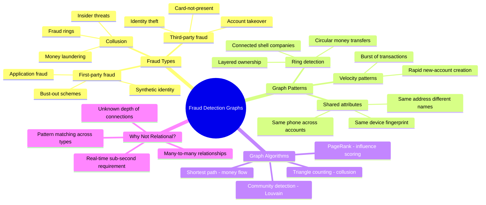

# Fraud Detection Schemas — Concept Overview

> Why graphs are the superior tool for detecting fraud patterns that relational databases miss.

---

## Why This Exists

**Origin**: Fraud detection moved from rule-based systems to graph analysis in the 2010s when financial institutions realized that fraudsters operate in **networks** — rings of connected accounts, shared devices, reused identities. Relational queries can check individual rules ("transaction > $10K"), but cannot efficiently detect structural patterns ("three accounts share a phone number, a device fingerprint, and a shipping address, but have different names").

**The problem it solves**: First-party fraud (application fraud using synthetic identities) evades traditional rule-based systems because each individual application looks legitimate. Only when you see the **network** — shared attributes connecting seemingly unrelated applications — do fraud rings become visible.

## Mindmap

## Key Terminology

| Term | Definition |
|---|---|
| **Fraud Ring** | A group of connected entities (accounts, people, devices) exhibiting coordinated fraudulent behavior |
| **Shared Attribute** | A property (phone, email, device, IP, address) connecting seemingly unrelated accounts |
| **Synthetic Identity** | A fabricated identity combining real and fake information to open accounts |
| **Community Detection** | Graph algorithm that identifies densely connected subgraphs (potential fraud rings) |
| **Link Analysis** | Examining relationships between entities to uncover hidden connections |
