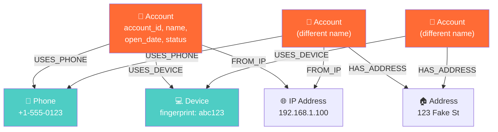
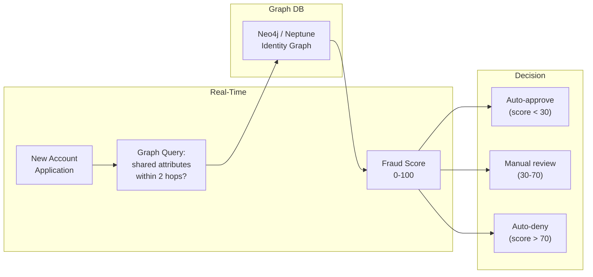

# Fraud Detection Schemas — How It Works, Examples, War Stories, Pitfalls, Interview, References

---

## Graph Schema — Fraud Detection Model



**The pattern above**: Three accounts with different names share the same phone, device, IP, and address. Individually, each looks legitimate. Connected via graph, it's a fraud ring.

## Cypher Queries — Fraud Detection

```cypher
// Pattern 1: Find accounts sharing 2+ attributes (potential fraud ring)
MATCH (a1:Account)-[:USES_PHONE]->(p:Phone)<-[:USES_PHONE]-(a2:Account)
WHERE a1 <> a2 AND a1.name <> a2.name
WITH a1, a2, COUNT(DISTINCT p) AS shared_phones
MATCH (a1)-[:USES_DEVICE]->(d:Device)<-[:USES_DEVICE]-(a2)
WITH a1, a2, shared_phones, COUNT(DISTINCT d) AS shared_devices
WHERE shared_phones >= 1 AND shared_devices >= 1
RETURN a1.account_id, a2.account_id, shared_phones, shared_devices
ORDER BY shared_phones + shared_devices DESC;

// Pattern 2: Circular money transfers (money laundering)
MATCH path = (a:Account)-[:TRANSFERRED_TO*3..6]->(a)
WHERE ALL(r IN relationships(path) WHERE r.amount > 9000)  // just below $10K reporting threshold
RETURN path, 
       REDUCE(total = 0, r IN relationships(path) | total + r.amount) AS total_flow;

// Pattern 3: Community detection — find fraud clusters
CALL gds.louvain.stream('fraud-graph', {
  nodeLabels: ['Account'],
  relationshipTypes: ['SHARES_PHONE', 'SHARES_DEVICE', 'SHARES_ADDRESS']
})
YIELD nodeId, communityId
WITH communityId, COLLECT(gds.util.asNode(nodeId).account_id) AS accounts
WHERE SIZE(accounts) >= 3  // clusters of 3+ accounts
RETURN communityId, accounts, SIZE(accounts) AS ring_size
ORDER BY ring_size DESC;
```

## Relational Equivalent — Why It's Painful

```sql
-- The same "shared phone" query in SQL: 
-- Find account pairs sharing phone AND device
SELECT a1.account_id, a2.account_id,
       COUNT(DISTINCT ap1.phone) AS shared_phones,
       COUNT(DISTINCT ad1.device_id) AS shared_devices
FROM accounts a1
JOIN account_phones ap1 ON a1.account_id = ap1.account_id
JOIN account_phones ap2 ON ap1.phone = ap2.phone AND ap1.account_id != ap2.account_id
JOIN accounts a2 ON a2.account_id = ap2.account_id
JOIN account_devices ad1 ON a1.account_id = ad1.account_id
JOIN account_devices ad2 ON ad1.device_id = ad2.device_id AND ad1.account_id != ad2.account_id
WHERE a2.account_id = ad2.account_id  -- same a2 for both shared attributes
GROUP BY a1.account_id, a2.account_id
HAVING COUNT(DISTINCT ap1.phone) >= 1 AND COUNT(DISTINCT ad1.device_id) >= 1;
-- 6 JOINs for 2-attribute matching. Each additional attribute adds 2 more JOINs.
-- This is O(n^2) on the account_phones table alone.
```

## Real-Time Fraud Scoring Pipeline



## War Story: PayPal — Graph-Based Fraud Detection

PayPal processes 40M+ transactions/day. Their graph-based fraud system identifies fraud rings by connecting accounts through shared devices, IP addresses, and shipping addresses. When a new account is created, a real-time graph query checks how many existing accounts share attributes within 2 hops. If the "shared attribute density" exceeds a threshold, the account is flagged.

**Result**: 10% reduction in fraud losses, $700M+ in annual fraud prevented.

## Pitfalls

| Pitfall | Fix |
|---|---|
| Building fraud detection with only rules, no graph | Rules catch individual anomalies. Graphs catch networks. Use both. |
| Not updating the graph in real-time | Batch-loaded graphs miss fraud in progress. Stream events into the graph with CDC |
| Over-connecting: every shared ZIP code = connected | Only connect on high-signal attributes: phone, device fingerprint, SSN last-4. ZIP code is too broad |
| Not handling super nodes (a shared WiFi IP connects 1000 accounts) | See [../03_Super_Nodes](../03_Super_Nodes/) — filter out known public IPs |

## Interview

### Q: "Design a fraud detection system for account opening."

**Strong Answer**: "Identity graph with nodes for Account, Phone, Device, Email, Address, IP, and SSN. Edges connect accounts to their attributes. At account creation, real-time graph query: 'How many other accounts share 2+ attributes with this application within 2 hops?' Weighted scoring: shared SSN last-4 = highest signal, shared IP = lowest (VPNs). Batch community detection (Louvain) runs nightly to find fraud rings. Results feed back into the scoring model."

## References

| Resource | Link |
|---|---|
| [Neo4j Fraud Detection Guide](https://neo4j.com/use-cases/fraud-detection/) | Official use case documentation |
| [FinCEN Files Analysis](https://github.com/ICIJ/datashare) | ICIJ's open-source investigation tool |
| *Graph-Powered Machine Learning* | Alessandro Negro (Manning) |
| Cross-ref: Property Graphs | [../01_Property_Graphs](../01_Property_Graphs/) |
| Cross-ref: Super Nodes | [../03_Super_Nodes](../03_Super_Nodes/) — handling high-degree nodes in fraud graphs |
