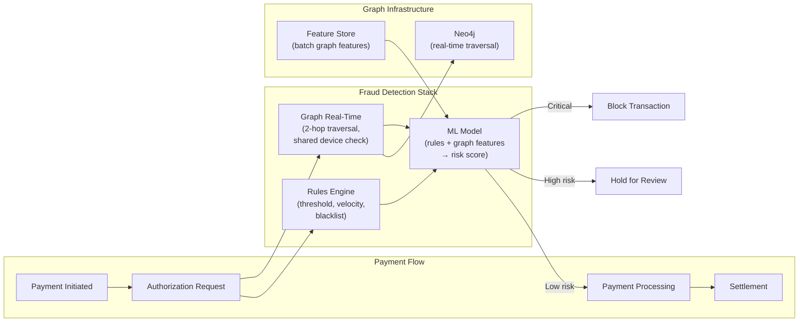

# Fraud Detection Schemas — Hands-On Examples

> Production-grade Cypher, PySpark, and SQL examples for building a fraud detection graph.

---

## Building the Fraud Graph — Cypher

### Schema Setup

```cypher
// ============================================================
// Constraints and indexes for fraud detection graph
// ============================================================

CREATE CONSTRAINT account_id IF NOT EXISTS FOR (a:Account) REQUIRE a.account_id IS UNIQUE;
CREATE CONSTRAINT device_fp IF NOT EXISTS FOR (d:Device) REQUIRE d.fingerprint IS UNIQUE;
CREATE CONSTRAINT ip_addr IF NOT EXISTS FOR (ip:IP) REQUIRE ip.address IS UNIQUE;
CREATE CONSTRAINT phone_num IF NOT EXISTS FOR (ph:Phone) REQUIRE ph.number IS UNIQUE;
CREATE CONSTRAINT card_hash IF NOT EXISTS FOR (c:Card) REQUIRE c.card_hash IS UNIQUE;

CREATE INDEX account_risk IF NOT EXISTS FOR (a:Account) ON (a.risk_score);
CREATE INDEX account_created IF NOT EXISTS FOR (a:Account) ON (a.created_date);
CREATE INDEX txn_time IF NOT EXISTS FOR ()-[t:TRANSACTED_WITH]-() ON (t.txn_time);
```

### Load Transaction Graph

```cypher
// Load accounts
LOAD CSV WITH HEADERS FROM 'file:///accounts.csv' AS row
CREATE (a:Account {
    account_id: toInteger(row.id),
    name: row.name,
    account_type: row.type,
    created_date: date(row.created),
    risk_score: 0.0,
    is_flagged: false
});

// Load devices and link to accounts
LOAD CSV WITH HEADERS FROM 'file:///device_usage.csv' AS row
MERGE (d:Device {fingerprint: row.device_fp})
ON CREATE SET d.device_type = row.device_type, d.os = row.os
WITH d, row
MATCH (a:Account {account_id: toInteger(row.account_id)})
MERGE (a)-[:OWNS_DEVICE {first_seen: datetime(row.first_seen)}]->(d);

// Load transactions as edges
LOAD CSV WITH HEADERS FROM 'file:///transactions.csv' AS row
MATCH (sender:Account {account_id: toInteger(row.sender_id)})
MATCH (receiver:Account {account_id: toInteger(row.receiver_id)})
CREATE (sender)-[:TRANSACTED_WITH {
    txn_id: toInteger(row.txn_id),
    amount: toFloat(row.amount),
    currency: row.currency,
    txn_time: datetime(row.txn_time),
    channel: row.channel
}]->(receiver);
```

---

## Pattern Detection Queries

### Shared Device Alert (Account Farm)

```cypher
// Find devices shared by 3+ accounts — potential account farm
MATCH (a:Account)-[:OWNS_DEVICE]->(d:Device)<-[:OWNS_DEVICE]-(b:Account)
WHERE a.account_id < b.account_id
WITH d, COLLECT(DISTINCT a) + COLLECT(DISTINCT b) AS accounts
WHERE SIZE(accounts) >= 3
RETURN d.fingerprint AS device,
       [acc IN accounts | acc.account_id] AS linked_accounts,
       SIZE(accounts) AS account_count,
       [acc IN accounts | acc.created_date] AS creation_dates
ORDER BY account_count DESC;
```

### Transaction Velocity Alert

```cypher
// Find accounts with unusual outbound velocity
// >5 unique new recipients in 1 hour
MATCH (sender:Account)-[t:TRANSACTED_WITH]->(receiver:Account)
WHERE t.txn_time >= datetime() - duration('PT1H')
WITH sender, 
     COUNT(DISTINCT receiver) AS unique_recipients,
     SUM(t.amount) AS total_sent,
     COLLECT(t.amount) AS amounts
WHERE unique_recipients >= 5
RETURN sender.account_id,
       unique_recipients,
       total_sent,
       amounts
ORDER BY unique_recipients DESC;
```

### Network Distance to Known Fraud

```cypher
// For each account, find shortest path to nearest flagged account
MATCH (a:Account {is_flagged: false})
MATCH (fraud:Account {is_flagged: true})
WITH a, fraud, 
     shortestPath((a)-[:TRANSACTED_WITH|OWNS_DEVICE|LOGGED_IN_FROM*..4]-(fraud)) AS path
WHERE path IS NOT NULL
WITH a, MIN(length(path)) AS min_distance_to_fraud
SET a.fraud_proximity = min_distance_to_fraud
RETURN a.account_id, min_distance_to_fraud
ORDER BY min_distance_to_fraud ASC
LIMIT 100;
```

---

## PySpark — Graph Feature Extraction

```python
from pyspark.sql import SparkSession
from pyspark.sql import functions as F
from graphframes import GraphFrame

spark = SparkSession.builder \
    .appName("fraud_graph_features") \
    .config("spark.jars.packages", "graphframes:graphframes:0.8.3-spark3.5-s_2.12") \
    .getOrCreate()

# Load nodes and edges from data lake
accounts = spark.read.parquet("/data/fraud/accounts")  # id, name, type, created
transactions = spark.read.parquet("/data/fraud/transactions")  # src, dst, amount, time

# Build GraphFrame
g = GraphFrame(accounts, transactions)

# 1. Degree centrality — high degree = potential hub/mule
degree = g.degrees  # in+out degree per node
in_degree = g.inDegrees
out_degree = g.outDegrees

# 2. PageRank — influence in the transaction network
pagerank = g.pageRank(resetProbability=0.15, maxIter=10)
pr_scores = pagerank.vertices.select("id", F.col("pagerank").alias("pr_score"))

# 3. Connected components — each component is a potential fraud network
components = g.connectedComponents()
component_sizes = components.groupBy("component").count()

# 4. Triangle count — clustering coefficient
triangles = g.triangleCount()

# 5. Combine all features
fraud_features = accounts \
    .join(degree, "id", "left") \
    .join(in_degree, "id", "left") \
    .join(out_degree, "id", "left") \
    .join(pr_scores, "id", "left") \
    .join(components.select("id", "component"), "id", "left") \
    .join(triangles.select("id", F.col("count").alias("triangle_count")), "id", "left")

# Write features to feature store for ML training
fraud_features.write.format("delta").mode("overwrite").save("/data/fraud/graph_features")
```

---

## Before vs After — Rules-Only vs Graph-Enhanced Detection

### ❌ Before: Rules-Only Fraud Detection

```sql
-- BAD: Individual transaction rules
-- Only catches obvious cases
SELECT txn_id, sender_id, amount
FROM transactions
WHERE amount > 9999                         -- threshold alert
   OR (sender_id IN (SELECT id FROM watchlist))  -- blacklist
   OR (COUNT(*) OVER (PARTITION BY sender_id 
       ORDER BY txn_time ROWS 10 PRECEDING) > 10 
       AND txn_time - LAG(txn_time) < INTERVAL '1 hour');  -- velocity

-- Misses: A sends $4,999 to B, B sends $4,999 to C, C sends $4,999 to A
-- Each individual transaction is below threshold. The RING is invisible.
```

### ✅ After: Graph Pattern Detection

```cypher
// GOOD: Detect rings regardless of individual amounts
MATCH ring = (a:Account)-[:TRANSACTED_WITH]->(b:Account)
             -[:TRANSACTED_WITH]->(c:Account)
             -[:TRANSACTED_WITH]->(a)
WHERE ALL(r IN relationships(ring) WHERE r.txn_time >= datetime() - duration('P7D'))
RETURN a.account_id, b.account_id, c.account_id,
       [r IN relationships(ring) | r.amount] AS amounts,
       reduce(total = 0.0, r IN relationships(ring) | total + r.amount) AS total_flow;

// This catches the $4,999 × 3 ring that rules missed entirely.
```

---

## Integration Diagram — Fraud Graph in a Payment Platform



---

## Runnable Exercise — Build a Fraud Detection Graph

```bash
# 1. Start Neo4j
docker run -d --name neo4j-fraud \
  -p 7474:7474 -p 7687:7687 \
  -e NEO4J_AUTH=neo4j/fraud123 \
  neo4j:5-community

# 2. Open http://localhost:7474, login, run:

# Create accounts
CREATE (a1:Account {account_id: 1, name: 'Alice', created_date: date('2024-01-01'), is_flagged: false})
CREATE (a2:Account {account_id: 2, name: 'Bob', created_date: date('2024-01-02'), is_flagged: false})
CREATE (a3:Account {account_id: 3, name: 'Carol', created_date: date('2024-01-02'), is_flagged: false})
CREATE (a4:Account {account_id: 4, name: 'Dave', created_date: date('2024-06-01'), is_flagged: true})

# Create devices
CREATE (d1:Device {fingerprint: 'DEV-001', device_type: 'MOBILE'})
CREATE (d2:Device {fingerprint: 'DEV-002', device_type: 'DESKTOP'})

# Create fraud-like patterns
CREATE (a1)-[:TRANSACTED_WITH {amount: 4999, txn_time: datetime('2024-10-01T10:00')}]->(a2)
CREATE (a2)-[:TRANSACTED_WITH {amount: 4999, txn_time: datetime('2024-10-01T11:00')}]->(a3)
CREATE (a3)-[:TRANSACTED_WITH {amount: 4999, txn_time: datetime('2024-10-01T12:00')}]->(a1)

# Shared device (account farm signal)
CREATE (a2)-[:OWNS_DEVICE]->(d1)
CREATE (a3)-[:OWNS_DEVICE]->(d1)
CREATE (a4)-[:OWNS_DEVICE]->(d1)

# 3. Run the cycle detection and shared device queries from this document
```
