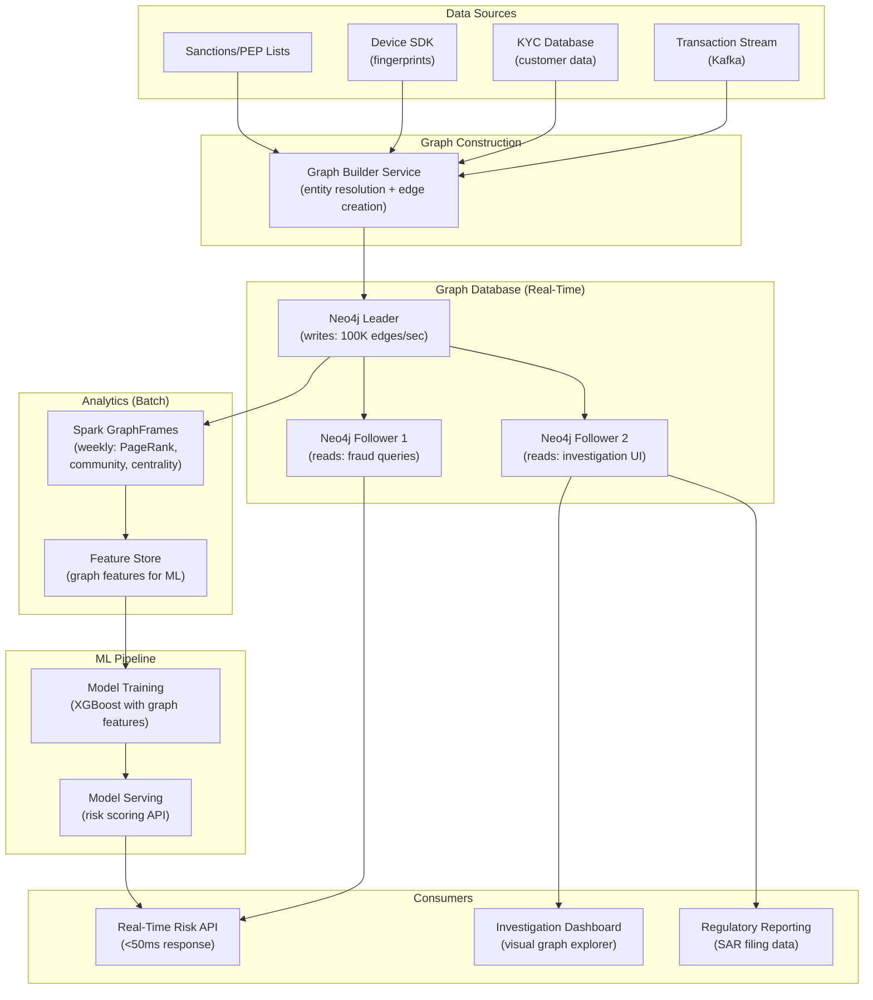

# Fraud Detection Schemas — Real-World Scenarios

> FAANG case studies, production numbers, post-mortems, and deployment topologies.

---

## Case Study 1: PayPal — Graph-Based Fraud Detection at Scale

**Context**: PayPal processes $1.5T+ annually across 400M+ accounts. Fraudsters use networks of fake accounts, shared devices, and money mule chains that are invisible to rule-based systems.

**Architecture**: Hybrid real-time + batch graph fraud detection:

- **Real-time**: TigerGraph for transaction-time traversals (<50ms)
- **Batch**: Weekly community detection, PageRank, and anomaly scoring
- **ML**: Gradient-boosted model with 30+ graph features alongside 200+ non-graph features

**Scale**:

- 400M+ account nodes
- 2B+ device/IP/card nodes
- 10B+ edges (transactions, device links, IP sessions)
- 100K edge mutations per second (real-time)
- Fraud pattern queries: <50ms at P99

**Result**: Graph-based detection catches 30% more fraud than rules alone. Combined with ML, false positive rate reduced by 40%. Annual prevented fraud: estimated $3B.

---

## Case Study 2: HSBC — Anti-Money Laundering Network Analysis

**Context**: HSBC was fined $1.9B in 2012 for AML failures. As part of remediation, they deployed graph-based network analysis to identify money laundering patterns across their global transaction network.

**Architecture**: Entity resolution + transaction graph:

- Nodes: Customers, accounts, beneficial owners, legal entities
- Edges: TRANSACTED_WITH, OWNS, DIRECTS, SHARES_ADDRESS
- Entity resolution: Link customers across jurisdictions using graph-based fuzzy matching
- Pattern detection: Shell company chains, circular fund flows, PEP (Politically Exposed Person) proximity

**Scale**:

- 40M+ customer nodes across 70+ countries
- 500M+ transaction edges per year
- Entity resolution: deduplicated 15% of the customer base (previously double-counted)

**Key finding**: Graph analysis identified £200M in previously undetected suspicious activity by revealing multi-hop money trails that crossed jurisdictional boundaries — patterns that jurisdiction-specific rule engines could never see.

---

## Case Study 3: Amazon — Seller Fraud Detection on the Marketplace

**Context**: Amazon's marketplace hosts millions of third-party sellers. Fraudulent sellers create fake reviews, collude on pricing, and use multiple accounts to game rankings.

**Architecture**: Seller relationship graph:

- Nodes: Sellers, Products, Reviews, Buyer accounts, IP addresses
- Edges: SELLS, REVIEWED_BY, SHARES_WAREHOUSE, LOGGED_IN_FROM
- Pattern: Seller A and Seller B share a warehouse address, bank account, and IP range → same entity evading restrictions

**Scale**:

- 6M+ active seller nodes
- 350M+ product nodes
- Review edges: 1B+
- Community detection identifies seller rings within hours

**Key design**: Amazon uses a two-phase approach:

1. **Batch graph analytics** (daily): Community detection identifies seller clusters with suspicious shared attributes
2. **Human-in-the-loop**: Flagged clusters are reviewed by investigators using a visual graph interface

---

## Case Study 4: Stripe — Device Intelligence Graph

**Context**: Stripe Radar uses a device intelligence graph to score payment risk. When a device (browser/phone) is used across multiple merchants, Stripe can detect patterns of fraud that individual merchants cannot see.

**Architecture**: Cross-merchant device graph:

- Nodes: Devices, Cards, Emails, IP addresses
- Edges: USED_DEVICE, USED_CARD, USED_EMAIL, USED_IP
- Feature extraction: For each payment, check if the device/card/email has been associated with chargebacks at other merchants

**Scale**:

- Processing for millions of merchants globally
- Device fingerprints: 1B+ nodes
- Cross-merchant fraud detection: <100ms per transaction
- Catches patterns invisible to any single merchant

**Result**: Stripe Radar blocks $billions in fraudulent transactions annually. The network effect (data from all merchants) means Stripe's fraud detection improves as the network grows.

---

## What Went Wrong — Post-Mortem: False Positive Storm

**Incident**: A bank's graph-based fraud system flagged 50,000 accounts as suspicious in a single batch run, triggering 50,000 fraud investigation cases. The compliance team was overwhelmed — actual fraud rate in the flagged accounts was <0.1%.

**Root cause**: The batch community detection algorithm (Louvain) was run with default parameters on an updated graph that included a marketing referral campaign event. The campaign created a burst of legitimate `REFERRED_BY` edges between 200,000 accounts. The community detection algorithm treated the referral cluster as a suspicious fraud ring because of its dense connectivity.

**Timeline**:

1. **Day 1**: Marketing launches referral campaign → 200K new REFERRED_BY edges
2. **Day 2**: Weekly batch community detection runs → identifies 50K accounts in dense community
3. **Day 3**: 50K fraud alerts generated → compliance team buried
4. **Day 5**: Investigation reveals <50 actual fraud cases in the cluster

**Fix**:

1. **Immediate**: Filter community detection to exclude known-legitimate edge types (REFERRED_BY, MARKETING_OPT_IN)
2. **Short-term**: Add a scoring layer between community detection and alert generation — communities need a minimum risk signal (e.g., ≥1 member previously flagged) to trigger alerts
3. **Long-term**: Implement feedback loop — investigators mark false positives, which tunes the detection threshold

**Prevention**: Never run graph algorithms on unfiltered edge sets. Edge type filtering is mandatory. Community detection without context produces noise, not signal.

---

## Deployment Topology — Fraud Graph Platform

**Infrastructure**:

| Component | Specification |
|---|---|
| Neo4j | 3-node causal cluster, 512GB RAM per node, 4TB NVMe, 100K writes/sec |
| Kafka | 12 brokers, `fraud.transactions` topic, <500ms end-to-end |
| Spark | 100 executors, weekly batch: 4 hours for full graph analytics |
| ML Model | XGBoost, 250 features (30 graph + 220 non-graph), retrained weekly |
| Risk API | 12 pods, <50ms P99, circuit breaker on graph timeouts |
