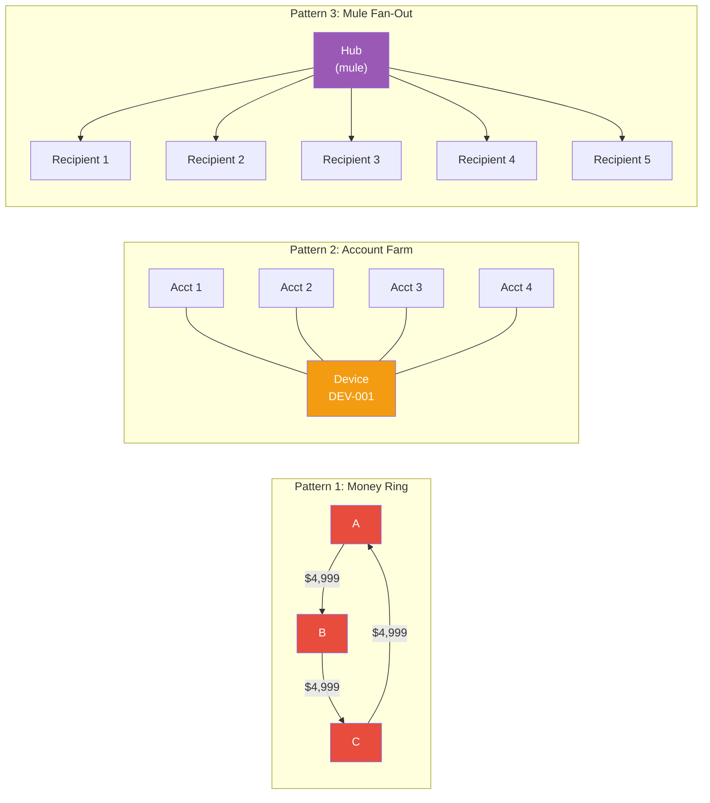

# Fraud Detection Schemas — Interview Angle

> How this appears in Principal-level interviews, sample questions, and what they're really testing.

---

## How This Appears

Fraud detection graph schemas appear in **system design** interviews for financial services, payments, and marketplace companies. The interviewer presents a scenario where coordinated fraud is the challenge — not just individual bad transactions:

- "Design a fraud detection system for a payments platform"
- "How would you detect money laundering in a global transaction network?"
- "Design the data architecture for a marketplace seller fraud system"

If you describe only rules (thresholds, blacklists) or only ML (feature engineering from transaction attributes), you're missing the network dimension. A Principal candidate identifies that coordinated fraud is a graph problem.

---

## Sample Questions

### Question 1: "Design a fraud detection system for a payment platform processing 10M transactions/day"

**Weak answer (Senior)**:
> "I'd build rules for amount thresholds, velocity checks, and geographic anomalies. Then train an ML model on historical fraud labels."

**Strong answer (Principal)**:
> "Fraud detection needs three layers, not one:
>
> **Layer 1 — Rules (milliseconds)**: Threshold alerts, velocity checks, blacklist matching. These catch the obvious 40% of fraud with near-zero latency.
>
> **Layer 2 — Graph (15-50ms)**: Model the transaction network as a property graph. Nodes = accounts, devices, IPs, cards. Edges = transactions, device ownership, login sessions. At transaction time, do a 2-3 hop traversal from the sender to check:
>
> - Is this account connected to a flagged account within 3 hops?
> - Does this account share a device with accounts created in the last 7 days?
> - Is this transaction part of a cycle (A→B→C→A)?
>
> **Layer 3 — ML (20-50ms)**: Combine rule features + graph features + behavioral features into a gradient-boosted model. Graph features include degree centrality, betweenness, community risk score, and distance to nearest known fraud.
>
> The total latency budget is <100ms (within the payment authorization window). If the graph layer is slow (super node problem), fall back to cached graph features via circuit breaker.
>
> Weekly batch: Run community detection (Louvain) and PageRank on the full graph. Update account-level graph features in the feature store. Retrain the ML model with investigation outcomes as labels."

**What they're really testing**: Do you know that fraud detection is multi-layered? Do you understand the latency constraint for real-time scoring? Can you articulate graph-specific detection patterns?

---

### Question 2: "How would you detect money laundering rings in transaction data?"

**Weak answer (Senior)**:
> "I'd look for large transactions or transactions to/from sanctioned countries."

**Strong answer (Principal)**:
> "Money laundering has three phases — placement, layering, extraction — and the layering phase is inherently a graph pattern: money flows through intermediary accounts to obscure its origin.
>
> The graph detection approach:
>
> 1. **Cycle detection**: Find paths where money flows A→B→C→...→A. In Cypher: `MATCH (a)-[:TRANSACTED_WITH*3..6]->(a)`. Cycles of 3-6 hops within a 30-day window are the strongest signal.
> 2. **Fan-out detection**: One account sending to 10+ new recipients in 24 hours — classic mule network pattern.
> 3. **Structuring detection**: Multiple transactions just below reporting thresholds ($10K in the US) from related accounts (shared device, IP, or phone).
>
> The critical insight: individual transactions in a laundering chain look normal. The structural pattern (cycle, fan-out) is what reveals the fraud. This is why graph analysis finds 30-40% more AML activity than transaction-level monitoring alone.
>
> Implementation: I'd run cycle detection as a batch job (weekly, on the full transaction graph) rather than real-time, because cycle detection is computationally expensive (potentially O(n!) in dense graphs). The batch results flag accounts for real-time scoring (proximity-to-cycle feature)."

**What they're really testing**: Do you understand the phases of money laundering? Can you map them to graph patterns? Do you know the computational trade-off between real-time and batch?

---

### Question 3: "Your fraud detection graph has a high false positive rate. How do you fix it?"

**Weak answer (Senior)**:
> "Tune the thresholds to be less sensitive."

**Strong answer (Principal)**:
> "High false positives in graph-based fraud detection usually come from three sources:
>
> 1. **Unfiltered community detection**: If the algorithm runs on all edge types (including referrals, marketing campaigns, legitimate co-browsing), it produces dense communities that aren't fraudulent. Fix: filter to only fraud-relevant edge types (TRANSACTED_WITH, OWNS_DEVICE) before running community detection.
>
> 2. **No context scoring**: Communities flagged purely by connectivity (high density = suspicious) without risk signals. Fix: require at least one risk indicator within the community — a flagged account, a sanctioned IP, or an anomalous transaction pattern — before generating an alert.
>
> 3. **No feedback loop**: If investigation outcomes (true/false positive) don't feed back into the model, it never learns. Fix: investigators label each case; retrain weekly with these labels; track precision/recall as KPIs.
>
> I'd also implement an alert scoring layer between detection and case creation. Not all flagged communities get alerts — only those exceeding a combined risk threshold. This reduces volume while maintaining recall."

**What they're really testing**: Can you diagnose false positive root causes? Do you understand the importance of feedback loops in ML/graph systems?

---

### Question 4: "How would you handle a super node in a fraud graph — an account with 5M edges?"

**Weak answer (Senior)**:
> "Add more resources to the graph database."

**Strong answer (Principal)**:
> "A super node in a fraud graph is almost always a legitimate entity — a major merchant, a payroll processor, or a government benefit distributer. The problem is that traversing through it during real-time scoring creates a combinatorial explosion.
>
> My approach:
>
> 1. **Identify and label super nodes**: Monitor degree distribution. Any node with >100K edges is a super node. Tag it in the graph: `SET n.is_super_node = true`.
>
> 2. **Bypass in real-time traversal**: During real-time scoring, skip super nodes in the traversal. A legitimate merchant being 2 hops from a fraud account is not meaningful — it's 2 hops from everything.
>
> 3. **Pre-compute features for super nodes**: Instead of traversing at query time, pre-compute graph features for super node neighborhoods in batch and serve from cache.
>
> 4. **Edge sampling**: For batch analytics (PageRank, community detection), sample edges from super nodes (e.g., keep 10K most recent edges) rather than processing all 5M.
>
> The key insight: super nodes are noise in fraud detection, not signal. A node connected to 5M other nodes has near-zero information value for fraud proximity — it's connected to everyone."

---

## Follow-Up Questions

| After Question... | Follow-Up | What They're Probing |
|---|---|---|
| Q1 (System design) | "How do you handle the chicken-and-egg problem — no fraud labels to train the initial model?" | Unsupervised graph anomaly detection first, then supervised refinement |
| Q2 (Money laundering) | "What about privacy — can you legally traverse customer data across jurisdictions?" | GDPR/privacy constraints on cross-border data sharing — federated graph approach |
| Q3 (False positives) | "What precision/recall target would you set?" | Fraud: recall >90%, precision >30% is typical — better to review 3 false positives than miss 1 fraud |
| Q4 (Super nodes) | "What if the super node IS the fraud — a mule hub receiving from 5M accounts?" | Unusual for mule hubs to reach 5M — but degree velocity (growth rate) is the signal, not absolute degree |

---

## Whiteboard Exercise — Draw in 5 Minutes

**Draw**: A fraud detection graph with three pattern types:

**Key points to call out**:

- Ring: Cycle detection via graph traversal — invisible in tabular data
- Farm: Shared device node connects unrelated accounts — impossible to detect without graph
- Fan-out: Hub sends to many new recipients — high out-degree + new edges = mule signal
