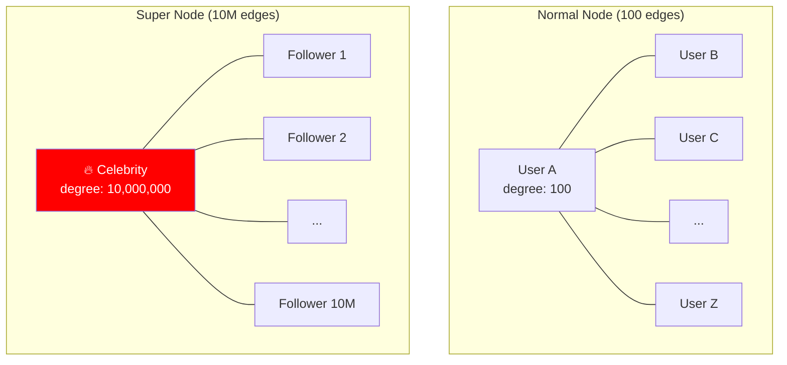

# Super Nodes — How It Works, Mitigation, War Stories, Pitfalls, Interview, References

---

## The Problem Visualized



## Mitigation Strategy 1: Partitioning the Super Node

Split the super node into multiple sub-nodes connected by a meta-relationship:

```cypher
// BEFORE: one celebrity node with 10M follower edges
(:Celebrity {name:"Taylor Swift"})-[:FOLLOWED_BY]->(:Fan) × 10,000,000

// AFTER: partition by follower region
(:Celebrity {name:"Taylor Swift"})-[:HAS_PARTITION]->(:CelebPartition {region:"US"})
(:CelebPartition {region:"US"})-[:FOLLOWED_BY]->(:Fan) × 3,000,000
(:CelebPartition {region:"EU"})-[:FOLLOWED_BY]->(:Fan) × 2,500,000
(:CelebPartition {region:"APAC"})-[:FOLLOWED_BY]->(:Fan) × 2,000,000
// ...

// Query fans from US only — touches 3M edges instead of 10M
MATCH (:Celebrity {name:"Taylor Swift"})-[:HAS_PARTITION]->(p:CelebPartition {region:"US"})
      -[:FOLLOWED_BY]->(fan:Fan)
RETURN fan.name LIMIT 100;
```

## Mitigation Strategy 2: Capping Traversal Depth + Filtering

```cypher
// BAD: traverse all edges of a super node
MATCH (celeb:Celebrity {name:"Taylor Swift"})-[:FOLLOWED_BY]->(fan)
RETURN fan.name;  // 10M results, minutes to execute

// GOOD: limit + filter by edge property
MATCH (celeb:Celebrity {name:"Taylor Swift"})-[f:FOLLOWED_BY]->(fan)
WHERE f.since > date('2025-01-01')  // only recent followers
RETURN fan.name
LIMIT 1000;  // cap results
```

## Mitigation Strategy 3: Pre-Computed Aggregates

```cypher
// Instead of traversing 10M edges to COUNT followers:
// Store the count as a property on the node
MATCH (c:Celebrity)
SET c.follower_count = SIZE(()-[:FOLLOWED_BY]->(c))

// Now: O(1) lookup instead of O(10M) traversal
MATCH (c:Celebrity {name:"Taylor Swift"})
RETURN c.follower_count;
```

## Detection: Finding Super Nodes

```cypher
// Identify super nodes in your graph
MATCH (n)
WITH n, SIZE(()-[]->(n)) + SIZE((n)-[]->()) AS degree
WHERE degree > 100000  // threshold
RETURN labels(n), n.name, degree
ORDER BY degree DESC
LIMIT 20;
```

## War Story: Twitter — Timeline Fanout

Twitter's "timeline fanout" problem is the canonical super node challenge:

- When a celebrity with 100M followers tweets, the system must deliver that tweet to 100M timelines
- **Fan-out-on-write**: Write the tweet to all 100M follower timelines at post time (slow write, fast read)
- **Fan-out-on-read**: Store the tweet once, merge celebrity tweets into the timeline at read time (fast write, slow read)
- Twitter uses a **hybrid**: fan-out-on-write for normal users, fan-out-on-read for celebrities (super nodes)

## War Story: Fraud Graph — Shared WiFi as Super Node

A fintech fraud graph connected accounts by shared IP addresses. A single Starbucks WiFi IP connected 500K accounts — creating a super node that made every fraud query traverse 500K edges. The fix:

1. Maintain a "known public IP" blocklist
2. Don't create edges for IPs with degree > 10K
3. Use IP-based connections only as supplementary signal, not primary

## Pitfalls

| Pitfall | Fix |
|---|---|
| Not knowing which nodes are super nodes | Run degree distribution analysis regularly |
| Treating all edges equally in traversal | Filter by edge properties (timestamp, weight) to reduce fan-out |
| Partitioning too aggressively (100 sub-nodes for a 10K-edge node) | Only partition when degree > 100K. Below that, normal traversal is fine |
| Using COUNT(edges) by traversal instead of cached property | Pre-compute and cache degree as a node property, update incrementally |

## Interview

### Q: "Your graph query is timing out. What do you investigate first?"

**Strong Answer**: "Super nodes. I'd run a degree distribution query to find nodes with degree > 100K. If a query traverses through a super node, I have several mitigations: (1) partition the super node by a meaningful attribute (region, time bucket), (2) filter edges by properties to reduce fan-out, (3) set a traversal depth limit, (4) for count queries, use pre-computed aggregates stored as node properties. If the super node is a shared public IP or a generic category, I'd consider not creating that edge at all."

## References

| Resource | Link |
|---|---|
| [Neo4j Super Node Documentation](https://neo4j.com/developer/kb/understanding-super-node-performance/) | Official performance guidance |
| *Graph Databases* 2nd Ed. | Ch. 8: Performance optimization |
| [Twitter timeline engineering](https://blog.twitter.com/engineering/en_us/topics/infrastructure) | Fan-out architecture |
| Cross-ref: Property Graphs | [../01_Property_Graphs](../01_Property_Graphs/) — index-free adjacency fundamentals |
| Cross-ref: Fraud Schemas | [../02_Fraud_Detection_Schemas](../02_Fraud_Detection_Schemas/) — super nodes in fraud graphs |
