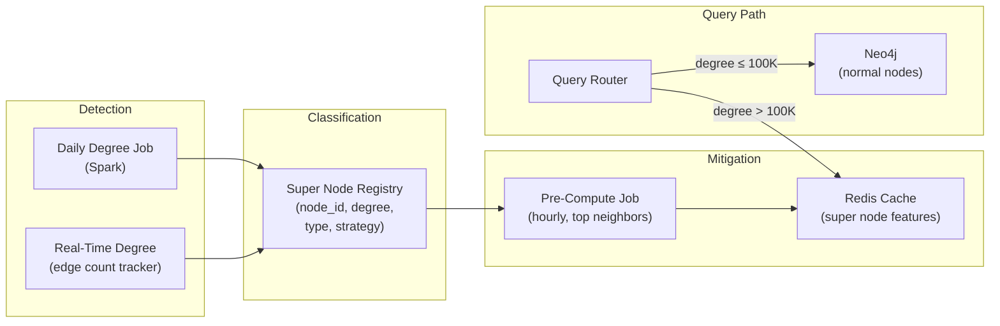

# Super Nodes — Hands-On Examples

> Production-grade Cypher, monitoring queries, and mitigation implementations.

---

## Detecting Super Nodes

### Cypher: Find All Super Nodes

```cypher
// ============================================================
// Identify super nodes — nodes with degree > 100K
// ============================================================

MATCH (n)-[r]-()
WITH n, labels(n) AS labels, COUNT(r) AS degree
WHERE degree > 100000
RETURN labels, 
       n.name AS name, 
       n.account_id AS id,
       degree
ORDER BY degree DESC
LIMIT 50;
```

### Cypher: Degree Distribution Analysis

```cypher
// ============================================================
// Degree distribution — find the power-law shape
// ============================================================

MATCH (n:Account)-[r]-()
WITH n, COUNT(r) AS degree
RETURN 
    CASE 
        WHEN degree <= 10 THEN '1-10'
        WHEN degree <= 100 THEN '11-100'
        WHEN degree <= 1000 THEN '101-1K'
        WHEN degree <= 10000 THEN '1K-10K'
        WHEN degree <= 100000 THEN '10K-100K'
        WHEN degree <= 1000000 THEN '100K-1M'
        ELSE '1M+'
    END AS degree_bucket,
    COUNT(n) AS node_count,
    MIN(degree) AS min_degree,
    MAX(degree) AS max_degree,
    AVG(degree) AS avg_degree
ORDER BY min_degree;
```

### Monitoring Query: Super Node Growth Alert

```cypher
// ============================================================
// Track degree growth rate — catch emerging super nodes
// ============================================================

// Run daily, compare to yesterday's snapshot
MATCH (n)-[r]-()
WHERE r.created_at >= datetime() - duration('P1D')
WITH n, COUNT(r) AS new_edges_today
WHERE new_edges_today > 10000  // >10K new edges in one day
MATCH (n)-[all_r]-()
WITH n, new_edges_today, COUNT(all_r) AS total_degree
RETURN labels(n) AS labels,
       n.name AS name,
       total_degree,
       new_edges_today,
       toFloat(new_edges_today) / total_degree * 100 AS growth_pct_today
ORDER BY new_edges_today DESC;
```

---

## Mitigation Implementation

### Strategy 1: Pre-Computed Cache for Super Node Neighborhoods

```python
import redis
import json
from neo4j import GraphDatabase

r = redis.Redis(host='localhost', port=6379, db=0)
driver = GraphDatabase.driver("bolt://localhost:7687", auth=("neo4j", "password"))

def precompute_super_node_features(node_id: int, ttl_seconds: int = 3600):
    """
    Pre-compute and cache features for a super node.
    Run hourly via Airflow/scheduler.
    """
    with driver.session() as session:
        # Pre-compute: top 100 most connected neighbors
        result = session.run("""
            MATCH (n {account_id: $node_id})-[r]->(neighbor)
            WITH neighbor, COUNT(r) AS edge_count
            ORDER BY edge_count DESC
            LIMIT 100
            RETURN neighbor.account_id AS id, 
                   neighbor.name AS name, 
                   edge_count
        """, node_id=node_id)
        
        top_neighbors = [dict(record) for record in result]
        
        # Pre-compute: degree by edge type
        result = session.run("""
            MATCH (n {account_id: $node_id})-[r]-()
            RETURN type(r) AS edge_type, COUNT(r) AS count
            ORDER BY count DESC
        """, node_id=node_id)
        
        edge_distribution = {record["edge_type"]: record["count"] for record in result}
        
        # Cache in Redis
        cache_key = f"super_node:{node_id}"
        cache_value = {
            "top_neighbors": top_neighbors,
            "edge_distribution": edge_distribution,
            "total_degree": sum(edge_distribution.values()),
            "computed_at": str(datetime.utcnow())
        }
        r.setex(cache_key, ttl_seconds, json.dumps(cache_value))
        
        return cache_value

def get_super_node_features(node_id: int):
    """
    Get features for a super node — cache first, graph fallback.
    """
    cache_key = f"super_node:{node_id}"
    cached = r.get(cache_key)
    if cached:
        return json.loads(cached)
    else:
        # Cache miss: compute and cache
        return precompute_super_node_features(node_id)
```

### Strategy 2: Degree-Aware Query Router

```python
class GraphQueryRouter:
    """
    Routes graph queries based on node degree.
    Super nodes → cache. Normal nodes → live traversal.
    """
    
    SUPER_NODE_THRESHOLD = 100_000
    
    def __init__(self, neo4j_driver, redis_client):
        self.driver = neo4j_driver
        self.redis = redis_client
    
    def get_degree(self, node_id: int) -> int:
        """
        Get node degree. Cached in Redis for 5 minutes.
        """
        cache_key = f"degree:{node_id}"
        cached = self.redis.get(cache_key)
        if cached:
            return int(cached)
        
        with self.driver.session() as session:
            result = session.run(
                "MATCH (n {account_id: $id})-[r]-() RETURN COUNT(r) AS degree",
                id=node_id
            )
            degree = result.single()["degree"]
            self.redis.setex(cache_key, 300, str(degree))
            return degree
    
    def find_neighbors(self, node_id: int, limit: int = 100):
        """Find neighbors with super node awareness."""
        degree = self.get_degree(node_id)
        
        if degree > self.SUPER_NODE_THRESHOLD:
            # Super node: return cached top neighbors
            return self._from_cache(node_id, limit)
        else:
            # Normal node: live traversal
            return self._from_graph(node_id, limit)
    
    def _from_cache(self, node_id, limit):
        features = get_super_node_features(node_id)
        return features["top_neighbors"][:limit]
    
    def _from_graph(self, node_id, limit):
        with self.driver.session() as session:
            result = session.run("""
                MATCH (n {account_id: $id})-[:KNOWS]->(neighbor)
                RETURN neighbor.account_id AS id, neighbor.name AS name
                LIMIT $limit
            """, id=node_id, limit=limit)
            return [dict(r) for r in result]
```

---

## Before vs After — Handling Super Node Queries

### ❌ Before: Naive Traversal (Timeout)

```cypher
// BAD: Unbounded traversal through celebrity with 10M followers
MATCH (me:User {id: 42})-[:FOLLOWS]->(celeb)-[:FOLLOWS]->(others)
WHERE celeb.name = 'Taylor Swift'
RETURN DISTINCT others.name LIMIT 50;

// Query plan: Expand ALL 10M FOLLOWS edges from celeb,
// then filter. Estimated: 10M × 150 = 1.5B potential paths.
// Result: TIMEOUT after 30 seconds. 
```

### ✅ After: Degree-Aware with Intermediate Limit

```cypher
// GOOD: Limit intermediate expansion
MATCH (me:User {id: 42})-[:FOLLOWS]->(celeb:User {name: 'Taylor Swift'})

// First check: is celeb a super node?
WITH me, celeb
CALL {
    WITH celeb
    MATCH (celeb)-[r:FOLLOWS]->()
    RETURN COUNT(r) AS celeb_degree
}

// Route based on degree
WITH me, celeb, celeb_degree
CALL {
    WITH me, celeb, celeb_degree
    // If super node: sample 1000 followers
    WITH me, celeb WHERE celeb_degree > 100000
    MATCH (celeb)-[:FOLLOWS]->(f)
    WITH f, rand() AS r
    ORDER BY r LIMIT 1000
    MATCH (f)-[:FOLLOWS]->(fof)
    WHERE fof <> me AND fof <> celeb
    RETURN DISTINCT fof.name AS name LIMIT 50
    
    UNION
    
    WITH me, celeb WHERE celeb_degree <= 100000
    MATCH (celeb)-[:FOLLOWS]->(f)-[:FOLLOWS]->(fof)
    WHERE fof <> me AND fof <> celeb
    RETURN DISTINCT fof.name AS name LIMIT 50
}
RETURN name;
// Super nodes: samples 1000 followers, then expands. Total: ~150K nodes.
// Normal nodes: full traversal.
```

---

## PySpark — Graph Analytics with Super Node Handling

```python
from pyspark.sql import SparkSession
from pyspark.sql import functions as F
from graphframes import GraphFrame

spark = SparkSession.builder.appName("super_node_analysis").getOrCreate()

# Load graph
nodes = spark.read.parquet("/data/graph/nodes")
edges = spark.read.parquet("/data/graph/edges")
g = GraphFrame(nodes, edges)

# 1. Identify super nodes
degrees = g.degrees
super_nodes = degrees.filter(F.col("degree") > 100000)
print(f"Super nodes: {super_nodes.count()}")
super_nodes.orderBy(F.desc("degree")).show(20)

# 2. PageRank WITH super node handling
# Option A: Remove super nodes from graph before PageRank
super_node_ids = super_nodes.select("id").collect()
super_set = {row.id for row in super_node_ids}

filtered_edges = edges.filter(
    ~F.col("src").isin(super_set) & ~F.col("dst").isin(super_set)
)
g_filtered = GraphFrame(nodes, filtered_edges)
pr = g_filtered.pageRank(resetProbability=0.15, maxIter=10)

# Option B: Edge sampling for super nodes
from pyspark.sql.window import Window

# Sample 10K edges per super node
w = Window.partitionBy("src").orderBy(F.rand())
sampled_edges = edges.withColumn("rn", F.row_number().over(w)) \
    .filter(
        (F.col("rn") <= 10000) | ~F.col("src").isin(super_set)
    ) \
    .drop("rn")

g_sampled = GraphFrame(nodes, sampled_edges)
pr_sampled = g_sampled.pageRank(resetProbability=0.15, maxIter=10)
```

---

## Integration Diagram — Super Node Management in Production


