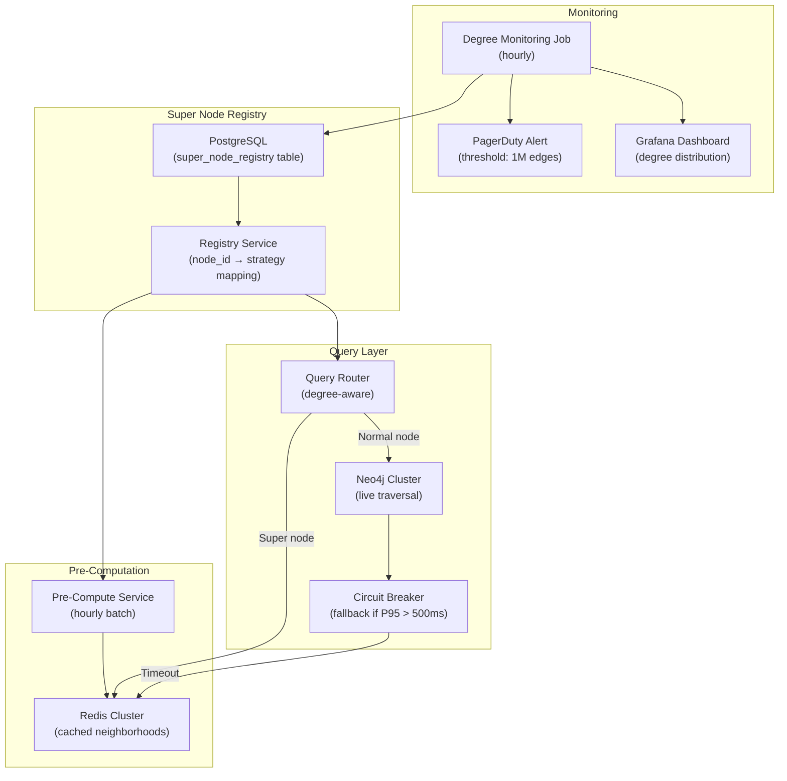

# Super Nodes — Real-World Scenarios

> FAANG case studies, production numbers, post-mortems, and deployment topologies.

---

## Case Study 1: Twitter/X — Celebrity Follower Graphs

**Context**: Twitter's social graph has extreme degree asymmetry. The average user has ~700 followers. Celebrities like Barack Obama have 130M+ followers. Any graph query touching a celebrity node must handle this 200,000× degree difference.

**Architecture**: Twitter doesn't use a traditional graph database for follower lookups. They use:

- **FlockDB**: A distributed graph database designed specifically for adjacency list lookups (not traversals). Optimized for "who follows X" and "does A follow B" — not multi-hop traversals.
- **Pre-computed feeds**: "What did people I follow post?" is a fan-out-on-write problem, not a graph traversal. New tweets are pushed to followers' timelines by a fan-out service.

**Scale**:

- 500M+ user nodes
- 100B+ follow edges
- Celebrity nodes: >10M followers each for top accounts
- "Does A follow B?" latency: <5ms
- Fan-out for celebrity tweet: 130M timeline updates, processed asynchronously (not real-time graph traversal)

**Key lesson**: Twitter solved the super node problem by not traversing through super nodes at all. They pre-compute the result (fan-out-on-write) rather than computing it at query time (fan-out-on-read).

---

## Case Study 2: LinkedIn — PYMK with High-Degree Members

**Context**: LinkedIn's "People You May Know" feature requires 2-3 hop traversals from the current user. Members who are "open networkers" (LIONs) connect with everyone — some have 30,000+ connections. These nodes dominate PYMK calculations.

**Architecture**: LinkedIn uses a tiered approach:

- **Normal members** (degree <5K): Full 2-hop traversal for PYMK
- **High-degree members** (degree 5K-50K): Sampled traversal — follow 1,000 random connections instead of all
- **Ultra-high-degree** (degree >50K): Exclude from intermediate traversal — directly connected to too many people, their recommendations would dominate everyone's PYMK

**Scale**:

- 900M+ member nodes, 15B+ edges
- High-degree members: ~0.1% of users, but contribute to ~30% of traversal cost
- PYMK query with super node handling: <200ms at P95
- PYMK query without handling: P95 = 3+ seconds (unacceptable)

**Key design**: LinkedIn's system tags each node with a degree tier. The traversal engine checks the tier before expanding edges and applies the appropriate strategy (full, sampled, or skip).

---

## Case Study 3: Neo4j — Enterprise Customer Resolution

**Context**: A major bank used Neo4j for customer entity resolution — linking customer records across systems. The "United States" country node was connected to 50M+ customer nodes. Any query involving country (e.g., "find customers in the US who share a phone number") traversed the US super node.

**Architecture changes**:

1. **Before**: All customers linked to `:Country {name: "United States"}` via `:LOCATED_IN`. Queries like `MATCH (c1:Customer)-[:LOCATED_IN]->(:Country)<-[:LOCATED_IN]-(c2:Customer) WHERE c1.phone = c2.phone` traversed 50M edges × 2.
2. **After**: Removed the Country node. Added `country` as a property on Customer nodes. Same-country queries now filter by property, not graph traversal.

**Result**: Query time for same-country deduplication went from timeout (>60s) to <2 seconds. Storage reduced by removing 50M edges.

**Key lesson**: Not everything should be a node. If an entity is connected to >10% of the graph, it's a dimension attribute, not a graph entity. Make it a property.

---

## Case Study 4: Uber — Super Nodes in the Routing Graph

**Context**: Uber's road network graph has intersection nodes with varying degree. Most intersections connect 2-4 roads. But major freeway interchanges connect 20+ road segments, and city center intersections handle hundreds of connection types (lanes, turn restrictions, transit stops).

**Architecture**: Contraction Hierarchies algorithm:

- Pre-process the graph by contracting low-importance nodes (degree 2-3 intersections on residential streets)
- Super nodes (major interchanges) remain as "shortcut" nodes in the hierarchy
- Routing queries traverse the hierarchy, hitting super nodes for long-distance routing and expanding to detail for local streets

**Scale**:

- 500M+ intersection nodes globally
- 1B+ road segment edges
- Major interchanges: degree 20-200 (not extreme, but query-time critical)
- Route calculation with contraction hierarchies: <50ms vs. 500ms+ with naive Dijkstra

---

## What Went Wrong — Post-Mortem: Cascading Timeout from Super Node

**Incident**: A social platform's "mutual friends" API started returning 503 errors for 15% of users. P99 latency jumped from 200ms to 30s+. The graph database cluster's connection pool was exhausted.

**Root cause**: A viral campaign caused a brand account's follower count to jump from 500K to 8M in 48 hours. The "mutual friends" feature computed `(user)-[:FOLLOWS]->(:BrandAccount)<-[:FOLLOWS]-(others)` — a 2-hop traversal through the 8M-edge super node. Every request involving this brand triggered an 8M-edge expansion.

**Timeline**:

1. **Hour 0**: Brand account reaches 8M followers via marketing campaign
2. **Hour 1**: Queries involving the brand account start timing out (>30s)
3. **Hour 2**: Connection pool exhaustion — timeout queries hold connections
4. **Hour 3**: Cascading failure — all graph queries affected, not just brand-related ones
5. **Hour 6**: Hot fix deployed — brand account tagged as super node, queries bypassed

**Fix**:

1. **Immediate**: Added `is_super_node` flag. Query planner checks flag before traversal.
2. **Short-term**: Implemented degree threshold alert (trigger at 1M edges). Pre-compute neighborhoods for flagged nodes.
3. **Long-term**: Deployed degree-aware query router with circuit breaker. If graph P95 > 500ms, all queries fall back to cached results.

---

## Deployment Topology — Super Node Management Architecture

| Component | Specification |
|---|---|
| Degree monitoring | Spark job, hourly, scans Neo4j degree API |
| Super node registry | PostgreSQL table, ~500 nodes (>100K degree) |
| Pre-compute service | Python, hourly, computes top-100 neighbors, edge distribution |
| Redis cache | 4 nodes, 32GB per node, TTL=1 hour per super node entry |
| Circuit breaker | Resilience4j, trip at P95 > 500ms, half-open after 30s |
