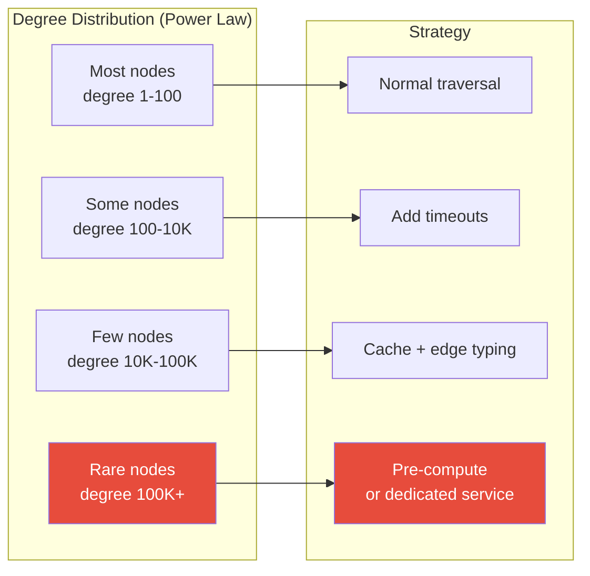

# Super Nodes — Interview Angle

> How this appears in Principal-level interviews, sample questions, and what they're really testing.

---

## How This Appears

Super nodes rarely appear as a direct question. Instead, they emerge as a follow-up to graph-related system design questions:

- "Great, now what happens when one node has 10M edges?"
- "How does this scale when a user has millions of followers?"
- "Your query works for normal users — what about power users?"

This is a **depth probe** — the interviewer wants to see if you've thought about edge cases and failure modes, not just the happy path.

---

## Sample Questions

### Question 1: "You've designed a PYMK feature using 2-hop traversal. A user has 5M connections. What happens?"

**Weak answer (Senior)**:
> "The query might be slow. I'd add caching."

**Strong answer (Principal)**:
> "A 2-hop traversal from a 5M-degree node expands to 5M × average_degree = potentially 750M nodes. This will either OOM the graph database or timeout.
>
> My mitigation strategy, in order of impact:
>
> 1. **Detection**: Tag nodes with degree >100K as super nodes via a daily monitoring job. Store the classification in a registry.
>
> 2. **Query routing**: Before traversal, check the starting node's degree class. Normal nodes (<100K) → live traversal. Super nodes → cached results.
>
> 3. **For super nodes**: Pre-compute PYMK recommendations hourly. Store top-100 recommendations in Redis. The recommendation quality is slightly stale (1 hour) but the latency is <5ms.
>
> 4. **Edge sampling**: If live traversal is needed for a super node (e.g., for A/B testing the recommendation quality), sample 1,000 random connections and expand only those. The result is approximate but bounded: 1,000 × 150 = 150K nodes = a manageable traversal.
>
> 5. **Circuit breaker**: If Neo4j P95 exceeds 500ms, all queries fall back to cached results — even for normal nodes. This prevents a single super node query from cascading to the entire cluster."

**What they're really testing**: Do you recognize the exponential expansion? Can you design a multi-strategy mitigation? Do you think about cascading failures?

---

### Question 2: "Should a country node exist in a graph? It would be connected to every customer in that country."

**Weak answer (Senior)**:
> "Yes, it's a natural entity. We should model it as a node."

**Strong answer (Principal)**:
> "It depends on whether you traverse through it. If the Country node is only used for display (show the customer's country), make it a property with a property index — no graph traversal needed.
>
> If Country is used for traversal (e.g., 'find customers in the same country who share a phone number'), then it becomes a super node problem. The 'United States' node has 50M+ edges. Traversing through it creates a 50M × 50M Cartesian product — the query will never complete.
>
> **Rule of thumb**: If a node has <100 distinct values and each instance connects to >1% of the graph, it's an attribute, not an entity. Model it as a property.
>
> If you must keep it as a node (e.g., for ontology reasons or knowledge graph consistency), add a property-based pre-filter: first filter by `country` property, then traverse the filtered subset."

---

### Question 3: "How do you run PageRank on a graph with super nodes?"

**Weak answer (Senior)**:
> "Just run PageRank normally. The algorithm handles it."

**Strong answer (Principal)**:
> "Standard PageRank will converge to a result, but it'll be dominated by super nodes and their immediate neighborhoods. The celebrity with 10M followers distributes PageRank to all 10M followers, inflating their scores — the top-20 results become 'people followed by the most popular account' rather than 'most influential people.'
>
> Three approaches:
>
> 1. **Remove super nodes**: Exclude nodes with degree >100K from the PageRank computation. Assign them a fixed score (e.g., 1.0). This lets the rest of the graph surface genuinely interesting nodes.
>
> 2. **Edge sampling**: For super nodes, sample 10K edges instead of using all 10M. This approximates the contribution without computational explosion.
>
> 3. **Personalized PageRank**: Instead of global PageRank, compute PageRank relative to a starting node (personalized). The reset probability prevents distant super nodes from dominating.
>
> In practice, I'd use approach 1 for global rankings and approach 3 for user-specific recommendations."

---

### Question 4: "How did Twitter solve the super node problem for its follower graph?"

**Weak answer (Senior)**:
> "They probably used a very large graph database."

**Strong answer (Principal)**:
> "Twitter didn't try to traverse through celebrity nodes. They designed around it with architecture:
>
> For **reads** ('show my timeline'): Fan-out-on-write. When a celebrity tweets, a background service pushes the tweet to all followers' pre-computed timelines. The user's timeline read is a simple sorted set lookup (Redis/Manhattan), not a graph traversal.
>
> For **adjacency** ('does A follow B?'): FlockDB — a distributed adjacency list store. Each query is a point lookup: `followers[celebrity_id].contains(user_id)`. O(1), not a graph traversal.
>
> For **analytics** ('how many followers does X have?'): Pre-materialized count. Updated asynchronously. Not computed on-the-fly.
>
> The key insight: Twitter doesn't traverse through super nodes. They pre-compute the results using fan-out. The follower graph is a storage structure, not a query target."

---

## Follow-Up Questions

| After Question... | Follow-Up | What They're Probing |
|---|---|---|
| Q1 (PYMK) | "What if the sampled 1,000 connections produce poor recommendations?" | Sampling quality — stratified by relationship strength, not pure random |
| Q2 (Country node) | "What about City nodes with 10K members?" | 10K is borderline — property if traversed through, node if analyzed independently |
| Q3 (PageRank) | "What if super nodes ARE the most important nodes?" | Depends on the definition of 'important' — most connected ≠ most influential |
| Q4 (Twitter) | "What if fan-out-on-write is too slow for a celebrity with 130M followers?" | Hybrid: fan-out-on-write for <100K followers, fan-out-on-read for celebrities (Twitter actually does this) |

---

## Whiteboard Exercise — Draw in 5 Minutes

**Draw**: The degree distribution and mitigation strategy map:

**Key points to call out**:

- Real-world graphs follow power-law distributions — 0.01% of nodes cause 30%+ of query cost
- Detection must be proactive (monitoring), not reactive (incident)
- Strategy escalates with degree: timeout → cache → bypass → dedicated system
