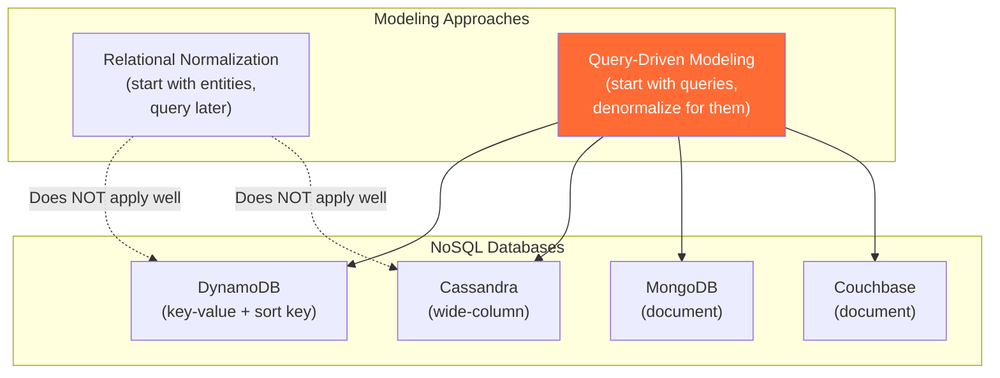

# Query-Driven Modeling — Concept Overview

> What it is, why a Principal Architect must know it, and where it fits in the bigger picture.

---

## Why This Exists

**Origin**: Query-driven modeling (also called access-pattern-driven design) emerged from the NoSQL movement in the late 2000s, formalized by practitioners at Amazon (Dynamo, 2007), Google (Bigtable, 2006), and MongoDB. Unlike relational modeling where you normalize first and query later, NoSQL demands you start with the queries and design the data model to serve them.

**The problem it solves**: Relational normalization optimizes for storage efficiency and write correctness. But at web scale (millions of reads/second, sub-10ms latency), normalized joins become prohibitively expensive. Query-driven modeling flips the process: you enumerate your access patterns first, then design tables/collections/partitions to serve each pattern with a single read — no joins, no cross-partition queries.

**Who formalized it**: Rick Houlihan (AWS) popularized the approach through his DynamoDB single-table design talks. MongoDB's documentation formalizes it as "model data for your application's queries." Apache Cassandra's data modeling guidelines are explicitly query-first.

---

## What Value It Provides

| Dimension | Value |
|---|---|
| **Read latency** | Every read served by a single partition lookup: <5ms at P99 |
| **Horizontal scalability** | Data distributed by partition key — scales linearly with nodes |
| **Predictable performance** | No joins or cross-partition scatter/gather — latency is deterministic |
| **Cost efficiency** | No over-provisioned query compute for join processing |
| **Application alignment** | Data model mirrors API contracts — what you store is what you return |

**Quantified**: Amazon reported that DynamoDB serves single-digit-millisecond reads at any scale because every read is a partition key lookup — no joins, no secondary index scatter. Their retail platform serves 50M+ requests/second at peak with consistent <10ms latency.

---

## Where It Fits

---

## When To Use / When NOT To Use

| Scenario | Query-Driven Modeling? | Why / Why Not |
|---|---|---|
| Known, stable access patterns (API-driven) | ✅ Best fit | Design data model to serve each API endpoint |
| High read throughput (>100K reads/sec) | ✅ Best fit | Partition-key lookups scale horizontally |
| Predictable latency requirements (<10ms) | ✅ Best fit | No joins = deterministic latency |
| Evolving, ad-hoc analytics queries | ❌ Wrong approach | Can't pre-optimize for unknown queries |
| Complex joins across many entities | ❌ Wrong approach | NoSQL doesn't support joins — use relational |
| Regulatory reporting (arbitrary date ranges) | ❌ Poor fit | Report queries change — can't pre-design for all |
| Small dataset (<100K records) | ❌ Overkill | PostgreSQL handles this with no issues |
| Event sourcing (append-only log) | ⚠️ Partial fit | Time-series access is query-driven, but event replay is not |

**Wrong-tool heuristic**: If you can't enumerate your access patterns upfront, query-driven modeling will fail. If access patterns change frequently, every change requires a data model migration.

---

## Key Terminology

| Term | Precise Definition |
|---|---|
| **Access Pattern** | A specific read or write operation the application performs — e.g., "get user by email," "list orders by customer sorted by date" |
| **Partition Key** | The attribute used to distribute data across physical partitions. All items with the same partition key are stored together |
| **Sort Key (Clustering Column)** | The attribute that determines the order of items within a partition. Enables range queries within a partition |
| **Single-Table Design** | A DynamoDB pattern where all entity types share one table, differentiated by partition key and sort key prefixes |
| **Denormalization** | Deliberately duplicating data across multiple items/tables so each access pattern can be served without joins |
| **Write Amplification** | The cost of denormalization — a single logical update may require writing to multiple items/tables |
| **Hot Partition** | A partition receiving disproportionate traffic because the partition key has low cardinality or skewed distribution |
| **GSI (Global Secondary Index)** | A DynamoDB index with a different partition key than the base table — enables alternate access patterns |
| **Materialized View** | In Cassandra, a server-maintained denormalized copy of base table data optimized for a different query |
| **Scatter-Gather** | A query pattern where the coordinator must query multiple partitions and combine results — defeats the purpose of partition-key design |
