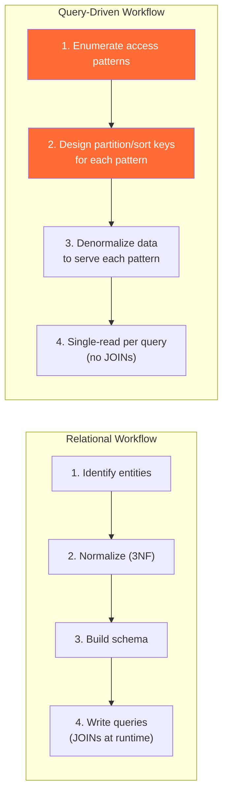
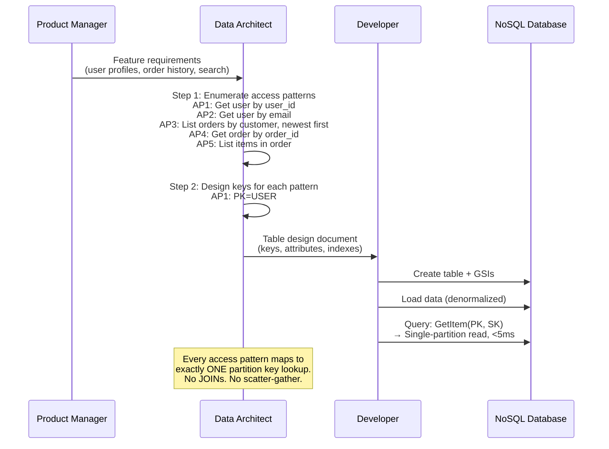
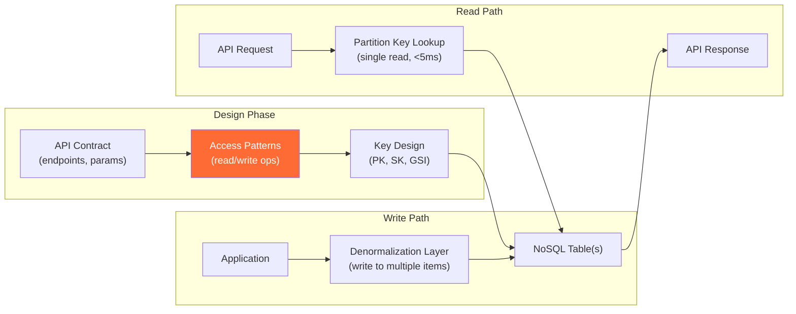
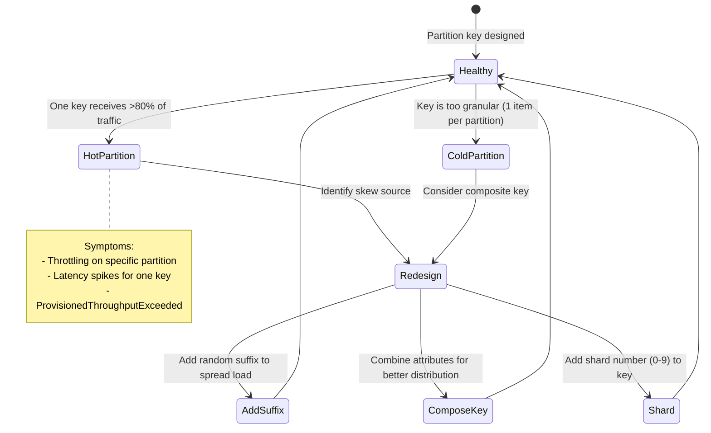

# Query-Driven Modeling — How It Works (Deep Internals)

> HLD, access pattern workflow, partition design, DDL structures, and data flow.

---

## High-Level Design — Query-Driven vs Relational Workflow



---

## Sequence Diagram — Access Pattern Design Process



---

## ER Diagram — Single-Table Design (DynamoDB)

```mermaid
erDiagram
    SINGLE_TABLE {
        varchar PK "Partition Key (e.g., USER#123)"
        varchar SK "Sort Key (e.g., PROFILE, ORDER#ts)"
        varchar GSI1PK "Global Secondary Index 1 PK"
        varchar GSI1SK "GSI1 Sort Key"
        varchar entity_type "USER, ORDER, ITEM"
        jsonb data "Entity-specific attributes"
    }
```

**How it works**: All entities (users, orders, items) live in the same table. The PK and SK prefixes differentiate entity types. Each access pattern maps to a PK lookup with optional SK range.

| Access Pattern | PK | SK | Operation |
|---|---|---|---|
| Get user profile | `USER#123` | `PROFILE` | GetItem |
| Get user by email | GSI1: `email@example.com` | — | Query GSI1 |
| List user's orders | `USER#123` | `ORDER#` (begins_with) | Query, ScanForward=false |
| Get order details | `ORDER#456` | `METADATA` | GetItem |
| List order items | `ORDER#456` | `ITEM#` (begins_with) | Query |

---

## Table Structures

### DynamoDB — Single-Table Design

```python
# ============================================================
# DynamoDB table creation with single-table design
# ============================================================

import boto3

dynamodb = boto3.client('dynamodb')

dynamodb.create_table(
    TableName='ECommerceTable',
    KeySchema=[
        {'AttributeName': 'PK', 'KeyType': 'HASH'},   # Partition key
        {'AttributeName': 'SK', 'KeyType': 'RANGE'},   # Sort key
    ],
    AttributeDefinitions=[
        {'AttributeName': 'PK', 'AttributeType': 'S'},
        {'AttributeName': 'SK', 'AttributeType': 'S'},
        {'AttributeName': 'GSI1PK', 'AttributeType': 'S'},
        {'AttributeName': 'GSI1SK', 'AttributeType': 'S'},
    ],
    GlobalSecondaryIndexes=[
        {
            'IndexName': 'GSI1',
            'KeySchema': [
                {'AttributeName': 'GSI1PK', 'KeyType': 'HASH'},
                {'AttributeName': 'GSI1SK', 'KeyType': 'RANGE'},
            ],
            'Projection': {'ProjectionType': 'ALL'},
        },
    ],
    BillingMode='PAY_PER_REQUEST'
)
```

### Cassandra — One Table Per Query

```sql
-- ============================================================
-- Cassandra: Each access pattern gets its own table
-- Denormalization is expected — same data in multiple tables
-- ============================================================

-- AP1: Get user by user_id
CREATE TABLE users_by_id (
    user_id     UUID PRIMARY KEY,
    email       TEXT,
    name        TEXT,
    created_at  TIMESTAMP,
    status      TEXT
);

-- AP2: Get user by email (different partition key)
CREATE TABLE users_by_email (
    email       TEXT PRIMARY KEY,
    user_id     UUID,
    name        TEXT,
    created_at  TIMESTAMP,
    status      TEXT
);

-- AP3: List orders by customer, newest first
CREATE TABLE orders_by_customer (
    customer_id UUID,
    order_date  TIMESTAMP,
    order_id    UUID,
    total       DECIMAL,
    status      TEXT,
    PRIMARY KEY (customer_id, order_date)
) WITH CLUSTERING ORDER BY (order_date DESC);

-- AP4: Get order details by order_id
CREATE TABLE orders_by_id (
    order_id    UUID PRIMARY KEY,
    customer_id UUID,
    order_date  TIMESTAMP,
    total       DECIMAL,
    status      TEXT,
    items       LIST<FROZEN<order_item>>
);

-- AP5: List items in an order
CREATE TABLE order_items (
    order_id    UUID,
    item_seq    INT,
    product_id  UUID,
    product_name TEXT,
    quantity    INT,
    unit_price  DECIMAL,
    PRIMARY KEY (order_id, item_seq)
);
```

### MongoDB — Document with Compound Indexes

```javascript
// ============================================================
// MongoDB: Documents with embedded data + compound indexes
// ============================================================

// Collection: users
db.users.createIndex({ email: 1 }, { unique: true });
db.users.createIndex({ "address.city": 1, created_at: -1 });

// Document structure (embedding order summary)
{
  _id: ObjectId("..."),
  user_id: "U-123",
  email: "alice@example.com",
  name: "Alice",
  address: { city: "Seattle", state: "WA", zip: "98101" },
  recent_orders: [
    { order_id: "O-456", date: ISODate("2024-03-15"), total: 159.99, status: "DELIVERED" },
    { order_id: "O-457", date: ISODate("2024-03-20"), total: 89.50, status: "SHIPPED" }
  ],
  created_at: ISODate("2023-01-01")
}

// Collection: orders (full detail, separate collection)
db.orders.createIndex({ customer_id: 1, order_date: -1 });
db.orders.createIndex({ order_id: 1 }, { unique: true });
```

---

## Data Flow Diagram — Query-Driven Modeling Pipeline



---

## State Machine — Partition Key Health



---

## Comparison — Access Pattern Mapping Across Databases

| Access Pattern | DynamoDB | Cassandra | MongoDB |
|---|---|---|---|
| Get by primary ID | `GetItem(PK=id)` | `SELECT WHERE id = ?` | `findOne({_id: id})` |
| Get by alternate key | Query GSI | Separate table | Query on indexed field |
| Range within entity | `Query(PK=entity, SK between)` | Clustering column range | Compound index range |
| List sorted | `Query(ScanForward=false)` | `CLUSTERING ORDER BY DESC` | `.sort({field: -1})` |
| Full-text search | Not supported (use OpenSearch) | Not supported (use Solr) | `$text` index or Atlas Search |
| Aggregation | Not supported (use EMR) | Limited (use Spark) | Aggregation pipeline |
