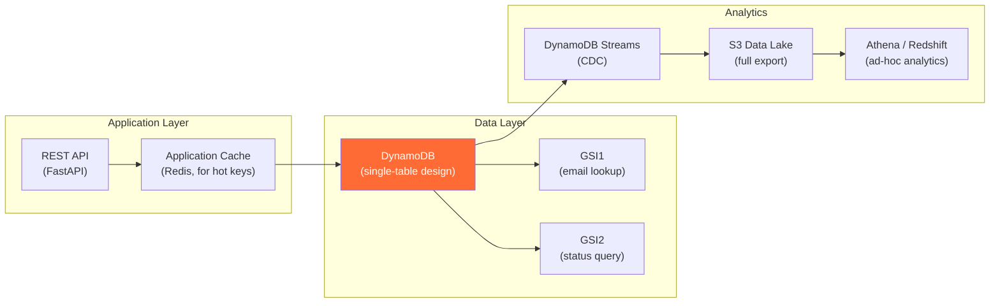

# Query-Driven Modeling — Hands-On Examples

> Production-grade DynamoDB, Cassandra, MongoDB, and application-layer code examples.

---

## DynamoDB — Single-Table Design for E-Commerce

### Access Pattern Table

| # | Access Pattern | PK | SK | Index |
|---|---|---|---|---|
| AP1 | Get user profile | `USER#<userId>` | `PROFILE` | Table |
| AP2 | Get user by email | `<email>` | — | GSI1 |
| AP3 | List orders by user | `USER#<userId>` | `ORDER#<timestamp>` | Table |
| AP4 | Get order by ID | `ORDER#<orderId>` | `METADATA` | Table |
| AP5 | List items in order | `ORDER#<orderId>` | `ITEM#<seq>` | Table |
| AP6 | Orders by status | `STATUS#<status>` | `<timestamp>#<orderId>` | GSI2 |

### Write Operations

```python
import boto3
from datetime import datetime
from decimal import Decimal

dynamodb = boto3.resource('dynamodb')
table = dynamodb.Table('ECommerceTable')

def create_user(user_id: str, email: str, name: str):
    table.put_item(Item={
        'PK': f'USER#{user_id}',
        'SK': 'PROFILE',
        'GSI1PK': email,
        'entity_type': 'USER',
        'user_id': user_id,
        'email': email,
        'name': name,
        'created_at': datetime.utcnow().isoformat(),
    })

def create_order(order_id: str, customer_id: str, items: list, total: float):
    timestamp = datetime.utcnow().isoformat()
    
    with table.batch_writer() as batch:
        # Order metadata (AP4)
        batch.put_item(Item={
            'PK': f'ORDER#{order_id}',
            'SK': 'METADATA',
            'entity_type': 'ORDER',
            'order_id': order_id,
            'customer_id': customer_id,
            'total': Decimal(str(total)),
            'status': 'PLACED',
            'order_date': timestamp,
        })
        
        # Order under customer (AP3: list orders by user)
        batch.put_item(Item={
            'PK': f'USER#{customer_id}',
            'SK': f'ORDER#{timestamp}',
            'entity_type': 'ORDER_SUMMARY',
            'order_id': order_id,
            'total': Decimal(str(total)),
            'status': 'PLACED',
        })
        
        # Order items (AP5)
        for i, item in enumerate(items):
            batch.put_item(Item={
                'PK': f'ORDER#{order_id}',
                'SK': f'ITEM#{i:04d}',
                'entity_type': 'ORDER_ITEM',
                'product_id': item['product_id'],
                'product_name': item['product_name'],
                'quantity': item['quantity'],
                'unit_price': Decimal(str(item['unit_price'])),
            })
        
        # Order by status (AP6 via GSI2)
        batch.put_item(Item={
            'PK': f'ORDER#{order_id}',
            'SK': 'METADATA',
            'GSI2PK': f'STATUS#PLACED',
            'GSI2SK': f'{timestamp}#{order_id}',
        })
```

### Read Operations

```python
from boto3.dynamodb.conditions import Key

def get_user_profile(user_id: str):
    """AP1: Get user by user_id — single GetItem, <5ms"""
    response = table.get_item(Key={
        'PK': f'USER#{user_id}', 
        'SK': 'PROFILE'
    })
    return response.get('Item')

def get_user_by_email(email: str):
    """AP2: Get user by email — GSI1 query"""
    response = table.query(
        IndexName='GSI1',
        KeyConditionExpression=Key('GSI1PK').eq(email)
    )
    return response['Items'][0] if response['Items'] else None

def list_user_orders(user_id: str, limit: int = 20):
    """AP3: List orders by user, newest first"""
    response = table.query(
        KeyConditionExpression=Key('PK').eq(f'USER#{user_id}') & Key('SK').begins_with('ORDER#'),
        ScanIndexForward=False,  # newest first
        Limit=limit
    )
    return response['Items']

def get_order_with_items(order_id: str):
    """AP4 + AP5: Get order metadata + all items in one query"""
    response = table.query(
        KeyConditionExpression=Key('PK').eq(f'ORDER#{order_id}')
    )
    items = response['Items']
    metadata = next((i for i in items if i['SK'] == 'METADATA'), None)
    order_items = [i for i in items if i['SK'].startswith('ITEM#')]
    return {'metadata': metadata, 'items': order_items}
```

---

## Cassandra — One Table Per Query

```python
from cassandra.cluster import Cluster
from cassandra.query import BatchStatement
import uuid
from datetime import datetime

cluster = Cluster(['cassandra-node1', 'cassandra-node2'])
session = cluster.connect('ecommerce')

def create_order_cassandra(customer_id, order_id, total, status, items):
    """
    Write to BOTH tables — denormalization in action.
    Same data written to orders_by_customer AND orders_by_id.
    """
    batch = BatchStatement()
    now = datetime.utcnow()
    
    # Table 1: orders_by_customer (AP3)
    batch.add(session.prepare("""
        INSERT INTO orders_by_customer 
        (customer_id, order_date, order_id, total, status) 
        VALUES (?, ?, ?, ?, ?)
    """), (customer_id, now, order_id, total, status))
    
    # Table 2: orders_by_id (AP4)
    batch.add(session.prepare("""
        INSERT INTO orders_by_id 
        (order_id, customer_id, order_date, total, status) 
        VALUES (?, ?, ?, ?, ?)
    """), (order_id, customer_id, now, total, status))
    
    # Table 3: order_items (AP5) — one insert per item
    for seq, item in enumerate(items):
        batch.add(session.prepare("""
            INSERT INTO order_items 
            (order_id, item_seq, product_id, product_name, quantity, unit_price) 
            VALUES (?, ?, ?, ?, ?, ?)
        """), (order_id, seq, item['product_id'], item['name'], 
               item['quantity'], item['price']))
    
    session.execute(batch)

def list_orders_by_customer(customer_id, limit=20):
    """AP3: Already sorted by order_date DESC (clustering order)"""
    return session.execute(
        "SELECT * FROM orders_by_customer WHERE customer_id = ? LIMIT ?",
        (customer_id, limit)
    )
```

---

## Before vs After — Relational JOINs vs Query-Driven

### ❌ Before: Normalized Relational (3 JOINs)

```sql
-- Get order details with customer and items
-- 3 JOINs, 4 tables
SELECT o.order_id, o.total, o.status,
       c.name AS customer_name, c.email,
       oi.product_name, oi.quantity, oi.unit_price
FROM orders o
JOIN customers c ON o.customer_id = c.customer_id
JOIN order_items oi ON o.order_id = oi.order_id
WHERE o.order_id = 'O-456';
-- Latency: 15-50ms (3 JOINs, index lookups)
-- At scale: JOIN cost grows with table sizes
```

### ✅ After: Query-Driven (Single Partition Read)

```python
# Get order details with items — ONE partition, ONE query
response = table.query(
    KeyConditionExpression=Key('PK').eq('ORDER#O-456')
)
# Returns: METADATA item + ITEM#0001, ITEM#0002, ...
# All in the same partition. No JOIN. No cross-table lookup.
# Latency: 3ms regardless of table size.
```

---

## Integration Diagram — Query-Driven Platform



---

## Runnable Exercise — Build an Access Pattern Map

```markdown
EXERCISE: Design a DynamoDB single-table for a blog platform.

Access Patterns:
  AP1: Get author by author_id
  AP2: List posts by author, newest first
  AP3: Get post by post_id (with comments)
  AP4: List posts by category
  AP5: Get comment by comment_id

Design the PK, SK, and GSI for each AP.

Expected Answer:
| AP | PK | SK | Index |
|---|---|---|---|
| AP1 | AUTHOR#<id> | PROFILE | Table |
| AP2 | AUTHOR#<id> | POST#<timestamp> | Table |
| AP3 | POST#<postId> | begins_with("") | Table |
| AP4 | CATEGORY#<cat> | POST#<timestamp> | GSI1 |
| AP5 | COMMENT#<id> | METADATA | Table |

Post item: PK=POST#<id>, SK=METADATA
Comment item: PK=POST#<id>, SK=COMMENT#<timestamp>#<commentId>
```
