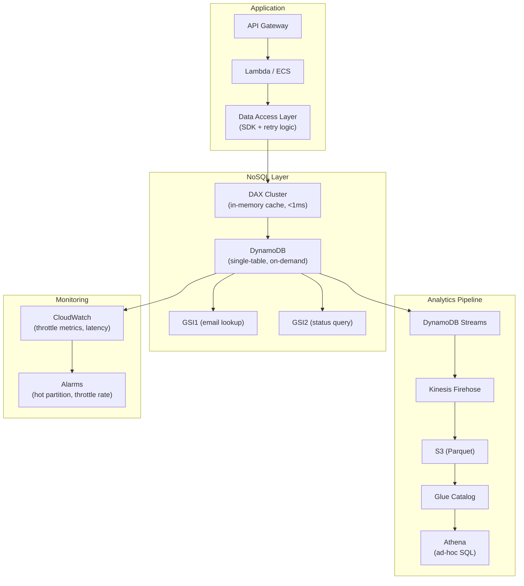

# Query-Driven Modeling — Real-World Scenarios

> FAANG case studies, production numbers, post-mortems, and deployment topologies.

---

## Case Study 1: Amazon — DynamoDB Single-Table for Retail

**Context**: Amazon's retail platform serves product catalog, shopping cart, order management, and customer profiles — all from DynamoDB. At peak (Prime Day), the system handles 50M+ requests/second.

**Architecture**: Single-table design per bounded context:

- **Shopping Cart**: PK = `CART#<customerId>`, SK = `ITEM#<productId>`. One query returns the entire cart.
- **Order History**: PK = `CUSTOMER#<id>`, SK = `ORDER#<timestamp>`. List orders newest-first is a single query.
- **Product Catalog**: PK = `PRODUCT#<id>`, SK = `METADATA` + `REVIEW#<ts>` + `VARIANT#<sku>`. Product page served from one partition.

**Scale**:

- 50M+ requests/second at peak
- P99 read latency: <10ms
- Zero downtime — DynamoDB auto-scales partitions
- No JOINs — every API response served from one table query

**Key design**: Amazon treats DynamoDB tables as materialized API contracts. Each table/GSI maps 1:1 to an API endpoint. If a new API endpoint is needed, they add a GSI or denormalize data into the table.

---

## Case Study 2: Netflix — Cassandra for Personalization

**Context**: Netflix's personalization engine decides which titles to show each of its 230M+ subscribers. User viewing history, ratings, and preferences are stored in Cassandra, modeled around the read patterns of the recommendation engine.

**Architecture**: One table per access pattern:

- `user_viewing_history`: PK = `user_id`, SK = `watch_date DESC`. "What did this user watch recently?"
- `title_ratings_by_user`: PK = `user_id`, SK = `title_id`. "How did this user rate each title?"
- `similar_titles`: PK = `title_id`, SK = `similarity_score DESC`. "What titles are similar?"

**Scale**:

- 230M+ user rows, 100B+ viewing events
- 3,000+ Cassandra nodes across 3 regions
- Write throughput: 1M+ writes/second
- Read latency: <5ms at P99

**Key design**: Netflix accepts massive write amplification (each view event writes to 5+ tables) in exchange for read-optimized access patterns. Every ML model input is a single partition scan.

---

## Case Study 3: Uber — DynamoDB for Trip Data

**Context**: Uber stores trip data (rider, driver, route, timestamps, pricing) in DynamoDB. The trip lifecycle has distinct access patterns: real-time (during trip), historical (trip receipt), and analytical (driver earnings).

**Architecture**:

- **Real-time**: PK = `TRIP#<tripId>`, SK for status updates. Updated every 5 seconds during active trips.
- **Rider history**: PK = `RIDER#<riderId>`, SK = `TRIP#<timestamp>`. Rider's trip list.
- **Driver earnings**: PK = `DRIVER#<driverId>`, SK = `EARNINGS#<weekDate>`. Weekly earnings summary.

**Scale**:

- 25M+ trips/day
- Real-time update latency: <10ms
- Trip history query: <5ms (single partition)

---

## Case Study 4: Discord — Cassandra for Message Storage

**Context**: Discord stores billions of messages across millions of channels. Access pattern: "load last 50 messages in channel" — a time-sorted reverse scan within a channel partition.

**Architecture**: Cassandra with time-bucketed partitions:

- PK = `channel_id + time_bucket` (daily bucket)
- Clustering column: `message_timestamp DESC`
- "Load channel" = query current bucket, newest first, limit 50

**Scale**:

- Trillions of messages
- 150M+ monthly active users
- 4B+ messages/day at peak
- Read: <10ms for channel load (single partition scan)

**Key design**: Discord uses time-bucketed partitions to prevent unbounded partition growth. Without bucketing, a channel active for 5 years would have millions of messages in one partition — violating Cassandra's partition size recommendation (<100MB).

---

## What Went Wrong — Post-Mortem: Hot Partition from Date-Based Partition Key

**Incident**: An IoT platform used DynamoDB with PK = `sensor_date` (e.g., `SENSOR#2024-03-15`). All sensors for a given day landed in the same partition. With 100K sensors reporting every second, the partition received 100K writes/second — far exceeding the per-partition limit (1,000 WCU for on-demand).

**Timeline**:

1. **Day 0**: System launches with 1,000 sensors — no issues
2. **Month 3**: 50,000 sensors — occasional throttling
3. **Month 6**: 100,000 sensors — continuous `ProvisionedThroughputExceededException`
4. **Day of incident**: 30% of writes rejected, dashboard data missing

**Root cause**: Partition key `sensor_date` has cardinality = 1 per day. All 100K sensors write to one partition. DynamoDB's per-partition limit is 1,000 WCU — 100x under the required throughput.

**Fix**:

1. **Immediate**: Changed PK to `sensor_id` (high cardinality — 100K distinct keys). Each sensor writes to its own partition.
2. **Access pattern for "all sensors on date"**: Added GSI with PK = `date`, SK = `sensor_id`. GSI partitions are split automatically.
3. **Prevention**: Added partition key cardinality analysis to the design review checklist.

**Lesson**: Partition keys must have high cardinality AND even distribution. Date-based partition keys create hot partitions unless combined with a high-cardinality prefix.

---

## Deployment Topology — Query-Driven NoSQL Platform

| Component | Specification |
|---|---|
| DynamoDB | On-demand capacity, single table, 3 GSIs |
| DAX | 3-node cluster (r5.large), <1ms reads for hot items |
| Streams | CDC to S3 for analytics (no impact on table performance) |
| Athena | Ad-hoc analytics on exported data (not on DynamoDB directly) |
