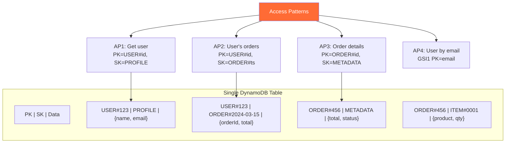

# Query-Driven Modeling — Interview Angle

> How this appears in Principal-level interviews, sample questions, and what they're really testing.

---

## How This Appears

Query-driven modeling appears in system design and data modeling interviews, especially at Amazon, Netflix, and companies using DynamoDB/Cassandra:

- "Design the data model for an e-commerce order system using DynamoDB"
- "How would you store messaging data for a chat platform at scale?"
- "You have these 5 access patterns — design the NoSQL schema"

If you start with entities and normalize, you're thinking relationally. A Principal candidate starts with the access patterns.

---

## Sample Questions

### Question 1: "Design a DynamoDB table for a social media feed — users, posts, followers, likes"

**Weak answer (Senior)**:
> "I'd create separate tables: Users, Posts, Followers, Likes. Query them individually."

**Strong answer (Principal)**:
> "First, I need the access patterns:
>
> 1. Get user profile by user_id
> 2. List user's posts, newest first
> 3. Get post by post_id with comments
> 4. List followers of a user
> 5. Check if user A follows user B
> 6. Get user's feed (posts from people they follow)
>
> Single-table design:
>
> - AP1: PK=`USER#<id>`, SK=`PROFILE`
> - AP2: PK=`USER#<id>`, SK=`POST#<timestamp>`
> - AP3: PK=`POST#<id>`, SK begins_with (METADATA, COMMENT#)
> - AP4: PK=`USER#<id>`, SK=`FOLLOWER#<followerId>`
> - AP5: Same as AP4 — GetItem on specific follower
> - AP6: Fan-out-on-write — when user X posts, write a feed item to each follower's partition: PK=`FEED#<followerId>`, SK=`<timestamp>#<postId>`
>
> AP6 creates write amplification (1 post → N writes, where N = follower count). For users with <10K followers, this is fine. For celebrities (>100K followers), switch to fan-out-on-read: query the celebrity's posts at read time.
>
> I'd add one GSI for AP where PK=`POST#<id>` for direct post lookups."

**What they're really testing**: Do you start with access patterns? Do you handle the fan-out trade-off? Do you identify the super-user edge case?

---

### Question 2: "What's wrong with using DynamoDB Scan?"

**Weak answer (Senior)**:
> "It's slow because it reads the entire table."

**Strong answer (Principal)**:
> "Scan reads every item in the table (or index), consuming read capacity proportional to the total stored data — not the result size. A Scan on a 1TB table reads 1TB of data even if only 100 items match the filter.
>
> The cost model makes it clear: Scan cost = total_items × item_size / 4KB, regardless of filter. A table with 100M items at 1KB each costs 25M RCU per full Scan.
>
> If you need Scan, it means your access pattern isn't supported by the key design. The fix is always the same: add a GSI with a partition key that matches the query predicate, turning O(n) Scan into O(result) Query.
>
> Legitimate Scan uses exist: data export (to S3 via DynamoDB Export), one-time migration, or backfill jobs. But never in the hot read path."

---

### Question 3: "When would you NOT use query-driven modeling?"

**Weak answer (Senior)**:
> "When the dataset is small."

**Strong answer (Principal)**:
> "Query-driven modeling fails in three specific scenarios:
>
> 1. **Unknown access patterns**: If you're building an analytics platform where users write arbitrary SQL, you can't pre-design the schema. Use a columnar warehouse instead.
>
> 2. **Rapidly changing access patterns**: Each new access pattern may require a new GSI, new denormalization write path, or table restructure. If access patterns change monthly, the migration burden exceeds the performance benefit.
>
> 3. **Complex cross-entity queries**: 'Find orders where the customer's address is in Seattle AND the product's category is Electronics AND the order was placed more than 30 days ago.' This requires a multi-attribute cross-entity query that doesn't map to a single partition key — use a relational database.
>
> The decision framework: If you can enumerate your access patterns on a whiteboard and they're stable for 6+ months, use query-driven modeling. If not, use PostgreSQL."

---

### Question 4: "How do you handle the need for ad-hoc analytics with DynamoDB?"

**Weak answer (Senior)**:
> "Export the data to a data warehouse."

**Strong answer (Principal)**:
> "DynamoDB is the operational database — optimized for known access patterns at low latency. Analytics requires a separate path:
>
> 1. **DynamoDB Streams → S3**: Enable DynamoDB Streams (CDC), pipe through Kinesis Firehose to S3 in Parquet format. Cost: near-zero marginal cost.
> 2. **Athena/Redshift**: Point Athena at the S3 data for ad-hoc SQL. For complex analytics, load into Redshift Spectrum.
> 3. **DynamoDB Export**: For full snapshots, use the Export to S3 feature (point-in-time, no impact on table throughput).
>
> The principle: separate operational and analytical workloads. DynamoDB serves transactions (<10ms). S3+Athena serves analytics (seconds to minutes). They share data through CDC, not through direct queries."

---

## Follow-Up Questions

| After Question... | Follow-Up | What They're Probing |
|---|---|---|
| Q1 (Social feed) | "What if a celebrity posts and they have 10M followers?" | Fan-out-on-write vs fan-out-on-read — hybrid approach for super users |
| Q2 (Scan) | "What about parallel Scan?" | Yes, parallel Scan is faster but still O(n) cost — only for batch, never for online |
| Q3 (When not to use) | "What about DynamoDB + OpenSearch?" | Valid hybrid — DynamoDB for writes, OpenSearch for flexible queries. Trade-off: consistency lag |
| Q4 (Analytics) | "What about DynamoDB's PartiQL?" | PartiQL enables SQL-like syntax but still needs proper key design — it's syntax sugar, not a query optimizer |

---

## Whiteboard Exercise — Draw in 5 Minutes

**Draw**: Access pattern mapping to DynamoDB keys:

