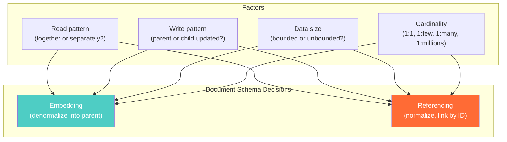

# Embedding vs Referencing — Concept Overview

> What they are, why a Principal Architect must know the trade-off, and where it fits in the bigger picture.

---

## Why This Exists

**Origin**: The embedding vs referencing decision is the fundamental schema design choice in document databases (MongoDB, Couchbase, DynamoDB, Firestore). It directly mirrors the normalization vs denormalization trade-off from relational databases but operates at the document level.

**The problem it solves**: In a document database, you can either **embed** related data inside the parent document (denormalize) or store it in a separate collection and **reference** it by ID (normalize). The choice determines read performance, write complexity, document size, and data consistency. Get it wrong and you'll either have bloated documents that exceed size limits or require multiple round trips that defeat the purpose of NoSQL.

**Who formalized it**: MongoDB's documentation formalized the pattern in the early 2010s. Rick Houlihan (AWS) extended the concept to DynamoDB's single-table design. The pattern applies universally to any document or key-value store.

---

## What Value It Provides

Choosing correctly between embedding and referencing:

| Dimension | Embedding | Referencing |
|---|---|---|
| **Read performance** | One read returns all data | Multiple reads required |
| **Write complexity** | Updates may touch large documents | Updates are atomic per document |
| **Data duplication** | Related data duplicated | No duplication |
| **Document size** | Grows with embedded data | Stays small and fixed |
| **Consistency** | Denormalized — update anomalies possible | Normalized — single source of truth |
| **Atomicity** | Embedded updates are atomic | Cross-document updates are not atomic |

---

## Where It Fits

---

## When To Embed / When To Reference

| Scenario | Embed? | Reference? | Why |
|---|---|---|---|
| User → address (1:1) | ✅ | | Always read together, rarely changes |
| Blog post → comments (1:few, <50) | ✅ | | Bounded, read together, small |
| Blog post → comments (1:many, unbounded) | | ✅ | Unbounded array breaks document size limit |
| Order → line items (1:few, <100) | ✅ | | Read together, bounded, atomic |
| Product → reviews (1:thousands) | | ✅ | Unbounded, reviews added independently |
| User → orders (1:many over time) | | ✅ | Grows forever, accessed independently |
| Author → books (many:many) | | ✅ | Many-to-many requires join collection |
| Product → category (many:1) | ⚠️ Hybrid | | Embed category name, reference full category |

---

## Key Terminology

| Term | Precise Definition |
|---|---|
| **Embedding** | Storing related data as a nested document or array within the parent document |
| **Referencing** | Storing a foreign key (ObjectId, UUID) in one document that points to another document in a separate collection |
| **Subset Pattern** | Embed a frequently-accessed subset of a child's fields in the parent; keep the full child in a separate collection |
| **Extended Reference** | Store a copy of key fields from the referenced document alongside the reference ID to avoid extra lookups |
| **Computed Pattern** | Pre-compute aggregated values (count, sum, average) and store them in the parent document to avoid aggregation queries |
| **Document Size Limit** | Maximum document size: MongoDB = 16MB, DynamoDB item = 400KB, Firestore = 1MB |
| **Unbounded Array** | An embedded array that grows without limit — the #1 cause of document size violations |
| **Array Fan-Out** | The read amplification when MongoDB must deserialize a large embedded array to access a single element |
| **$lookup** | MongoDB's left outer join operator for referencing patterns — equivalent to a SQL LEFT JOIN but less efficient |
| **Denormalization Tax** | The ongoing cost of keeping duplicated data consistent across multiple documents |
