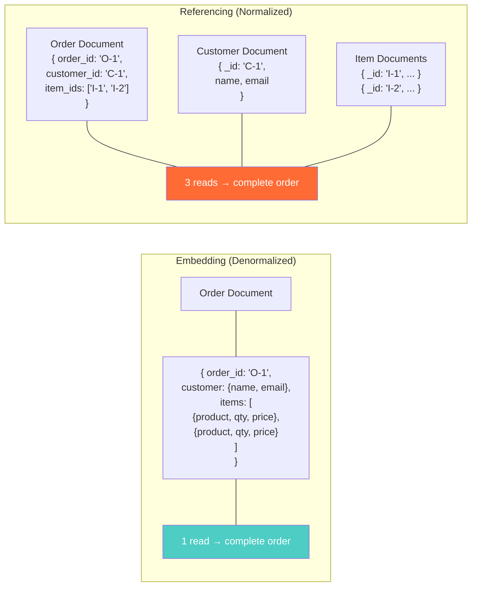
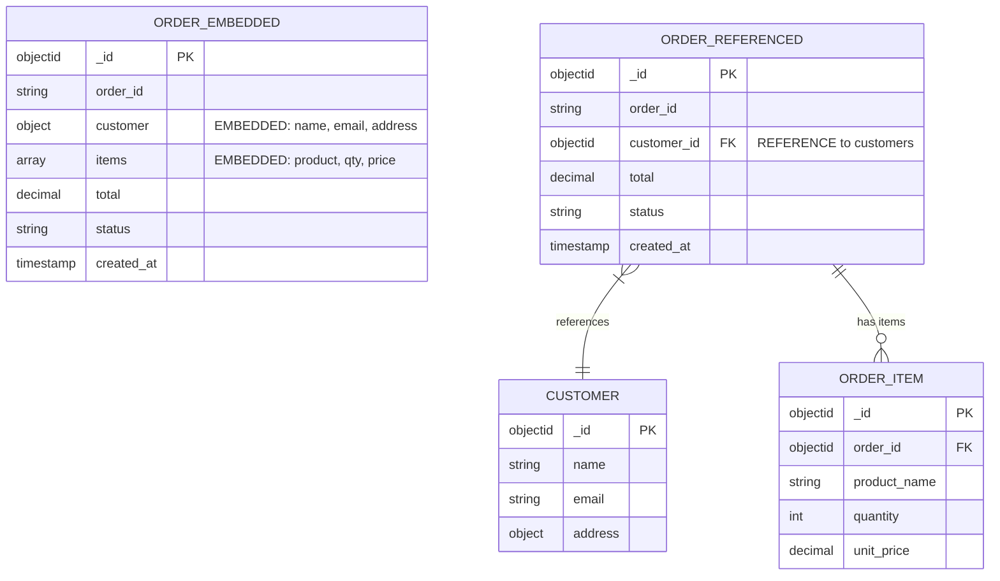
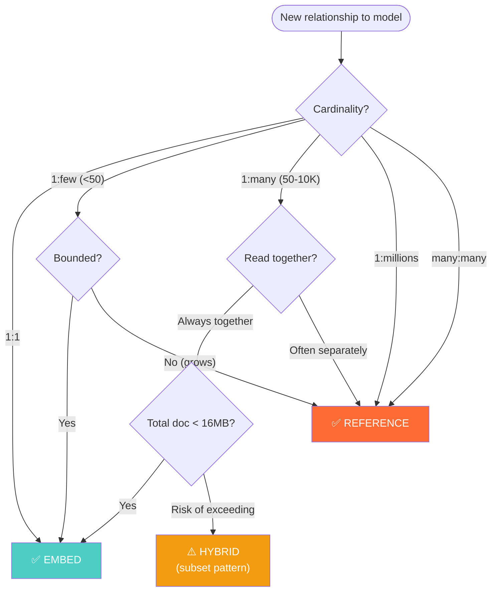
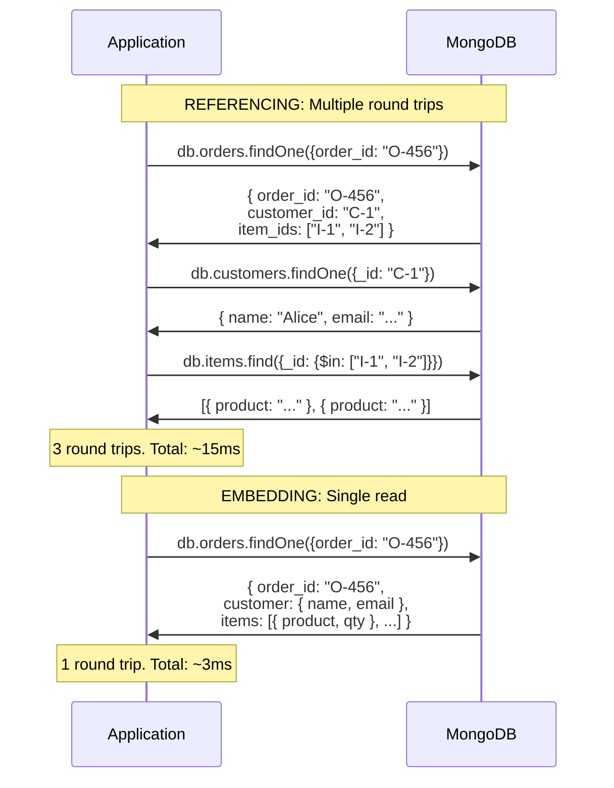
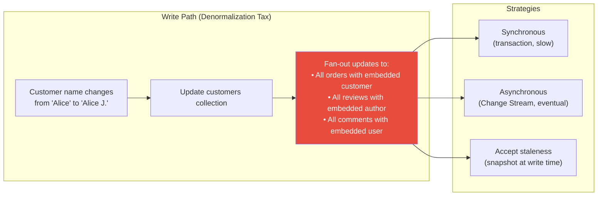

# Embedding vs Referencing — How It Works (Deep Internals)

> HLD, storage impact, query patterns, hybrid strategies, and data flow.

---

## High-Level Design — Embedding vs Referencing



---

## ER Diagram — Document Schema Patterns



---

## Decision Flowchart — Embed or Reference?



---

## Storage Internals — Document Size Impact

```javascript
// ============================================================
// Size comparison: embedded vs referenced
// ============================================================

// EMBEDDED: All order data in one document
// An order with 50 items, each item ~200 bytes
// Document size: ~200 + 50 * 200 = ~10.2 KB ✅ OK
// An order with 10,000 items (wholesale bulk order):
// Document size: ~200 + 10,000 * 200 = ~2 MB ⚠️ Getting large
// An order with 100,000 items:  
// Document size: ~200 + 100,000 * 200 = ~20 MB ❌ EXCEEDS 16MB LIMIT

// REFERENCED: Order header + separate item documents
// Order document: ~500 bytes (always fixed)
// Item documents: 200 bytes each (separate collection)
// Never exceeds limits. But: N+1 reads required.
```

---

## Hybrid Patterns — Detailed

### Pattern 1: Subset Pattern

```javascript
// Full product document (product collection)
{
  _id: ObjectId("..."),
  name: "MacBook Pro 16-inch",
  price: 2499.00,
  description: "Full 2000-word product description...",
  specs: { cpu: "M3 Max", ram: "36GB", storage: "1TB", ... },
  reviews: [ /* hundreds of reviews */ ],
  images: [ /* 20 high-res image URLs */ ],
  inventory: { warehouse_a: 50, warehouse_b: 120, ... }
}
// Size: ~50KB with reviews

// Order with SUBSET pattern — embed only what's needed
{
  _id: ObjectId("..."),
  order_id: "O-456",
  items: [
    {
      product_id: ObjectId("..."),  // reference for full details
      name: "MacBook Pro 16-inch",  // embedded subset
      price: 2499.00,              // embedded (snapshot at order time)
      image: "https://..."          // embedded (thumbnail only)
    }
  ]
}
// Size: ~500 bytes per item. No need to $lookup for order display.
```

### Pattern 2: Extended Reference

```javascript
// Instead of just storing customer_id, store key fields too
{
  _id: ObjectId("..."),
  order_id: "O-456",
  customer: {
    _id: ObjectId("..."),    // reference ID
    name: "Alice Johnson",    // embedded for display
    email: "alice@example.com" // embedded for notifications
    // Full address, preferences, etc. NOT embedded — reference if needed
  },
  items: [ /* ... */ ]
}
// Avoids $lookup for 90% of use cases (display order)
// $lookup only needed for full customer profile
```

### Pattern 3: Computed Pattern

```javascript
// Product with embedded review statistics (pre-computed)
{
  _id: ObjectId("..."),
  name: "MacBook Pro 16-inch",
  price: 2499.00,
  // Pre-computed from reviews collection
  review_stats: {
    count: 1247,
    average: 4.7,
    distribution: { "5": 890, "4": 250, "3": 70, "2": 20, "1": 17 }
  }
  // Individual reviews stored in separate collection
}
// Product listing page needs count+average — no aggregation query needed
// Review detail page $lookups individual reviews
```

---

## Sequence Diagram — $lookup (Application-Level JOIN)



---

## Data Flow — Maintaining Embedded Data Consistency



The **denormalization tax**: When you embed customer data in orders, every customer name change requires updating all orders containing that customer. This is the cost of embedding.

---

## Comparison — Embedding vs Referencing Across Databases

| Aspect | MongoDB | DynamoDB | Firestore | Couchbase |
|---|---|---|---|---|
| Max document size | 16 MB | 400 KB | 1 MB | 20 MB |
| Server-side JOIN | `$lookup` (aggregation) | None | None | N1QL `JOIN` |
| Embedding support | Nested documents + arrays | Nested maps + lists | Nested maps + arrays | Nested JSON |
| Transaction support | Multi-document ACID | TransactWriteItems (25 items) | Batch writes | Multi-doc ACID |
| Change streams | Yes (for fan-out) | DynamoDB Streams | Snapshot listeners | DCP |
