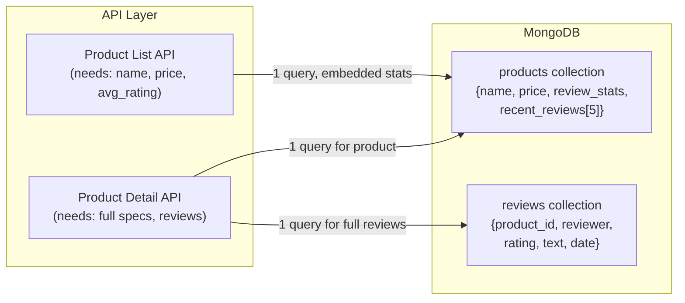

# Embedding vs Referencing — Hands-On Examples

> Production-grade MongoDB, DynamoDB, and application-layer code examples.

---

## MongoDB — Embedding Pattern

### Embedded Schema: Orders with Items

```javascript
// ============================================================
// EMBEDDED: Order with customer and items in one document
// Use when: items are bounded, always read with the order
// ============================================================

// Insert order with embedded data
db.orders.insertOne({
  order_id: "O-456",
  customer: {
    customer_id: "C-123",
    name: "Alice Johnson",
    email: "alice@example.com"
  },
  items: [
    { product_id: "P-1", name: "Laptop", qty: 1, price: 999.99 },
    { product_id: "P-2", name: "Mouse", qty: 2, price: 29.99 }
  ],
  total: 1059.97,
  status: "PLACED",
  created_at: new Date()
});

// Read: One query, complete order — 3ms
db.orders.findOne({ order_id: "O-456" });

// Update embedded item quantity
db.orders.updateOne(
  { order_id: "O-456", "items.product_id": "P-2" },
  { $set: { "items.$.qty": 3, total: 1089.96 } }
);
```

### Referenced Schema: Products with Reviews

```javascript
// ============================================================
// REFERENCED: Product and reviews in separate collections
// Use when: reviews are unbounded, accessed independently
// ============================================================

// Products collection
db.products.insertOne({
  _id: ObjectId("product1"),
  name: "MacBook Pro",
  price: 2499.00,
  review_count: 0,       // computed field
  avg_rating: 0.0        // computed field
});

// Reviews collection (separate)
db.reviews.insertOne({
  product_id: ObjectId("product1"),
  reviewer_id: ObjectId("user1"),
  reviewer_name: "Bob",   // extended reference (avoid lookup for display)
  rating: 5,
  text: "Excellent laptop...",
  created_at: new Date()
});
db.reviews.createIndex({ product_id: 1, created_at: -1 });

// Read product with paginated reviews (2 queries)
const product = db.products.findOne({ _id: ObjectId("product1") });
const reviews = db.reviews.find({ product_id: ObjectId("product1") })
                          .sort({ created_at: -1 })
                          .limit(10);

// Update computed stats when review is added
db.products.updateOne(
  { _id: ObjectId("product1") },
  { $inc: { review_count: 1 }, $set: { avg_rating: 4.8 } }
);
```

---

## MongoDB — Hybrid: Subset Pattern

```javascript
// ============================================================
// SUBSET PATTERN: Embed recent reviews, reference all reviews
// ============================================================

// Product with embedded recent reviews (top 5)
db.products.insertOne({
  _id: ObjectId("product1"),
  name: "MacBook Pro",
  price: 2499.00,
  review_stats: { count: 1247, average: 4.7 },
  recent_reviews: [
    { reviewer: "Alice", rating: 5, text: "Amazing!", date: ISODate("2024-03-20") },
    { reviewer: "Bob", rating: 4, text: "Great but pricey", date: ISODate("2024-03-19") },
    { reviewer: "Carol", rating: 5, text: "Best laptop", date: ISODate("2024-03-18") }
    // Only keep latest 5 reviews embedded
  ]
});

// When a new review is added:
// 1. Insert into reviews collection (full data)
db.reviews.insertOne({ product_id: ObjectId("product1"), /* ... */ });

// 2. Update embedded subset (push + trim)
db.products.updateOne(
  { _id: ObjectId("product1") },
  {
    $push: {
      recent_reviews: {
        $each: [{ reviewer: "Dave", rating: 5, text: "Love it", date: new Date() }],
        $position: 0,    // add to front
        $slice: 5         // keep only 5
      }
    },
    $inc: { "review_stats.count": 1 }
  }
);
```

---

## DynamoDB — Single-Table Embedding

```python
import boto3
from decimal import Decimal

dynamodb = boto3.resource('dynamodb')
table = dynamodb.Table('ECommerceTable')

# ============================================================
# EMBEDDED in DynamoDB: Order with items in a single item
# DynamoDB item limit: 400KB
# ============================================================

def create_order_embedded(order_id, customer, items):
    """
    Embed items directly in the order item.
    Good when: items are bounded (<20), always read together.
    """
    table.put_item(Item={
        'PK': f'ORDER#{order_id}',
        'SK': 'DETAILS',
        'customer': {
            'id': customer['id'],
            'name': customer['name'],
            'email': customer['email']
        },
        'items': [
            {
                'product_id': item['product_id'],
                'name': item['name'],
                'qty': item['qty'],
                'price': Decimal(str(item['price']))
            }
            for item in items
        ],
        'total': Decimal(str(sum(i['price'] * i['qty'] for i in items))),
        'status': 'PLACED'
    })

# ============================================================
# REFERENCED in DynamoDB: Items as separate items in same partition
# Good when: items are unbounded or accessed independently
# ============================================================

def create_order_referenced(order_id, customer_id, items):
    """
    Order metadata and items as separate items.
    Same partition key = one Query returns everything.
    """
    with table.batch_writer() as batch:
        # Order metadata
        batch.put_item(Item={
            'PK': f'ORDER#{order_id}',
            'SK': 'METADATA',
            'customer_id': customer_id,
            'status': 'PLACED',
            'item_count': len(items)
        })
        
        # Each item as a separate item in the same partition
        for i, item in enumerate(items):
            batch.put_item(Item={
                'PK': f'ORDER#{order_id}',
                'SK': f'ITEM#{i:04d}',
                'product_id': item['product_id'],
                'name': item['name'],
                'qty': item['qty'],
                'price': Decimal(str(item['price']))
            })
    
    # Read entire order: one Query, one partition
    # Returns METADATA + all ITEM# items
```

---

## Before vs After — Embedding Decision

### ❌ Before: Embedded Unbounded Array

```javascript
// BAD: Embedding all comments in a blog post
// Post with 50,000 comments → document = 25MB → EXCEEDS 16MB LIMIT
{
  _id: ObjectId("..."),
  title: "Popular Post",
  content: "...",
  comments: [
    // 50,000 comments * ~500 bytes = 25MB ❌
    { user: "Alice", text: "Great post!", date: ISODate("...") },
    // ... 49,999 more comments
  ]
}
```

### ✅ After: Reference + Subset Pattern

```javascript
// GOOD: Separate comments collection + embedded top 5
// Post document: ~5KB (predictable)
{
  _id: ObjectId("..."),
  title: "Popular Post",
  content: "...",
  comment_count: 50000,
  top_comments: [
    { user: "Alice", text: "Great post!", likes: 230 },
    { user: "Bob", text: "Very helpful!", likes: 180 },
    // Only top 5 embedded
  ]
}

// Comments collection (unbounded, paginated)
// { post_id, user, text, date, likes } — indexed on post_id + date
```

---

## Integration Diagram — Embedding Strategy in a Platform



---

## Runnable Exercise — Choose Embed or Reference

```markdown
EXERCISE: For each relationship, decide: embed, reference, or hybrid?

1. User → shipping addresses (a user has 2-5 addresses)
   → EMBED (bounded, always read with user, small)

2. Author → blog posts (prolific author has 500+ posts)
   → REFERENCE (unbounded, accessed independently)

3. Order → payment info (exactly one payment per order)
   → EMBED (1:1, always read together, never shared)

4. Movie → actors (movie has 20-50 actors, shared across movies)
   → HYBRID (embed actor name/photo for display, 
              reference full actor profile for detail page)

5. Chat channel → messages (millions of messages)
   → REFERENCE with time-bucketing (unbounded, paginated)

6. Product → current price (one price at any time)
   → EMBED (1:1, always needed, small)

7. Product → price history (hundreds of past prices)
   → REFERENCE (unbounded, rarely read, keep separate)
```
