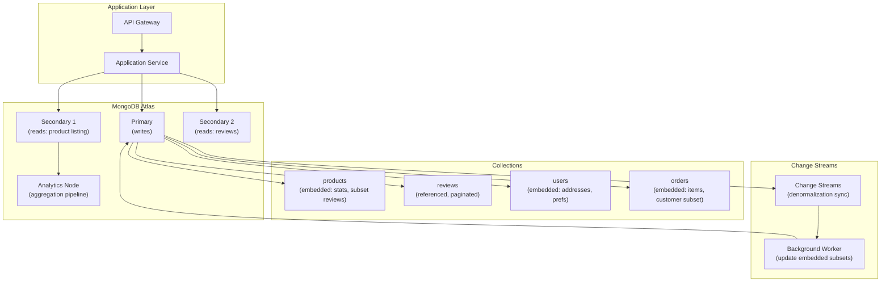

# Embedding vs Referencing — Real-World Scenarios

> FAANG case studies, production numbers, post-mortems, and deployment topologies.

---

## Case Study 1: MongoDB Atlas — E-Commerce Product Catalog

**Context**: A major e-commerce platform stores 50M+ products in MongoDB. Each product has attributes, images, pricing, inventory, and reviews.

**Architecture**: Hybrid embedding with subset pattern:

- **Product document**: Embeds core attributes (name, price, category), image thumbnails, and review_stats (count, average)
- **Reviews collection**: Separate, referenced by product_id. Top 3 reviews embedded in product for listing page.
- **Inventory collection**: Separate (updated every minute from warehouse systems). Product embeds `in_stock: boolean` only.

**Scale**:

- 50M product documents, avg 8KB each
- 500M review documents, separate collection
- Product listing page: 1 query, 20 products, <10ms
- Product detail page: 2 queries (product + reviews), <15ms

**Key design**: The subset pattern lets the listing page render without any $lookup. The detail page does one additional query for paginated reviews.

---

## Case Study 2: Lyft — Ride Data in DynamoDB

**Context**: Lyft stores ride data using DynamoDB with embedded ride details. Each ride captures pickup/dropoff, route, pricing, and driver/rider references.

**Architecture**: Embedded ride details with referenced user profiles:

- **Ride item**: PK=`RIDE#<id>`, embeds route (polyline), pricing breakdown, timestamps
- **User reference**: Ride embeds rider_name and rider_photo (extended reference), not full profile
- **Driver reference**: Same — embed name+photo, reference full profile

**Scale**:

- Ride document: ~2KB each (well within 400KB DynamoDB limit)
- 10M+ rides/day
- Ride detail read: single GetItem, <5ms
- No $lookup equivalent needed — all display data embedded

**Result**: Embedding rider/driver display fields eliminated 60% of secondary reads. Each ride detail page went from 3 reads to 1 read.

---

## Case Study 3: The New York Times — Article Content Management

**Context**: NYT stores articles with rich metadata, embedded media references, and related article links in MongoDB.

**Architecture**:

- **Article document**: Embeds author info (name, bio, photo URL), section tags, and SEO metadata
- **Comments**: Separate collection, referenced by article_id (unbounded — popular articles get 10K+ comments)
- **Related articles**: Embed top 5 related article summaries (subset), reference full articles

**Key design**: Author info is embedded because it's always displayed with the article and rarely changes. If an author updates their bio, a background job updates all their articles (denormalization tax — ~500 articles per author on average, acceptable batch).

---

## Case Study 4: Stripe — Payment Document Design

**Context**: Stripe stores payment intent objects as documents. Each payment has embedded card details (masked), charge breakdown, and metadata.

**Architecture**: Maximum embedding:

- **Payment document**: Embeds everything needed for the API response — card info (masked), billing address, charge breakdown, refund history
- **Why full embedding**: Stripe's API returns the complete payment object in one call. Referencing would add latency to every API response.

**Design principle**: "Shape your documents to match your API responses." If the API returns it together, store it together.

---

## What Went Wrong — Post-Mortem: Unbounded Array Overflow

**Incident**: A social media platform embedded all user activity (likes, shares, comments) as an array in the user document. After 2 years, power users had 100K+ activities. Their documents exceeded MongoDB's 16MB limit. Reads/writes to power user documents took >5 seconds.

**Timeline**:

1. **Year 1**: Average user document: 50KB (500 activities). No issues.
2. **Year 2**: Power users reach 50,000 activities. Documents: 5MB. Reads slow to 500ms.
3. **Month 18**: Top user reaches 100,000 activities. Document: 12MB. Update operations timeout.
4. **Month 20**: User hits 16MB limit. MongoDB rejects writes with `BSONObjectTooLarge`.

**Root cause**: Unbounded embedded array. No size limit on the activity array. No migration plan.

**Fix**:

1. **Immediate**: Cap embedded activities at last 100. Move older activities to separate collection.
2. **Short-term**: Implement the bucket pattern — group activities by month in separate documents.
3. **Long-term**: Migrate to a separate `user_activities` collection with pagination. User document embeds only `activity_count` and `recent_activities[10]`.

**Prevention**: Never embed an array that can grow without bound. Set an embedding threshold during design review (e.g., max 50 items, max 100KB of embedded data).

---

## Deployment Topology — Document Database with Hybrid Patterns

| Component | Specification |
|---|---|
| MongoDB Atlas | M50 cluster (3 nodes), 16 vCPU, 128GB RAM |
| collections | 4: products (50M docs), reviews (500M), users (20M), orders (100M) |
| Embedding | products: subset reviews, computed stats; orders: customer subset, items |
| Referencing | reviews → product_id; orders → full customer (for profile updates) |
| Change Streams | Sync embedded subsets when source documents change (eventual, <5s lag) |
