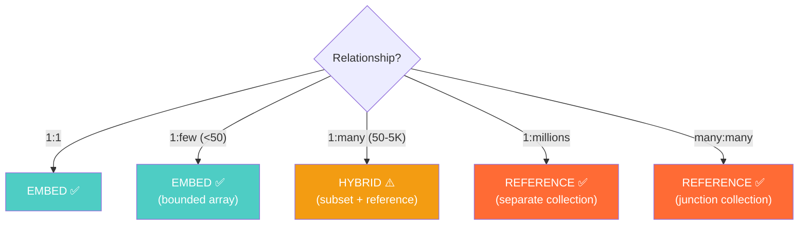

# Embedding vs Referencing — Interview Angle

> How this appears in Principal-level interviews, sample questions, and what they're really testing.

---

## How This Appears

Embedding vs referencing is the most common MongoDB/NoSQL design question. It appears in:

- "Design the data model for X using MongoDB"
- "How would you store this data in a document database?"
- Follow-up to any NoSQL system design question

The weak candidate always embeds everything. The strong candidate asks about cardinality, access patterns, and growth.

---

## Sample Questions

### Question 1: "Design a MongoDB schema for a blog platform with users, posts, comments, and likes"

**Weak answer (Senior)**:
> "I'd embed everything in the post document — comments, likes, and author info."

**Strong answer (Principal)**:
> "First, let me analyze the cardinality of each relationship:
>
> - Author → Posts: 1:many (author can have 1-500 posts)
> - Post → Comments: 1:many (popular posts can have 10K+ comments)
> - Post → Likes: 1:many (popular posts can have 1M+ likes)
> - User → Author: 1:1
>
> Based on cardinality and access patterns:
>
> **Post document** (embedding bounded data):
>
> - Embed author info (extended reference: name, avatar URL — not full profile)
> - Embed `like_count` (computed pattern — pre-computed from likes collection)
> - Embed `comment_count` (computed)
> - Embed `recent_comments[5]` (subset pattern — last 5 comments for preview)
>
> **Comments collection** (reference — unbounded):
>
> - Separate collection, indexed on `post_id + created_at DESC`
> - Each comment embeds commenter name (extended reference — avoid $lookup for display)
>
> **Likes collection** (reference — unbounded, write-heavy):
>
> - Separate collection: `{ post_id, user_id, created_at }`
> - Compound index on `(post_id, user_id)` for uniqueness and "did I like this?" check
> - `like_count` pre-computed in post document (increment on write)
>
> This gives me single-read for post listing (embedded stats + recent comments) and two-read for post detail (post + paginated comments)."

**What they're really testing**: Can you analyze cardinality? Do you know the subset and computed patterns? Do you think about unbounded growth?

---

### Question 2: "When should you use $lookup in MongoDB?"

**Weak answer (Senior)**:
> "When you need to join data from different collections."

**Strong answer (Principal)**:
> "`$lookup` should be used sparingly, never in hot read paths. It's an aggregation pipeline stage that performs a server-side left outer join — it's functional, but it's slow compared to index-based reads.
>
> **Use $lookup for**:
>
> - Batch analytics jobs (offline, latency-insensitive)
> - Admin dashboards (low traffic, <100 req/s)
> - Data migration/backfill scripts
> - Generating reports
>
> **Never use $lookup for**:
>
> - Customer-facing API endpoints (>100 req/s)
> - Real-time queries where P95 latency matters
>
> If you find yourself needing $lookup in a hot path, it means your embedding strategy is wrong. You should pre-embed the data you need using the extended reference or subset pattern, or use a change stream to keep embedded data in sync."

---

### Question 3: "You have a product catalog with 50M products, each with 100-5,000 reviews. How do you model this?"

**Weak answer (Senior)**:
> "Embed reviews in the product document."

**Strong answer (Principal)**:
> "5,000 reviews at ~500 bytes each = 2.5MB per product. That's within MongoDB's 16MB limit, but 50M products × 2.5MB average = 125TB total. Loading a 2.5MB product document for a listing page (where you only need name, price, and average rating) is wasteful.
>
> My design:
>
> **Product document** (~5KB):
>
> ```
> { name, price, category, images[5],
>   review_stats: { count: 3200, average: 4.7, 
>                   distribution: {5: 2000, 4: 800, ...} },
>   featured_reviews: [{text, rating, author}] // top 3 only
> }
> ```
>
> **Reviews collection** (separate):
>
> ```
> { product_id, reviewer_id, reviewer_name, rating, text, date, helpful_count }
> ```
>
> Index: `{ product_id: 1, date: -1 }` for paginated retrieval.
>
> **Update flow**: When a new review is added:
>
> 1. Insert into reviews collection
> 2. Atomically update `review_stats` in product document (`$inc` count, recalculate average)
> 3. If the new review's `helpful_count` qualifies, replace one of `featured_reviews`
>
> Product listing: 1 query, embedded stats. Product detail: 2 queries (product + reviews page 1). Review pagination: 1 query per page."

---

### Question 4: "How do you handle the 'denormalization tax' — keeping embedded data consistent?"

**Weak answer (Senior)**:
> "Update all the copies when the source changes."

**Strong answer (Principal)**:
> "The denormalization tax has three payment strategies, each with different consistency and performance trade-offs:
>
> 1. **Accept staleness (most common)**: Don't update embedded copies at all. An order that embedded the customer name at order time keeps that name forever. This is often correct — the shipping label should show the name at the time of shipping.
>
> 2. **Eventual sync via Change Streams**: Set up a Change Stream listener on the source collection. When a customer updates their name, the listener fans out updates to all documents containing the embedded copy. Lag: 1-5 seconds. Best for: display data like user avatars, product names.
>
> 3. **Transactional sync**: Use MongoDB multi-document transactions to update the source and all embedded copies atomically. Strongest consistency, but highest latency and lock contention. Use only when consistency is legally required.
>
> The decision framework: How bad is stale data? If it's a name on a receipt → accept staleness. If it's a price on a cart → transactional sync. If it's an avatar on a comment → eventual sync."

---

## Follow-Up Questions

| After Question... | Follow-Up | What They're Probing |
|---|---|---|
| Q1 (Blog) | "What if a user deletes their account — how do you handle embedded author info?" | Soft delete + anonymize embedded copies vs. tombstone pattern |
| Q2 ($lookup) | "What about view materialization in MongoDB?" | On-demand materialized views exist but have limitations |
| Q3 (Product reviews) | "DynamoDB has a 400KB limit — how would you adapt?" | Use separate items in the same partition (PK=product, SK=REVIEW#ts) |
| Q4 (Tax) | "What if the Change Stream consumer fails?" | Exactly-once processing, dead letter queue, idempotent updates |

---

## Whiteboard Exercise — Draw in 5 Minutes


