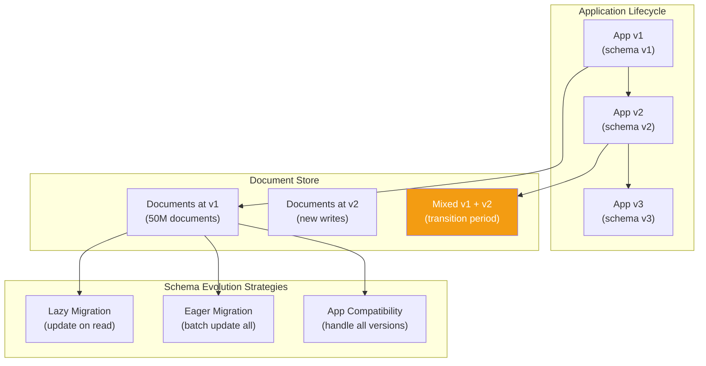

# Schema Evolution — Concept Overview

> What it is, why a Principal Architect must know it, and where it fits in the bigger picture.

---

## Why This Exists

**Origin**: Schema evolution became a critical concern with the rise of document databases in the late 2000s. While these databases are marketed as "schemaless," the reality is that every document has an implicit schema defined by the application code that reads and writes it. When that implicit schema changes, existing documents don't automatically update — creating multi-version document populations that the application must handle.

**The problem it solves**: In a relational database, `ALTER TABLE ADD COLUMN` applies instantly (metadata change) or through a migration. In a document database with 100M documents, there's no equivalent `ALTER COLLECTION`. You have three choices: (1) lazy migration (update documents on read), (2) eager migration (batch update all documents), or (3) application-level compatibility (code handles both old and new formats). Each has different downtime, consistency, and complexity trade-offs.

**Who formalized it**: Martin Fowler's evolutionary database design (2016), MongoDB's schema versioning pattern, and the broader event-sourcing community's work on event schema evolution all contributed to formalizing the problem space.

---

## What Value It Provides

| Dimension | Value |
|---|---|
| **Zero-downtime deployments** | Schema changes without taking the database offline |
| **Backward compatibility** | Old application versions can read new documents and vice versa |
| **Gradual rollout** | Schema changes can be deployed incrementally across a fleet |
| **Data integrity** | Application code handles all document versions without crashes |
| **Auditability** | Schema version tracking enables debugging and compliance |

---

## Where It Fits

---

## When To Use Each Strategy

| Scenario | Lazy | Eager | App Compat | Why |
|---|---|---|---|---|
| Adding optional field | | | ✅ | No migration needed — old docs lack field, new docs have it |
| Renaming a field | ✅ | | | Lazy: read old name, write new name. Eventually all docs migrate |
| Changing data type (string→int) | | ✅ | | Must batch-convert to maintain query consistency |
| Adding required field | | ✅ | | Can't query on field that doesn't exist in old docs |
| Restructuring (flatten nested object) | ✅ | | | Lazy migration with version check on read |
| Removing field | | | ✅ | Just stop reading/writing it. Clean up old docs eventually |
| 100M+ documents, zero downtime | ✅ | | | Eager migration too slow/risky at this scale |
| <1M documents, scheduled window | | ✅ | | Eager is simpler and achieves consistent state |

---

## Key Terminology

| Term | Precise Definition |
|---|---|
| **Schema Evolution** | The process of changing a document's structure (fields, types, nesting) while maintaining compatibility with existing documents |
| **Lazy Migration** | Updating a document to the new schema only when it's next read or written — documents migrate gradually over time |
| **Eager Migration** | Batch-updating all documents to the new schema in a background job — all documents reach the new version |
| **Schema Versioning** | Including a `schema_version` field in each document to identify which version of the schema it conforms to |
| **Backward Compatibility** | New application code can read documents written by old application code |
| **Forward Compatibility** | Old application code can read documents written by new application code (harder to achieve) |
| **Dual Write** | During migration, writing documents in both old and new formats to support rolling deployments |
| **Dark Launch** | Deploying new schema writes without reading them, to validate data before switching reads |
| **Expand-Contract Pattern** | A migration strategy: first expand (add new field alongside old), then contract (remove old field after all consumers migrate) |
| **JSON Schema Validation** | MongoDB's built-in schema enforcement that rejects documents not matching the defined JSON Schema |
