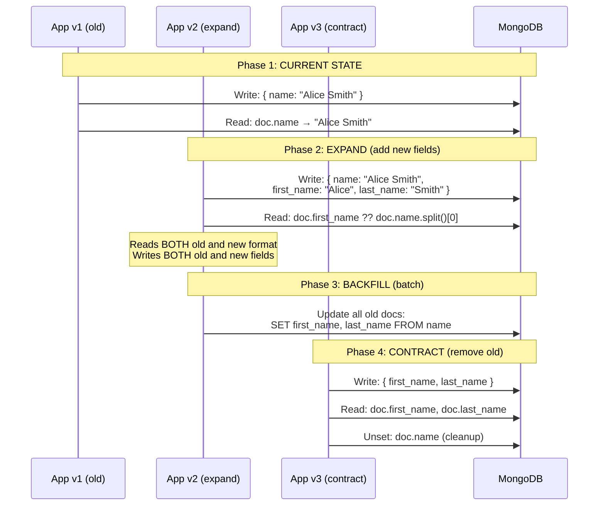
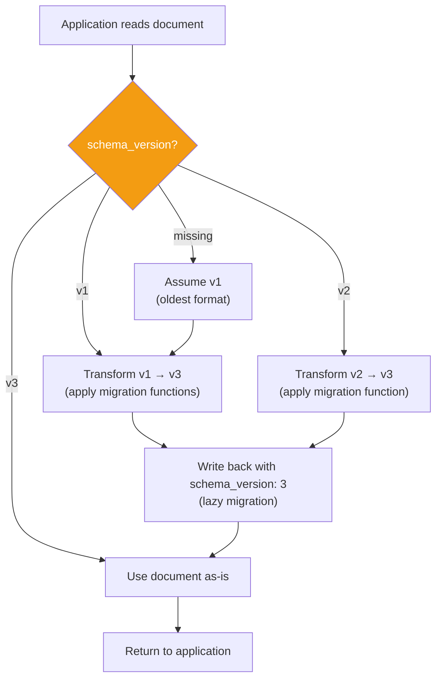
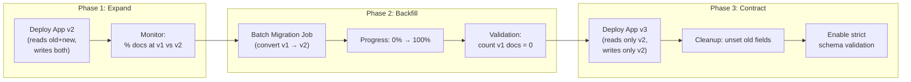

# Schema Evolution — How It Works (Deep Internals)

> HLD, migration strategies, versioning patterns, and data flow.

---

## High-Level Design — Expand-Contract Migration Pattern



---

## Schema Versioning Pattern — Detailed



---

## Code Implementation — Schema Versioning

```python
# ============================================================
# Schema versioning with migration functions
# ============================================================

CURRENT_SCHEMA_VERSION = 3

# Migration functions: transform from version N to version N+1
MIGRATIONS = {
    # v1 → v2: Split 'name' into 'first_name' and 'last_name'
    (1, 2): lambda doc: {
        **doc,
        'first_name': doc['name'].split()[0],
        'last_name': ' '.join(doc['name'].split()[1:]),
        'schema_version': 2
    },
    
    # v2 → v3: Add 'display_name' and 'email_verified' fields
    (2, 3): lambda doc: {
        **doc,
        'display_name': f"{doc['first_name']} {doc['last_name']}",
        'email_verified': False,  # default for existing users
        'schema_version': 3
    },
}

def migrate_document(doc: dict) -> dict:
    """
    Migrate document to current schema version.
    Applies each migration function in sequence.
    """
    version = doc.get('schema_version', 1)  # default: v1
    
    while version < CURRENT_SCHEMA_VERSION:
        next_version = version + 1
        migration_fn = MIGRATIONS.get((version, next_version))
        if migration_fn is None:
            raise ValueError(f"No migration from v{version} to v{next_version}")
        doc = migration_fn(doc)
        version = next_version
    
    return doc

def read_user(user_id: str, collection) -> dict:
    """
    Read user with lazy migration.
    If document is not at current version, migrate and write back.
    """
    doc = collection.find_one({'_id': user_id})
    if doc is None:
        return None
    
    current_version = doc.get('schema_version', 1)
    
    if current_version < CURRENT_SCHEMA_VERSION:
        # Migrate to current version
        migrated = migrate_document(doc)
        
        # Write back (lazy migration)
        collection.replace_one({'_id': user_id}, migrated)
        return migrated
    
    return doc

def write_user(user_data: dict, collection):
    """Always write at current schema version."""
    user_data['schema_version'] = CURRENT_SCHEMA_VERSION
    collection.replace_one(
        {'_id': user_data['_id']}, 
        user_data, 
        upsert=True
    )
```

---

## Eager Migration — Batch Script

```python
from pymongo import MongoClient, UpdateOne
from datetime import datetime

client = MongoClient('mongodb://localhost:27017')
db = client['production']
collection = db['users']

def eager_migrate_v1_to_v2(batch_size: int = 1000):
    """
    Batch migrate all v1 documents to v2.
    Run as a background job. Idempotent.
    """
    total = 0
    cursor = collection.find(
        {'$or': [
            {'schema_version': {'$exists': False}},
            {'schema_version': 1}
        ]},
        batch_size=batch_size
    )
    
    operations = []
    for doc in cursor:
        first_name = doc['name'].split()[0]
        last_name = ' '.join(doc['name'].split()[1:])
        
        operations.append(UpdateOne(
            {'_id': doc['_id']},
            {'$set': {
                'first_name': first_name,
                'last_name': last_name,
                'schema_version': 2,
                'migrated_at': datetime.utcnow()
            }}
        ))
        
        if len(operations) >= batch_size:
            collection.bulk_write(operations, ordered=False)
            total += len(operations)
            operations = []
            print(f"Migrated {total} documents")
    
    if operations:
        collection.bulk_write(operations, ordered=False)
        total += len(operations)
    
    print(f"Migration complete: {total} documents migrated")

# Run with monitoring
# eager_migrate_v1_to_v2(batch_size=500)
```

---

## MongoDB JSON Schema Validation

```javascript
// ============================================================
// Schema validation — enforce structure on new writes
// ============================================================

db.runCommand({
  collMod: "users",
  validator: {
    $jsonSchema: {
      bsonType: "object",
      required: ["first_name", "last_name", "email", "schema_version"],
      properties: {
        schema_version: {
          bsonType: "int",
          minimum: 2,
          description: "Must be at least version 2"
        },
        first_name: {
          bsonType: "string",
          maxLength: 100
        },
        last_name: {
          bsonType: "string",
          maxLength: 100
        },
        email: {
          bsonType: "string",
          pattern: "^[a-zA-Z0-9._%+-]+@[a-zA-Z0-9.-]+\\.[a-zA-Z]{2,}$"
        },
        email_verified: {
          bsonType: "bool"
        }
      }
    }
  },
  validationLevel: "moderate",  // Only validate new inserts and updates
  validationAction: "warn"      // Log warning, don't reject (during migration)
});

// After migration is complete, switch to strict:
// validationLevel: "strict", validationAction: "error"
```

---

## Data Flow Diagram — Schema Migration Pipeline



---

## Comparison — Schema Evolution Across Databases

| Aspect | MongoDB | DynamoDB | Cassandra | PostgreSQL |
|---|---|---|---|---|
| Schema enforcement | Optional JSON Schema | None (flexible) | CQL table schema | Strict (DDL) |
| Adding field | No-op (just write it) | No-op | ALTER TABLE ADD | ALTER TABLE (metadata-only) |
| Removing field | Stop writing it | Stop writing it | Not recommended | ALTER TABLE DROP |
| Renaming field | Application-level migration | Application-level | Not supported | ALTER TABLE RENAME |
| Changing type | Migration required | Migration required | Not supported | ALTER TYPE (limited) |
| Backfill mechanism | Application batch job | DynamoDB Streams + Lambda | Spark job | UPDATE + index rebuild |
| Validation | JSON Schema (optional) | None | CQL constraints | CHECK, NOT NULL |
| Version tracking | Manual (schema_version field) | Manual | Manual | Migration tools (Flyway, Alembic) |
