# Schema Evolution — Hands-On Examples

> Production-grade migration scripts, validation, and versioning patterns.

---

## Expand-Contract Migration — Complete Example

### Phase 1: Add New Fields (Expand)

```python
# ============================================================
# Application v2: Write both old and new fields
# Read from new field, fall back to old
# ============================================================

from pymongo import MongoClient
from datetime import datetime

client = MongoClient('mongodb://localhost:27017')
db = client['production']
users = db['users']

def create_user_v2(first_name: str, last_name: str, email: str):
    """Write in new format, include old format for backward compat."""
    users.insert_one({
        # New fields (v2)
        'first_name': first_name,
        'last_name': last_name,
        'display_name': f"{first_name} {last_name}",
        # Old field (v1 backward compat — remove in contract phase)
        'name': f"{first_name} {last_name}",
        # Metadata
        'email': email,
        'schema_version': 2,
        'created_at': datetime.utcnow()
    })

def read_user_v2(user_id: str):
    """Read with backward compatibility for v1 documents."""
    doc = users.find_one({'_id': user_id})
    if doc is None:
        return None
    
    # Handle both v1 and v2 formats
    if 'first_name' in doc:
        # v2 format: use directly
        return doc
    else:
        # v1 format: derive new fields
        name_parts = doc.get('name', '').split(' ', 1)
        doc['first_name'] = name_parts[0]
        doc['last_name'] = name_parts[1] if len(name_parts) > 1 else ''
        doc['display_name'] = doc.get('name', '')
        return doc
```

### Phase 2: Backfill Old Documents

```python
def backfill_v1_to_v2(batch_size: int = 500):
    """
    Batch migrate v1 documents. Idempotent. Can be restarted safely.
    Run as a background Airflow task.
    """
    from pymongo import UpdateOne
    
    migrated = 0
    cursor = users.find(
        {'schema_version': {'$exists': False}},  # v1 docs have no version
        batch_size=batch_size,
        no_cursor_timeout=True
    )
    
    ops = []
    for doc in cursor:
        name_parts = doc.get('name', '').split(' ', 1)
        ops.append(UpdateOne(
            {'_id': doc['_id'], 'schema_version': {'$exists': False}},  # idempotent guard
            {'$set': {
                'first_name': name_parts[0],
                'last_name': name_parts[1] if len(name_parts) > 1 else '',
                'display_name': doc.get('name', ''),
                'schema_version': 2,
                'migrated_at': datetime.utcnow()
            }}
        ))
        
        if len(ops) >= batch_size:
            result = users.bulk_write(ops, ordered=False)
            migrated += result.modified_count
            ops = []
    
    if ops:
        result = users.bulk_write(ops, ordered=False)
        migrated += result.modified_count
    
    cursor.close()
    return migrated

# Verification
def verify_migration():
    v1_count = users.count_documents({'schema_version': {'$exists': False}})
    v2_count = users.count_documents({'schema_version': 2})
    total = users.count_documents({})
    print(f"v1: {v1_count}, v2: {v2_count}, total: {total}")
    assert v1_count == 0, f"{v1_count} documents still at v1!"
```

### Phase 3: Remove Old Fields (Contract)

```python
def contract_remove_name_field(batch_size: int = 500):
    """
    After ALL consumers are on v2+, remove the old 'name' field.
    Only run after verify_migration() passes.
    """
    from pymongo import UpdateOne
    
    cursor = users.find(
        {'name': {'$exists': True}},
        batch_size=batch_size
    )
    
    ops = []
    for doc in cursor:
        ops.append(UpdateOne(
            {'_id': doc['_id']},
            {'$unset': {'name': ''}}
        ))
        
        if len(ops) >= batch_size:
            users.bulk_write(ops, ordered=False)
            ops = []
    
    if ops:
        users.bulk_write(ops, ordered=False)
```

---

## DynamoDB — Schema Evolution with Versioning

```python
import boto3
from decimal import Decimal

dynamodb = boto3.resource('dynamodb')
table = dynamodb.Table('UsersTable')

CURRENT_VERSION = 3

# Migration functions
def migrate_v1_to_v2(item):
    """Split name into first_name + last_name."""
    name = item.get('name', '')
    parts = name.split(' ', 1)
    item['first_name'] = parts[0]
    item['last_name'] = parts[1] if len(parts) > 1 else ''
    item['schema_version'] = 2
    return item

def migrate_v2_to_v3(item):
    """Add preferences with defaults."""
    item['preferences'] = {
        'theme': 'light',
        'notifications': True,
        'language': 'en'
    }
    item['schema_version'] = 3
    return item

MIGRATIONS = {
    1: migrate_v1_to_v2,
    2: migrate_v2_to_v3,
}

def read_user_with_migration(user_id: str):
    """Read with lazy migration through all versions."""
    response = table.get_item(Key={'PK': f'USER#{user_id}', 'SK': 'PROFILE'})
    item = response.get('Item')
    if not item:
        return None
    
    version = item.get('schema_version', 1)
    
    if version < CURRENT_VERSION:
        # Apply migrations in sequence
        while version < CURRENT_VERSION:
            migration_fn = MIGRATIONS[version]
            item = migration_fn(item)
            version = item['schema_version']
        
        # Write back migrated item (lazy migration)
        table.put_item(Item=item)
    
    return item
```

---

## MongoDB — Change Stream for Schema Sync

```python
# ============================================================
# Use Change Streams to sync schema changes across collections
# Example: When user name changes, update all embedded references
# ============================================================

import threading
from pymongo import MongoClient

client = MongoClient('mongodb://localhost:27017')
db = client['production']

def watch_user_changes():
    """
    Watch for user document changes.
    When first_name or last_name changes, update all embedded references.
    """
    pipeline = [
        {'$match': {
            'operationType': 'update',
            'updateDescription.updatedFields': {
                '$elemMatch': {'$in': ['first_name', 'last_name']}
            }
        }}
    ]
    
    with db.users.watch(pipeline, full_document='updateLookup') as stream:
        for change in stream:
            user = change['fullDocument']
            user_id = user['_id']
            new_display = f"{user['first_name']} {user['last_name']}"
            
            # Update all orders with this customer embedded
            db.orders.update_many(
                {'customer.customer_id': user_id},
                {'$set': {
                    'customer.name': new_display,
                    'customer.first_name': user['first_name'],
                    'customer.last_name': user['last_name']
                }}
            )
            
            # Update all reviews with this author embedded
            db.reviews.update_many(
                {'author.user_id': user_id},
                {'$set': {'author.name': new_display}}
            )

# Run in background thread
threading.Thread(target=watch_user_changes, daemon=True).start()
```

---

## Before vs After — Schema Field Rename

### ❌ Before: In-Place Rename (Breaks Old Readers)

```javascript
// BAD: Rename field in one shot
// All old application instances crash on missing 'name' field
db.users.updateMany({}, { $rename: { "name": "full_name" } });
// Old app code: user.name → undefined → crash
```

### ✅ After: Expand-Contract (Zero Downtime)

```javascript
// GOOD: Three-phase rename
// Phase 1: EXPAND — write both
db.users.updateMany(
  { full_name: { $exists: false } },
  [{ $set: { full_name: "$name" } }]
);
// Now both 'name' and 'full_name' exist

// Phase 2: Update all app instances to read 'full_name'
// Wait for rollout: 100% of fleet on new version

// Phase 3: CONTRACT — remove old field
db.users.updateMany({}, { $unset: { name: "" } });
```

---

## Integration Diagram — Schema Evolution Pipeline

```mermaid
flowchart LR
    subgraph "CI/CD Pipeline"
        PR["Pull Request<br/>(schema change)"]
        REVIEW["Schema Review<br/>(backward compat check)"]
        DEPLOY["Deploy App v2<br/>(expand phase)"]
    end
    
    subgraph "Migration"
        JOB["Backfill Job<br/>(Airflow DAG)"]
        MONITOR["Migration Monitor<br/>(% at each version)"]
        VERIFY["Verification<br/>(v1 count = 0?)"]
    end
    
    subgraph "Contract Phase"
        DEPLOY_V3["Deploy App v3<br/>(contract phase)"]
        CLEANUP["Cleanup Job<br/>(unset old fields)"]
        VALIDATE["Enable Strict<br/>Schema Validation"]
    end
    
    PR --> REVIEW --> DEPLOY --> JOB --> MONITOR --> VERIFY
    VERIFY --> DEPLOY_V3 --> CLEANUP --> VALIDATE
```


