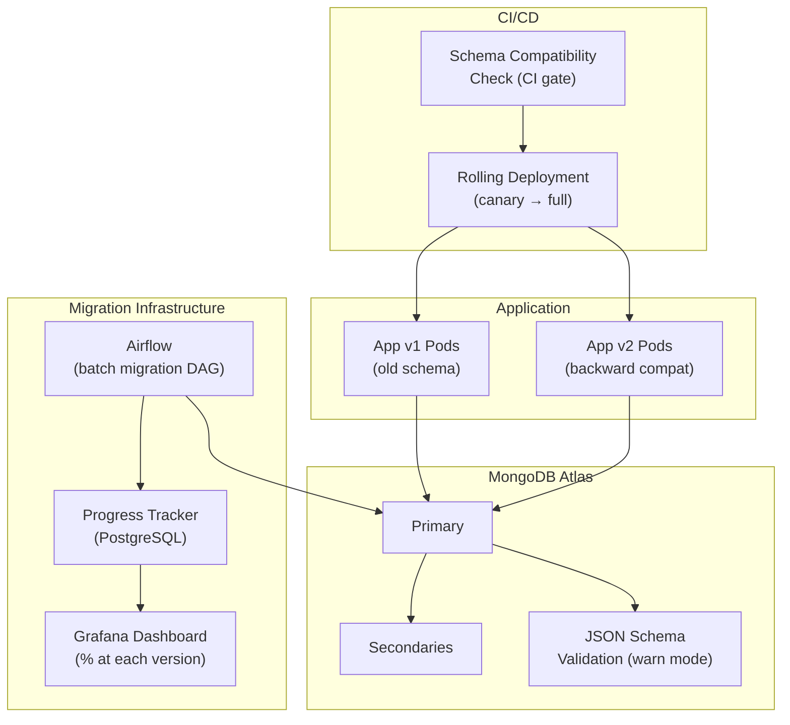

# Schema Evolution — Real-World Scenarios

> FAANG case studies, production numbers, post-mortems, and deployment topologies.

---

## Case Study 1: Uber — DynamoDB Schema Evolution for Trip Data

**Context**: Uber's trip data evolved over 5 years from simple ride records to complex multi-modal trips (UberX, UberPool, Uber Eats, Uber Freight). Each product added new fields and restructured existing ones.

**Architecture**: Schema versioning + lazy migration:

- Every DynamoDB item has `schema_version` field
- Application code includes migration functions for each version pair
- Lazy migration: items updated on next read/write
- Background batch job runs weekly to convert remaining stale items

**Scale**:

- 500M+ trip items across versions v1-v8
- ~15% of items at each legacy version at any time (long-tail — inactive users)
- Lazy migration handles 80% of items within 30 days of a new version
- Weekly batch handles the remaining 20%

**Key design**: Uber treats each schema version as a supported API contract. The application code includes a `TripAdapter` that transforms any version to the current internal representation. This decouples storage format from business logic.

---

## Case Study 2: MongoDB Atlas — Schema Validation Rollout

**Context**: A SaaS platform with 100M+ user documents in MongoDB Atlas needed to add strict schema validation after 3 years of "schemaless" development. Documents had 5+ implicit schema versions due to feature additions.

**Architecture**: Three-phase rollout:

1. **Audit**: Aggregation pipeline to categorize documents by implicit version (which fields exist)
2. **Backfill**: Airflow DAG to migrate all documents to latest schema (added defaults for missing fields)
3. **Enforce**: Enable JSON Schema validation with `validationLevel: "strict"` and `validationAction: "error"`

**Scale**:

- 100M documents
- 5 implicit schema versions
- Backfill: 72 hours at 500 docs/batch (throttled to avoid impact)
- Post-validation: 0.003% of writes rejected (edge cases found and fixed)

---

## Case Study 3: Netflix — Event Schema Evolution with Avro

**Context**: Netflix processes 700B+ events/day through Kafka. Event schemas evolve frequently as new telemetry is added. Using Avro with a Schema Registry ensures backward and forward compatibility.

**Architecture**: Schema Registry enforced compatibility:

- Every event has an Avro schema registered in Confluent Schema Registry
- Schema changes must pass compatibility checks before deployment
- Backward compatible: new readers can read old events (missing fields get defaults)
- Forward compatible: old readers can read new events (unknown fields ignored)

**Scale**:

- 10,000+ distinct event schemas
- 700B+ events/day
- Schema changes: ~50/week across all teams
- Compatibility check: <100ms per validation

**Key design**: Netflix uses the Schema Registry as a gate in the CI/CD pipeline. No event producer can deploy without a compatibility check passing. This prevents breaking consumers.

---

## Case Study 4: Shopify — Commerce Schema Evolution

**Context**: Shopify's merchant data (products, orders, customers) evolves constantly as new commerce features launch. With 2M+ merchants, each with different data volumes, schema changes must be non-disruptive.

**Architecture**: Expand-contract with feature flags:

- New fields added with defaults (expand phase)
- Feature flag controls which code path reads new vs old format
- Backfill runs gradually over weeks, throttled per merchant
- Old fields removed after 100% migration confirmed

**Key design**: Shopify uses per-merchant migration tracking. A migration progress table tracks which merchants have been migrated. This allows resumable, idempotent migrations that can be paused without data loss.

---

## What Went Wrong — Post-Mortem: Breaking Schema Change

**Incident**: A team deployed a new application version that renamed `user.address` (string) to `user.address` (object with `{street, city, state, zip}`). The deployment was instant (all pods updated in 5 minutes). But the database contained 20M documents with `address` as a string. The new code expected an object → `TypeError: Cannot read property 'city' of string` → 500 errors for 30% of users.

**Timeline**:

1. **T+0**: Deploy app v2 (address is object)
2. **T+1min**: First 500 errors — users with old string address
3. **T+3min**: Error rate reaches 30% (70% of users had been updated by recent writes)
4. **T+5min**: Rollback to app v1
5. **T+30min**: Fix deployed — app v2.1 handles both string and object address

**Root cause**: No expand phase. The schema change was "big bang" — new format only, no backward compatibility with existing documents.

**Fix**:

1. **Immediate**: Rollback to v1
2. **v2.1**: Added defensive code: `typeof doc.address === 'string' ? {street: doc.address} : doc.address`
3. **Backfill**: Batch job to convert all string addresses to objects
4. **v3**: After 100% migration, remove string handling code

**Prevention**: Schema change checklist:

- [ ] New code reads both old and new format (backward compatible)
- [ ] New code writes in new format (forward migration)
- [ ] Backfill job tested on staging with real data volumes
- [ ] Rollback plan documented
- [ ] Migration progress monitoring in place

---

## Deployment Topology — Schema Evolution Infrastructure

| Component | Specification |
|---|---|
| Schema check | CI gate: validates backward + forward compatibility |
| Rolling deploy | Canary: 5% → 25% → 100% over 30 minutes |
| Migration DAG | Airflow, batch_size=500, throttled to 1000 writes/sec |
| Progress tracker | PostgreSQL table: `{migration_id, total, migrated, started_at}` |
| Validation | MongoDB JSON Schema, `warn` mode during migration, `error` after |
