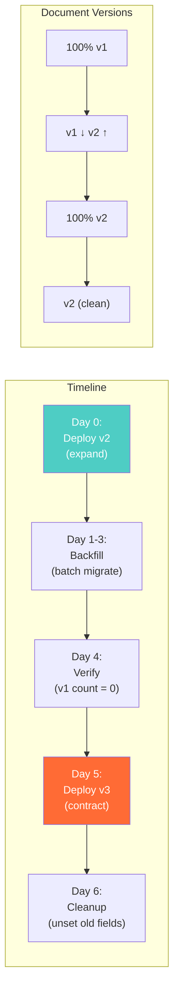

# Schema Evolution — Interview Angle

> How this appears in Principal-level interviews, sample questions, and what they're really testing.

---

## How This Appears

Schema evolution questions appear as follow-ups to NoSQL design questions or as standalone operational questions:

- "How do you handle schema changes in MongoDB at scale?"
- "Your collection has 500M documents. You need to restructure a field. How?"
- "How do you deploy a database migration with zero downtime?"

The weak candidate says "just update the documents." The strong candidate describes the expand-contract pattern, versioning, and production safeguards.

---

## Sample Questions

### Question 1: "You need to split a 'name' field into 'first_name' and 'last_name' across 100M documents. How?"

**Weak answer (Senior)**:
> "Run an update script to split the name field for all documents."

**Strong answer (Principal)**:
> "This is a three-phase expand-contract migration:
>
> **Phase 1 — Expand**: Deploy app v2 that writes both `name` AND `first_name`/`last_name`. When reading, it checks for `first_name` first, falls back to splitting `name`. This is backward compatible — v2 reads v1 documents safely.
>
> **Phase 2 — Backfill**: Run a throttled batch job (Airflow DAG) that converts remaining v1 documents. Batch size = 500, with 0.5s sleep between batches to avoid saturating the primary. At 100M documents with throttling, this takes ~28 hours. The job is idempotent — it can be restarted safely.
>
> **Phase 3 — Verify + Contract**: After backfill, verify: `db.users.countDocuments({schema_version: 1})` must be 0. Then deploy v3 that only reads `first_name`/`last_name` and doesn't write `name`. Finally, clean up: `$unset name` from all documents.
>
> Key safeguards: schema_version field on every document, idempotent migration functions, throttled batches, and a monitoring dashboard showing % at each version."

**What they're really testing**: Do you understand the expand-contract pattern? Do you handle the transition period? Do you think about production impact?

---

### Question 2: "During a rolling deployment, pods running v1 and v2 coexist for 10 minutes. What happens?"

**Weak answer (Senior)**:
> "The v1 pods might have issues reading new documents."

**Strong answer (Principal)**:
> "This is the forward compatibility problem. During a rolling deploy:
>
> - v2 pods write documents with new fields (e.g., `first_name`, `last_name`)
> - v1 pods read these documents and encounter unexpected fields
>
> If the v1 code is strict (TypeScript interfaces, Pydantic models with `extra='forbid'`), it will reject unknown fields → crash.
>
> **Prevention**:
>
> 1. All data models must tolerate unknown fields (Python: `extra='ignore'`, TypeScript: partial types)
> 2. New fields should have defaults so old code doesn't break on missing values
> 3. Never remove or rename a field in the same deploy that adds the new field — these are separate deploys
>
> The safe sequence: Deploy 1 adds new fields (expand). Deploy 2, weeks later, removes old fields (contract). Never combine expand and contract in one deploy."

---

### Question 3: "Should you use lazy or eager migration?"

**Weak answer (Senior)**:
> "Eager migration is better because you know when it's done."

**Strong answer (Principal)**:
> "It depends on the access pattern and scale:
>
> **Lazy migration** (update on read):
>
> - Best for: Large collections (>100M) where not all documents are regularly accessed
> - Advantage: Zero batch overhead, no production I/O impact
> - Disadvantage: Some documents may never migrate (inactive users), mixed versions persist indefinitely
> - Use when: You can tolerate mixed versions and the migration logic is simple
>
> **Eager migration** (batch job):
>
> - Best for: Required consistency (all documents must be at same version for query correctness)
> - Advantage: Deterministic completion, enables strict schema validation after
> - Disadvantage: I/O impact on production, needs throttling, takes hours/days for large collections
> - Use when: New fields need indexing, or schema validation will be enforced
>
> In practice, I use both: lazy migration for the 80% of active documents, followed by an eager backfill for the remaining 20% of dormant documents."

---

### Question 4: "How does Netflix handle event schema evolution?"

**Weak answer (Senior)**:
> "They probably version their events."

**Strong answer (Principal)**:
> "Netflix uses Apache Avro with Confluent Schema Registry for event schema evolution. The key elements:
>
> 1. **Schema Registry as CI gate**: Every event producer registers its schema. Schema changes must pass compatibility checks (backward, forward, or full) before the producer can deploy.
>
> 2. **Backward compatibility**: New consumers can read events produced by old producers. Missing fields get default values defined in the Avro schema.
>
> 3. **Forward compatibility**: Old consumers can read events produced by new producers. Unknown fields are ignored (Avro's reader/writer schema resolution).
>
> 4. **Schema ID embedding**: Every Kafka message starts with a 5-byte header: magic byte + 4-byte schema ID. The consumer uses the schema ID to look up the exact Avro schema for deserialization.
>
> This approach scales to 10,000+ event schemas and 700B+ events/day. The Schema Registry is the single source of truth for event contracts."

---

## Follow-Up Questions

| After Question... | Follow-Up | What They're Probing |
|---|---|---|
| Q1 (Split name) | "What if 5% of names have no space (single name)?" | Edge case handling in migration function — default last_name to empty string |
| Q2 (Rolling deploy) | "What about database-level validation?" | MongoDB JSON Schema — use `validationLevel: moderate` during transition |
| Q3 (Lazy vs eager) | "What if you need to add an index on the new field?" | Eager migration required — can't index a field that doesn't exist on all docs |
| Q4 (Netflix) | "What about breaking changes that can't be backward compatible?" | New event type + deprecation schedule for old type — never break existing events |

---

## Whiteboard Exercise — Draw in 5 Minutes

