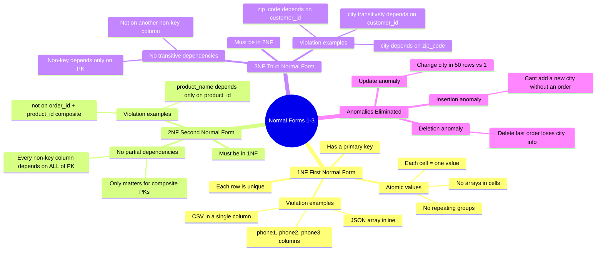

# 1NF Through 3NF — Concept Overview

> The foundation normalization forms that every data architect must internalize — not just know, but *feel* in their bones when looking at a schema.

---

## Why This Exists

**Origin**: Edgar F. Codd introduced normalization in 1970 at IBM Research. His goal was not elegance — it was **eliminating anomalies**. Update anomalies, insertion anomalies, and deletion anomalies are bugs in your schema that silently corrupt data over time.

**The problem it solves**: If a customer's city is stored in 50 order rows, and the customer moves, you must update 50 rows. If you update 49, you now have inconsistent data with no error thrown and no log entry. This is an **update anomaly** — the most insidious kind of bug because it's silent and cumulative.

**Principal-level nuance**: Normalization is a *design-time* tool, not a *deployment-time* mandate. You normalize to understand your data's dependencies, then selectively denormalize for performance. An architect who blindly normalizes everything produces an unusable 30-JOIN reporting schema. An architect who skips normalization produces a write-anomaly minefield.

## Mindmap

## Key Terminology

| Term | Precise Definition |
|---|---|
| **Functional Dependency** | Column B is functionally dependent on column A if each value of A determines exactly one value of B (A → B) |
| **Partial Dependency** | A non-key column depends on only PART of a composite primary key (violates 2NF) |
| **Transitive Dependency** | A → B → C where C depends on A only through B (violates 3NF) |
| **Candidate Key** | A minimal set of columns that uniquely identifies a row |
| **Update Anomaly** | Inconsistency caused by updating a repeated value in some rows but not all |
| **Insertion Anomaly** | Inability to insert valid data because of missing unrelated data |
| **Deletion Anomaly** | Unintended loss of data when deleting a row that contains the only copy of some information |
