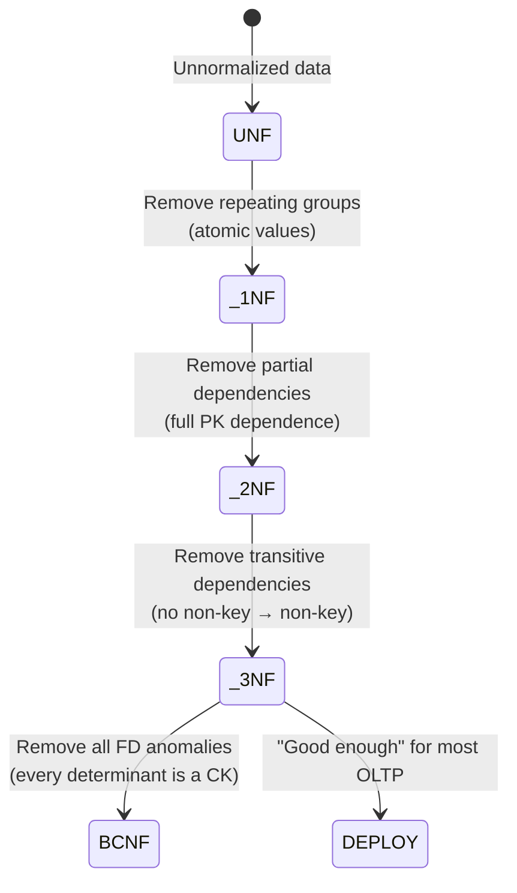

# 1NF Through 3NF — How It Works, Examples, Pitfalls, Interview, References

---

## Step-by-Step Normalization Walkthrough

### Step 0: Unnormalized (0NF) — The Starting Point

```
ORDER_RECORD:
| order_id | customer_id | customer_name | customer_city | customer_zip | products                    | order_date |
|----------|-------------|---------------|---------------|--------------|-----------------------------| -----------|
| 1001     | C1          | Alice Smith   | Seattle       | 98101        | Widget A, Gadget B          | 2025-01-15 |
| 1002     | C1          | Alice Smith   | Seattle       | 98101        | Gadget B                    | 2025-01-20 |
| 1003     | C2          | Bob Jones     | Portland      | 97201        | Widget A, Widget C, Gadget B | 2025-01-22 |
```

**Violations**: `products` contains multiple values (not atomic), customer info repeated across orders.

### Step 1: First Normal Form (1NF)

**Rule**: Every cell contains a single atomic value. No repeating groups.

```sql
-- Split the products column into separate rows
CREATE TABLE order_details_1nf (
    order_id        INT,
    customer_id     VARCHAR(10),
    customer_name   VARCHAR(200),
    customer_city   VARCHAR(200),
    customer_zip    VARCHAR(10),
    product_name    VARCHAR(200),  -- now atomic: one product per row
    order_date      DATE,
    PRIMARY KEY (order_id, product_name)
);
```

```
| order_id | customer_id | customer_name | customer_city | customer_zip | product_name | order_date |
|----------|-------------|---------------|---------------|--------------|-------------- |------------|
| 1001     | C1          | Alice Smith   | Seattle       | 98101        | Widget A     | 2025-01-15 |
| 1001     | C1          | Alice Smith   | Seattle       | 98101        | Gadget B     | 2025-01-15 |
| 1002     | C1          | Alice Smith   | Seattle       | 98101        | Gadget B     | 2025-01-20 |
| 1003     | C2          | Bob Jones     | Portland      | 97201        | Widget A     | 2025-01-22 |
| 1003     | C2          | Bob Jones     | Portland      | 97201        | Widget C     | 2025-01-22 |
| 1003     | C2          | Bob Jones     | Portland      | 97201        | Gadget B     | 2025-01-22 |
```

**Now in 1NF** ✅ — but customer info is repeated (update anomaly: if Alice moves, must update all her rows).

### Step 2: Second Normal Form (2NF)

**Rule**: No partial dependencies. PK is `(order_id, product_name)`. `customer_name` depends only on `customer_id` (through `order_id`), NOT on `product_name`. That's a partial dependency.

```sql
-- Split: separate ORDERS from ORDER_LINES
CREATE TABLE orders_2nf (
    order_id        INT PRIMARY KEY,
    customer_id     VARCHAR(10)    NOT NULL,
    customer_name   VARCHAR(200),
    customer_city   VARCHAR(200),
    customer_zip    VARCHAR(10),
    order_date      DATE
);

CREATE TABLE order_lines_2nf (
    order_id        INT            NOT NULL REFERENCES orders_2nf(order_id),
    product_name    VARCHAR(200)   NOT NULL,
    PRIMARY KEY (order_id, product_name)
);
```

**Now in 2NF** ✅ — but `customer_city` depends on `customer_zip` (transitive: order_id → customer_id → customer_zip → customer_city).

### Step 3: Third Normal Form (3NF)

**Rule**: No transitive dependencies. `customer_city` depends on `customer_zip`, which depends on `customer_id`.

```sql
-- Split: separate CUSTOMERS from ORDERS
CREATE TABLE customers_3nf (
    customer_id     VARCHAR(10) PRIMARY KEY,
    customer_name   VARCHAR(200) NOT NULL,
    customer_zip    VARCHAR(10),
    customer_city   VARCHAR(200)
);

CREATE TABLE orders_3nf (
    order_id        INT PRIMARY KEY,
    customer_id     VARCHAR(10) NOT NULL REFERENCES customers_3nf(customer_id),
    order_date      DATE
);

CREATE TABLE order_lines_3nf (
    order_id        INT           NOT NULL REFERENCES orders_3nf(order_id),
    product_name    VARCHAR(200)  NOT NULL,
    PRIMARY KEY (order_id, product_name)
);
```

**Now in 3NF** ✅ — no update anomalies, no insertion anomalies, no deletion anomalies.

**(Technically, `customer_city → customer_zip` is still a transitive dependency within the customer table. Full 3NF would split zip/city into a separate table. In practice, this is often left as-is.)**

## State Diagram — Normalization Progression



## Anomaly Detection SQL

```sql
-- ============================================================
-- Detect UPDATE ANOMALIES: same entity with different values
-- ============================================================
SELECT customer_id, customer_name, COUNT(DISTINCT customer_city) AS city_count
FROM orders_denormalized
GROUP BY customer_id, customer_name
HAVING COUNT(DISTINCT customer_city) > 1;
-- If this returns rows, you have an update anomaly:
-- same customer has different cities in different order rows

-- ============================================================
-- Detect REDUNDANCY: how much data is duplicated
-- ============================================================
SELECT 
    COUNT(*) AS total_rows,
    COUNT(DISTINCT customer_id) AS unique_customers,
    ROUND(COUNT(*)::NUMERIC / COUNT(DISTINCT customer_id), 1) AS avg_duplication
FROM orders_denormalized;
-- If avg_duplication > 5, normalization would significantly reduce storage
```

## When 3NF Is Not Enough (Preview of BCNF)

```
| student_id | course   | instructor   |
|------------|----------|--------------|
| S1         | Math     | Prof. Smith  |
| S2         | Math     | Prof. Jones  |
| S3         | Physics  | Prof. Smith  |
```

PK: `(student_id, course)`. FD: `course → instructor` but `course` is not a superkey. This table is in 3NF but NOT in BCNF. See [../02_BCNF_And_4NF](../02_BCNF_And_4NF/).

## War Story: Uber — Denormalized Ride Table

Uber's original `rides` table was denormalized: rider name, rider city, driver name, driver city, car model — all in one table. At 20M rides/day, a driver changing their car model required updating millions of rows. They normalized into `dim_driver`, `dim_rider`, `dim_vehicle` and a `fact_rides` table, reducing the car-model update from a 2-hour batch job to a single row update.

## Pitfalls

| Pitfall | Fix |
|---|---|
| Normalizing a read-heavy analytical table | Normalize for OLTP, denormalize for OLAP. These are different systems |
| Leaving a 0NF table in production ("we'll fix it later") | The longer a denormalized table lives, the harder it is to migrate. Fix early |
| Not documenting functional dependencies | Write them down: `customer_id → customer_name, customer_city, customer_zip` |
| Over-normalizing (splitting zip → city into its own table) | Stop at 3NF for OLTP unless you have a specific anomaly that 3NF doesn't fix |

## Interview

### Q: "Walk me through normalizing a flat file."

**Strong Answer**: "Step 1: identify repeating groups and make every cell atomic → 1NF. Step 2: identify the composite PK and remove partial dependencies — any non-key column that depends on only part of the PK gets extracted into its own table → 2NF. Step 3: remove transitive dependencies — if A → B → C, extract B and C into their own table → 3NF. I'd do this on a whiteboard, showing the functional dependencies with arrows and the resulting table splits. For OLTP, 3NF is usually sufficient. For analytical, I'd then deliberately denormalize."

## References

| Resource | Link |
|---|---|
| *An Introduction to Database Systems* | C.J. Date — definitive textbook |
| Codd's Original Paper | "A Relational Model of Data for Large Shared Data Banks" (1970) |
| [Database Normalization Explained](https://github.com/DataEngineer-io/data-engineer-handbook) | Community resources |
| Cross-ref: BCNF/4NF | [../02_BCNF_And_4NF](../02_BCNF_And_4NF/) |
| Cross-ref: Denormalization | [../04_Denormalization_Trade_Offs](../04_Denormalization_Trade_Offs/) |
