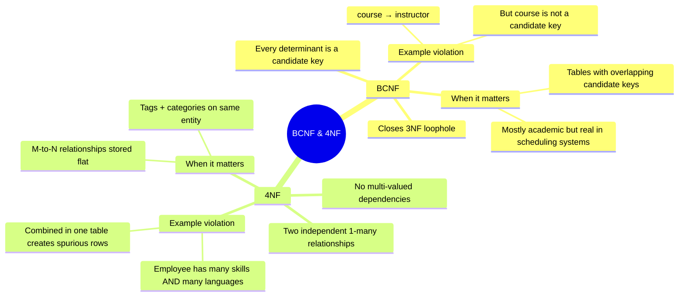

# BCNF and 4NF — Concept Overview & Deep Internals

> Beyond 3NF: when every determinant must be a candidate key, and multi-valued dependencies.

---

## Why This Exists

**BCNF (Boyce-Codd Normal Form)**: 3NF has a loophole. If a non-key column determines part of the primary key, 3NF allows it. BCNF closes this gap: every determinant (column that determines another) must be a candidate key or superkey.

**4NF (Fourth Normal Form)**: Addresses multi-valued dependencies — when two independent 1:many relationships exist for the same entity and are stored in the same table.

## Mindmap



## BCNF Example

```sql
-- VIOLATES BCNF: course → instructor, but course is not a candidate key
-- PK is (student_id, course)
CREATE TABLE enrollment_not_bcnf (
    student_id   INT,
    course       VARCHAR(50),
    instructor   VARCHAR(100),  -- course → instructor (FD)
    PRIMARY KEY (student_id, course)
);
-- Problem: if we change who teaches Math, update ALL enrollment rows

-- FIX: decompose into BCNF
CREATE TABLE course_instructor (
    course       VARCHAR(50) PRIMARY KEY,
    instructor   VARCHAR(100) NOT NULL
);

CREATE TABLE enrollment_bcnf (
    student_id   INT,
    course       VARCHAR(50) REFERENCES course_instructor(course),
    PRIMARY KEY (student_id, course)
);
```

## 4NF Example — Multi-Valued Dependencies

```sql
-- VIOLATES 4NF: employee has INDEPENDENT multi-valued dependencies
-- Employee skills and employee languages are unrelated to each other
CREATE TABLE employee_skills_languages_bad (
    employee_id  INT,
    skill        VARCHAR(100),
    language     VARCHAR(100),
    PRIMARY KEY (employee_id, skill, language)
);
-- Result: cartesian product of skills × languages per employee
-- Employee 1 has 3 skills and 2 languages = 6 rows (should be 5)
-- | 1 | Java   | English |
-- | 1 | Java   | Spanish |
-- | 1 | Python | English |
-- | 1 | Python | Spanish |
-- | 1 | SQL    | English |
-- | 1 | SQL    | Spanish |

-- FIX: decompose into two independent tables
CREATE TABLE employee_skills (
    employee_id  INT,
    skill        VARCHAR(100),
    PRIMARY KEY (employee_id, skill)
);  -- 3 rows

CREATE TABLE employee_languages (
    employee_id  INT,
    language     VARCHAR(100),
    PRIMARY KEY (employee_id, language)
);  -- 2 rows
-- Total: 5 rows instead of 6. No spurious relationships.
```

## When BCNF/4NF Matter in Practice

| Scenario | BCNF Needed? | 4NF Needed? |
|---|---|---|
| Course scheduling system | ✅ Yes — course→instructor dependency | |
| Employee profile with tags + categories | | ✅ Yes — independent multi-valued deps |
| Standard OLTP with simple PKs | ❌ 3NF sufficient | ❌ Usually fine |
| Kimball star schema (DW) | ❌ Intentionally denormalized | ❌ |

## Interview — Q: "What's the difference between 3NF and BCNF?"

**Strong Answer**: "3NF says no transitive dependencies — non-key columns depend only on the primary key, not on other non-key columns. BCNF strengthens this: every determinant in the table must be a candidate key. The classic example is a course-enrollment table where `course → instructor` but `course` alone is not a candidate key (the PK is `student_id + course`). This is 3NF compliant but violates BCNF. The fix: extract `course → instructor` into its own table."

## References

| Resource | Link |
|---|---|
| *An Introduction to Database Systems* | C.J. Date — Ch. 12: BCNF |
| Cross-ref: 1NF-3NF | [../01_1NF_Through_3NF](../01_1NF_Through_3NF/) |
| Cross-ref: 5NF/6NF | [../03_5NF_And_6NF](../03_5NF_And_6NF/) |
