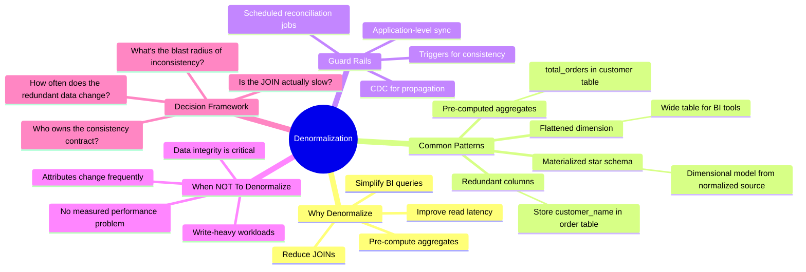
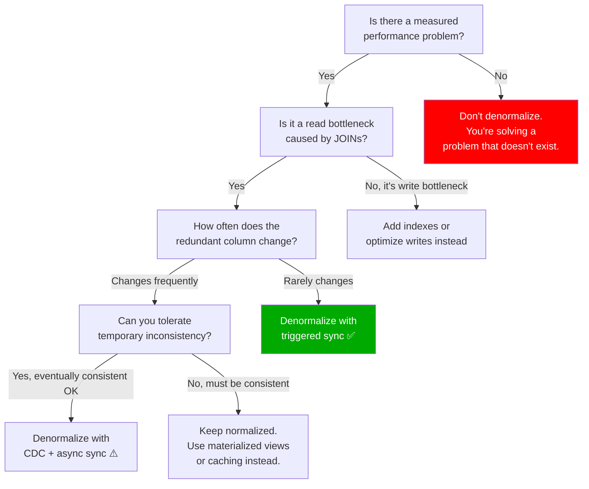

# Denormalization Trade-Offs — Concept Overview & Deep Internals

> The intentional re-introduction of redundancy for performance. This is WHERE you earn your Principal title.

---

## Why This Exists

**The fundamental tension**: Normalization eliminates anomalies but increases JOINs. Denormalization reduces JOINs but reintroduces anomalies. A Principal data architect doesn't pick one — they normalize everything first to understand the dependencies, then strategically denormalize based on measured access patterns.

**Rule**: "Normalize until it hurts, denormalize until it works." — Unknown, but widely attributed.

## Mindmap



## Decision Framework



## Before/After: Denormalization in Practice

```sql
-- ============================================================
-- BEFORE: normalized (3 JOINs for a common dashboard query)
-- ============================================================
SELECT 
    c.customer_name,
    c.customer_tier,
    o.order_date,
    p.product_name,
    ol.quantity,
    ol.unit_price * ol.quantity AS line_total
FROM order_lines ol
JOIN orders o ON ol.order_id = o.order_id
JOIN customers c ON o.customer_id = c.customer_id
JOIN products p ON ol.product_id = p.product_id
WHERE o.order_date >= '2025-01-01';
-- Execution: 4.2 seconds on 500M order_lines

-- ============================================================
-- AFTER: denormalized wide table (0 JOINs)
-- ============================================================
CREATE TABLE fact_order_lines_denorm AS
SELECT 
    ol.order_line_id,
    o.order_id,
    o.order_date,
    c.customer_id,
    c.customer_name,      -- REDUNDANT
    c.customer_tier,      -- REDUNDANT
    p.product_id,
    p.product_name,       -- REDUNDANT
    ol.quantity,
    ol.unit_price,
    ol.unit_price * ol.quantity AS line_total  -- PRE-COMPUTED
FROM order_lines ol
JOIN orders o ON ol.order_id = o.order_id
JOIN customers c ON o.customer_id = c.customer_id
JOIN products p ON ol.product_id = p.product_id;

-- Same query, 0.3 seconds (14x faster)
SELECT customer_name, customer_tier, order_date, 
       product_name, quantity, line_total
FROM fact_order_lines_denorm
WHERE order_date >= '2025-01-01';
```

## Consistency Protection Strategies

| Strategy | Consistency | Complexity | Use When |
|---|---|---|---|
| **Database trigger** | Strong (synchronous) | Medium | OLTP, < 1M rows, critical consistency |
| **CDC + streaming** | Eventual (seconds) | High | Large scale, acceptable lag |
| **Application sync** | Depends on discipline | Low | Small team, simple denorm |
| **Nightly reconciliation** | Weak (up to 24h lag) | Low | Analytics-only table, not user-facing |
| **Materialized view** | Refresh-based | Low | Modern DB engines (Postgres, Snowflake) |

## War Story: Airbnb — Denormalized Search Index

Airbnb's search index denormalizes listing data (host name, location, amenities, reviews, pricing) into a single Elasticsearch document per listing. The source-of-truth is a normalized PostgreSQL schema. CDC (Debezium) streams changes to Kafka, which updates the search index within seconds. The search API never touches Postgres — it only reads the denormalized index.

**Key lesson**: The normalized DB is the write path. The denormalized index is the read path. CDC bridges them.

## Pitfalls

| Pitfall | Fix |
|---|---|
| Denormalizing without measuring the performance problem first | Profile the query. The bottleneck might be missing indexes, not JOINs |
| No consistency mechanism for redundant data | Use triggers, CDC, or scheduled reconciliation — pick one and document it |
| Denormalizing a frequently-changing column | Only denormalize stable attributes (customer_name: OK). Avoid fast-changing ones (account_balance: dangerous) |
| Losing the normalized source of truth | Keep the normalized tables as the system of record. Denormalized tables are derived artifacts |

## Interview

### Q: "When do you denormalize, and how do you protect consistency?"

**Strong Answer**: "I denormalize ONLY after measuring a performance bottleneck caused by JOINs. My decision framework: (1) Is the redundant column stable? Customer name changes rarely — safe to denormalize. Account balance changes constantly — dangerous. (2) What consistency is acceptable? For an executive dashboard refreshed hourly, eventual consistency with a 5-minute CDC lag is fine. For a payments table, I'd use a trigger or keep it normalized. (3) I always maintain the normalized schema as the source of truth. The denormalized table is a derived, performance-optimized view."

## References

| Resource | Link |
|---|---|
| *The Data Warehouse Toolkit* 3rd Ed. | Kimball — star schema is intentional denormalization |
| *Designing Data-Intensive Applications* | Martin Kleppmann — Ch. 3: Storage and Retrieval |
| Cross-ref: 1NF-3NF | [../01_1NF_Through_3NF](../01_1NF_Through_3NF/) — what you denormalize FROM |
| Cross-ref: Star Schema | [../../10_Data_Modeling_For_Analytics](../../10_Data_Modeling_For_Analytics/) — the ultimate denormalization |
