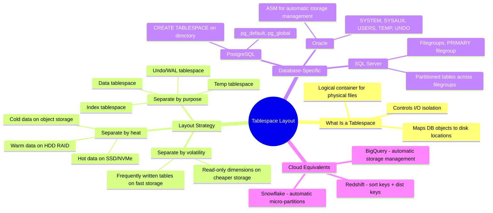

# Tablespace Layout — Concept Overview

> How to physically organize database files on storage for performance, manageability, and isolation.

---

## Why This Exists

**Origin**: Tablespaces originated in Oracle (1980s) as a way to map logical database objects to physical storage locations. Every major RDBMS (PostgreSQL, Oracle, SQL Server, DB2) implements some form of tablespace or filegroup.

**The problem it solves**: Without thoughtful tablespace layout, your 500GB fact table, your 50MB dimension table, your indexes, and your temp space all compete for the same I/O channel. Under load, a full table scan on `fact_sales` starves index lookups on `dim_customer`. Tablespace separation puts hot and cold data on different storage tiers, isolates temp operations, and enables targeted backup/recovery.

**Principal-level nuance**: In cloud-native warehouses (Snowflake, BigQuery, Redshift), tablespace layout is abstracted away — the engine manages it. But in PostgreSQL, Oracle, and on-prem Hadoop/Spark, physical layout decisions directly impact throughput. A Principal architect must know both worlds.

## Mindmap

## When To Care / When NOT To

| Scenario | Tablespace Layout Matters? | Why |
|---|---|---|
| On-prem PostgreSQL with mixed OLTP+OLAP | ✅ Critical | Isolate temp from data I/O |
| Oracle RAC enterprise DW | ✅ Critical | ASM layout affects parallelism |
| Snowflake / BigQuery | ❌ Abstracted | Engine handles storage automatically |
| Self-managed Spark on HDFS | ✅ Important | HDFS block placement, short-circuit reads |

## Key Terminology

| Term | Definition |
|---|---|
| **Tablespace** | A named storage container that maps logical DB objects to physical disk locations |
| **Filegroup** | SQL Server's equivalent of a tablespace |
| **I/O Isolation** | Ensuring different workloads use different storage channels to avoid contention |
| **Storage Tier** | Classification of storage by speed/cost: NVMe > SSD > HDD > Object Storage |
| **ASM** | Oracle Automatic Storage Management — distributes data across disks automatically |
