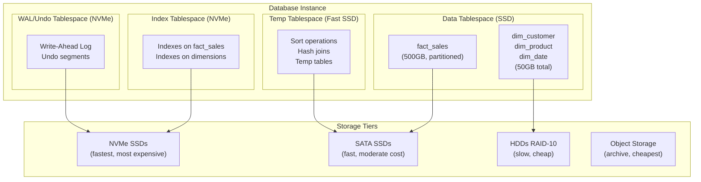

# Tablespace Layout — How It Works, Examples, War Stories, Pitfalls, Interview, References

---

## HLD — Tablespace Architecture



## PostgreSQL Implementation

```sql
-- ============================================================
-- Create tablespaces pointing to different storage paths
-- ============================================================

-- Fast NVMe for indexes and WAL
CREATE TABLESPACE ts_indexes LOCATION '/mnt/nvme/pg_indexes';

-- SSD for fact tables
CREATE TABLESPACE ts_facts LOCATION '/mnt/ssd/pg_facts';

-- HDD for rarely-changed dimensions
CREATE TABLESPACE ts_dimensions LOCATION '/mnt/hdd/pg_dimensions';

-- Temp tablespace for sort/hash operations
-- (set in postgresql.conf: temp_tablespaces = 'ts_temp')

-- ============================================================
-- Create tables on specific tablespaces
-- ============================================================

CREATE TABLE fact_sales (
    sale_sk         BIGINT PRIMARY KEY,
    date_sk         INT NOT NULL,
    product_sk      BIGINT NOT NULL,
    customer_sk     BIGINT NOT NULL,
    net_amount      DECIMAL(12,2)
) TABLESPACE ts_facts
PARTITION BY RANGE (date_sk);

CREATE TABLE dim_customer (
    customer_sk     BIGINT PRIMARY KEY,
    customer_name   VARCHAR(300),
    city            VARCHAR(200)
) TABLESPACE ts_dimensions;

-- Put indexes on NVMe
CREATE INDEX idx_fact_sales_date 
    ON fact_sales(date_sk) 
    TABLESPACE ts_indexes;

CREATE INDEX idx_fact_sales_customer 
    ON fact_sales(customer_sk) 
    TABLESPACE ts_indexes;
```

## SQL Server Filegroups

```sql
-- SQL Server equivalent: filegroups
ALTER DATABASE SalesDB ADD FILEGROUP FG_Facts;
ALTER DATABASE SalesDB ADD FILE (
    NAME = 'facts_data', 
    FILENAME = 'F:\SQLData\facts_data.ndf',
    SIZE = 500GB, FILEGROWTH = 10GB
) TO FILEGROUP FG_Facts;

ALTER DATABASE SalesDB ADD FILEGROUP FG_Indexes;
ALTER DATABASE SalesDB ADD FILE (
    NAME = 'index_data', 
    FILENAME = 'G:\SQLIndex\index_data.ndf'
) TO FILEGROUP FG_Indexes;

-- Create table on specific filegroup
CREATE TABLE fact_sales (...) ON FG_Facts;
CREATE INDEX idx_date ON fact_sales(date_sk) ON FG_Indexes;
```

## War Story: Bloomberg — I/O Isolation for Market Data

Bloomberg's market data platform processes 300B+ messages/day. Their PostgreSQL cluster uses isolated tablespaces:

- **NVMe**: Indexes and WAL (write-ahead log) — critical for write throughput
- **SSD**: Real-time fact tables (last 24 hours of tick data)
- **HDD**: Historical fact tables (30+ days of tick data)
- **Object Storage (S3)**: Archived data (> 1 year)

**Key insight**: A single rogue analytical query scanning a year of data would previously saturate the I/O channel and block real-time ingestion. Tablespace isolation on separate storage controllers eliminated this contention.

## Pitfalls

| Pitfall | Fix |
|---|---|
| Everything on the default tablespace | Separate data, indexes, temp, and WAL to different storage paths |
| Temp tablespace on the same disk as data | Sort operations compete with reads. Put temp on a dedicated fast path |
| Not monitoring tablespace usage | Set alerts at 80% capacity. Autogrow is dangerous without monitoring |
| Ignoring cloud-managed storage layout | On Snowflake/BigQuery, focus on clustering/sort keys instead of tablespaces |

## Interview — Q: "How do you handle I/O contention in a mixed OLTP/OLAP workload?"

**Strong Answer**: "Tablespace isolation. Put indexes on NVMe (fast random reads), fact tables on SSD (fast sequential reads for scans), temp operations on a separate SSD (sort/hash), and WAL on dedicated NVMe (fast sequential writes). This prevents analytical scans from starving transactional lookups. In cloud-managed DBs, this translates to sort key selection and clustering strategy instead of physical tablespace management."

## References

| Resource | Link |
|---|---|
| [PostgreSQL Tablespaces](https://www.postgresql.org/docs/current/manage-ag-tablespaces.html) | Official documentation |
| Oracle ASM | Automatic Storage Management architecture guide |
| Cross-ref: Storage Parameters | [../02_Storage_Parameters](../02_Storage_Parameters/) |
| Cross-ref: Physical vs Logical | [../03_Physical_vs_Logical_Separation](../03_Physical_vs_Logical_Separation/) |
