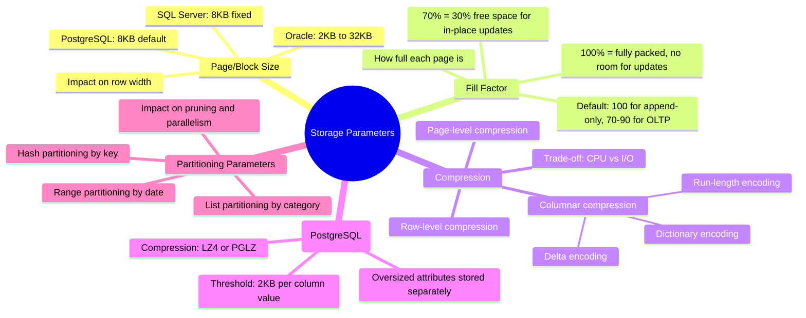

# Storage Parameters — Concept Overview & Deep Internals

> Fill factor, page size, compression, and the knobs that control how data is physically stored on disk.

---

## Why This Exists

Every row you insert eventually lands on a disk page. How that page is structured — its size, how full it is, what compression is applied — determines the read/write performance of every query. Storage parameters are the bridge between your logical schema and your physical I/O profile.

## Mindmap



## Fill Factor — The Critical Knob

```sql
-- ============================================================
-- PostgreSQL: Fill Factor
-- ============================================================

-- OLTP table (frequent UPDATEs) — leave room for HOT updates
CREATE TABLE customers (
    customer_id  INT PRIMARY KEY,
    customer_name VARCHAR(200),
    email VARCHAR(255),
    city VARCHAR(200)
) WITH (fillfactor = 70);
-- 30% of each page is empty, allowing in-place updates (HOT = Heap Only Tuple)
-- Without this: every UPDATE creates a new row version on a DIFFERENT page → table bloat

-- Append-only fact table (never updated) — pack pages fully
CREATE TABLE fact_sales (
    sale_sk BIGINT PRIMARY KEY,
    date_sk INT, product_sk BIGINT,
    net_amount DECIMAL(12,2)
) WITH (fillfactor = 100);
-- 100% utilization. No wasted space. Optimal for read-heavy sequential scans.

-- Index-specific fill factor
CREATE INDEX idx_customers_city ON customers(city) WITH (fillfactor = 90);
-- 10% free space in index pages for new entries without page splits
```

## Compression — Engine Comparison

| Engine | Compression Type | Typical Ratio | CPU Cost | Best For |
|---|---|---|---|---|
| **PostgreSQL** | TOAST (LZ4/PGLZ) per column | 2-4x on text | Low | Large text/JSONB columns |
| **Oracle** | OLTP/HCC compression | 2-10x | Medium-High | Data warehouse |
| **Redshift** | AZ64, LZO, ZSTD per column | 3-8x | Low (columnar) | Analytical workloads |
| **Snowflake** | Automatic micro-partition compression | 5-10x | None (engine-managed) | Everything |
| **Parquet/ORC** | Dictionary + RLE + Delta | 5-15x | Low (columnar) | Data lake files |

## Redshift Column Encoding

```sql
-- Redshift: choose encoding per column
CREATE TABLE fact_sales (
    sale_sk         BIGINT        ENCODE AZ64,      -- integer-optimized compression
    date_sk         INT           ENCODE DELTA,     -- sequential dates compress well with delta
    product_sk      BIGINT        ENCODE AZ64,
    customer_sk     BIGINT        ENCODE AZ64,
    store_name      VARCHAR(200)  ENCODE LZO,       -- text compression
    order_status    VARCHAR(20)   ENCODE BYTEDICT,  -- low cardinality → dictionary
    net_amount      DECIMAL(12,2) ENCODE AZ64
) DISTKEY(customer_sk) SORTKEY(date_sk);
-- ANALYZE COMPRESSION fact_sales; -- Redshift recommends optimal encodings
```

## War Story: Netflix — Parquet Compression Tuning

Netflix's analytics platform stores petabytes on S3 in Parquet format. They found that switching from `SNAPPY` to `ZSTD` compression for string-heavy columns reduced storage by 40% while only adding 5% CPU overhead during reads. For integer columns, `DELTA_BINARY_PACKED` encoding was 3x more efficient than plain encoding because timestamps and IDs are sequential.

## Pitfalls

| Pitfall | Fix |
|---|---|
| Default fillfactor (100) on an OLTP table with frequent UPDATEs | Set fillfactor to 70-80 for UPDATE-heavy tables. Check table bloat with `pgstattuple` |
| Not using columnar compression on analytical tables | Use Parquet/ORC for lake, AZ64/ZSTD for Redshift, automatic for Snowflake |
| Wrong page size for row width | If avg row is 4KB and page is 8KB, only 2 rows per page. Consider adjusting or splitting wide tables |
| Not running ANALYZE COMPRESSION (Redshift) | Let the engine recommend encodings. Don't guess. |

## Interview — Q: "How do you optimize storage for a write-heavy OLTP table vs a read-heavy DW table?"

**Strong Answer**: "For OLTP: fillfactor 70-80 to leave room for HOT updates (PostgreSQL) or free space for in-place modifications. Minimal compression — CPU matters more than storage. For DW: fillfactor 100 (append-only, never updated), aggressive columnar compression (dictionary encoding for low-cardinality, delta for sequences, ZSTD for general). Partitioning by date for both, but with different goals: OLTP for maintenance windows, DW for query pruning."

## References

| Resource | Link |
|---|---|
| [PostgreSQL Storage Parameters](https://www.postgresql.org/docs/current/sql-createtable.html#SQL-CREATETABLE-STORAGE-PARAMETERS) | Official docs |
| [Redshift Column Encoding](https://docs.aws.amazon.com/redshift/latest/dg/c_Compression_encodings.html) | AWS Redshift compression guide |
| [Parquet Format](https://parquet.apache.org/docs/file-format/) | Apache Parquet encoding spec |
| Cross-ref: Tablespace Layout | [../01_Tablespace_Layout](../01_Tablespace_Layout/) |
