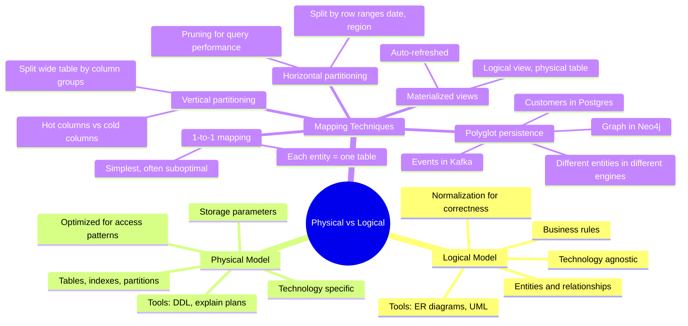
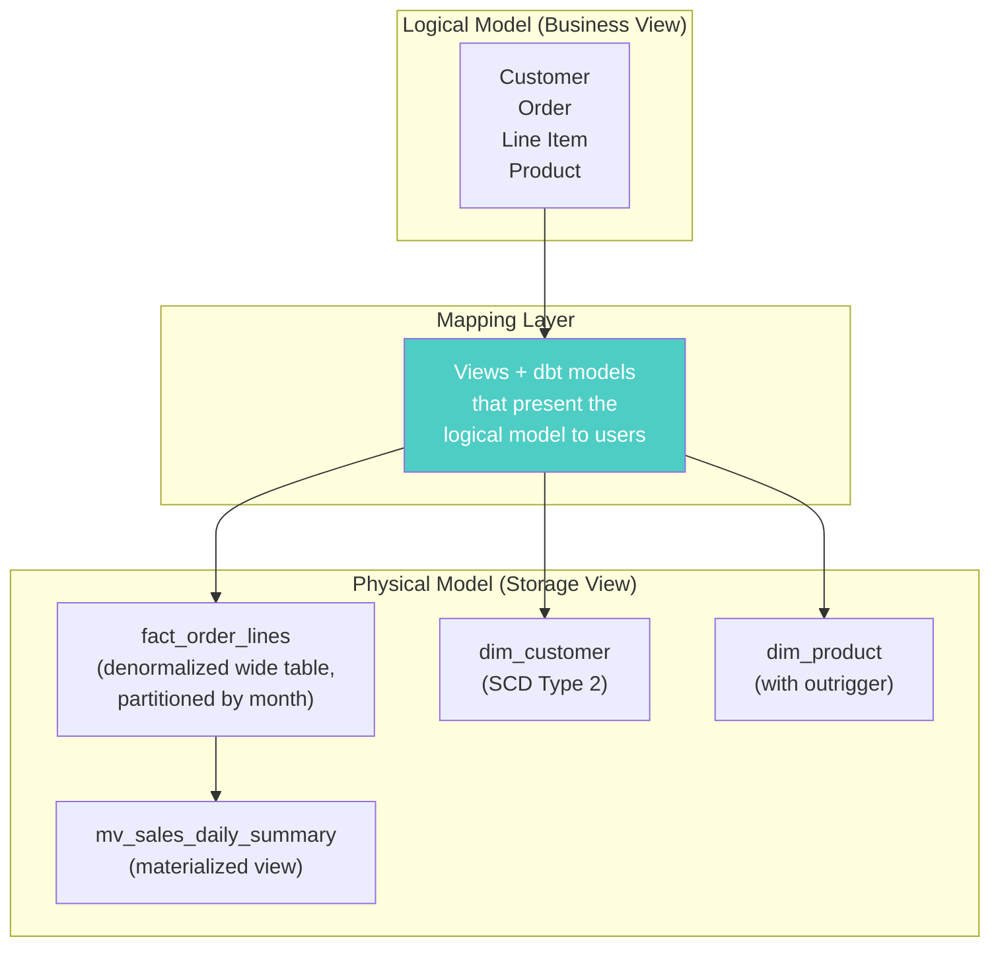

# Physical vs Logical Separation — Concept Overview & Deep Internals

> Why your logical model should NOT dictate your physical layout — and how to decouple them.

---

## Why This Exists

**The problem**: Junior architects design a logical model, then implement it 1:1 as physical tables. The logical model says "Customer has Orders which have Line Items" — so they create 3 tables with foreign keys. But physically, the query pattern might demand a wide denormalized table, partitioned by date, with a materialized view for aggregation.

**The separation principle**: Logical = what the data means. Physical = how the data is stored. A Principal architect designs the logical model for correctness and the physical model for performance — and maps between them.

## Mindmap



## Architecture Diagram



## Examples

```sql
-- ============================================================
-- LOGICAL: clean normalized entities
-- ============================================================
-- Logically: Customer → Order → OrderLine → Product (4 entities)

-- ============================================================
-- PHYSICAL: optimized for the access pattern
-- ============================================================
-- Physically: one wide fact table + dimension tables
CREATE TABLE fact_order_lines (
    -- From logical "Order" + "OrderLine" + denormalized "Customer" + "Product"
    order_line_sk   BIGINT PRIMARY KEY,
    order_id        INT,
    order_date      DATE,
    customer_sk     BIGINT,
    customer_name   VARCHAR(300),  -- DENORMALIZED from dim_customer
    product_sk      BIGINT,
    product_name    VARCHAR(500),  -- DENORMALIZED from dim_product
    quantity        INT,
    unit_price      DECIMAL(10,2),
    line_total      DECIMAL(12,2)  -- PRE-COMPUTED
) PARTITION BY RANGE (order_date);

-- MAPPING: a view that presents the logical model to analysts
CREATE VIEW v_orders_logical AS
SELECT 
    order_id,
    order_date,
    customer_name AS customer,
    product_name AS product,
    quantity,
    line_total AS revenue
FROM fact_order_lines;
-- Analysts see the logical model. The engine reads the physical model.
```

## Vertical Partitioning — Hot vs Cold Columns

```sql
-- Wide customer table: 80 columns
-- Access pattern: 90% of queries use only 10 columns

-- PHYSICAL: split into hot and cold
CREATE TABLE customer_hot (
    customer_sk  BIGINT PRIMARY KEY,
    customer_name VARCHAR(300),
    email VARCHAR(255),
    tier VARCHAR(20),
    last_order_date DATE
) TABLESPACE ts_ssd;

CREATE TABLE customer_cold (
    customer_sk  BIGINT PRIMARY KEY REFERENCES customer_hot(customer_sk),
    date_of_birth DATE,
    ssn_hash BINARY(32),
    registration_ip VARCHAR(45),
    -- ... 70 more rarely-accessed columns
) TABLESPACE ts_hdd;

-- LOGICAL VIEW: presents the full customer
CREATE VIEW v_customer AS
SELECT h.*, c.*
FROM customer_hot h
LEFT JOIN customer_cold c ON h.customer_sk = c.customer_sk;
```

## War Story: Spotify — Polyglot Physical Model

Spotify's logical model has "User → Playlist → Song → Artist." Physically:

- **User profiles**: PostgreSQL (transactional, ACID)
- **Playlist-Song relationships**: Cassandra (distributed, high write throughput)
- **Song metadata + audio features**: BigQuery (analytical, ML feature store)
- **User-to-User recommendations**: Graph stored in custom in-memory engine

The logical model is unified through a dbt DAG that materializes cross-engine joins into BigQuery for analytics.

## Pitfalls

| Pitfall | Fix |
|---|---|
| 1:1 logical-to-physical mapping without optimization | Profile query patterns first. Physical model should serve the access pattern, not the ER diagram |
| Denormalizing without maintaining the normalized source | Keep the logical model as the source of truth. Physical is derived |
| Over-partitioning (partition per day on a 1000-row table) | Partition only when table > 10GB or query patterns benefit from pruning |
| No mapping layer (views/dbt) between logical and physical | Users should query logical views. DBAs manage physical tables |

## Interview — Q: "How does your physical model differ from your logical model?"

**Strong Answer**: "The logical model captures business entities and rules — it's normalized, technology-agnostic, and designed for correctness. The physical model is the actual storage implementation — denormalized for query speed, partitioned for pruning, with indexes for access patterns. I use a mapping layer (views or dbt models) so analysts interact with the logical model while the engine reads the physical model. The two evolve independently: business changes affect the logical model, performance changes affect the physical model."

## References

| Resource | Link |
|---|---|
| *The Data Model Resource Book Vol. 1* | Len Silverston — logical vs physical patterns |
| *Designing Data-Intensive Applications* | Martin Kleppmann — polyglot persistence |
| Cross-ref: Tablespace Layout | [../01_Tablespace_Layout](../01_Tablespace_Layout/) |
| Cross-ref: Denormalization | [../../07_Normalization_Theory/04_Denormalization_Trade_Offs](../../07_Normalization_Theory/04_Denormalization_Trade_Offs/) |
