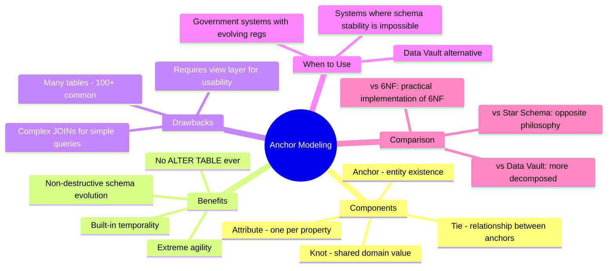

# Anchor Modeling — Concept Overview & Deep Internals

> A highly decomposed 6NF modeling technique for extreme agility — the opposite of denormalization.

---

## Why This Exists

**Origin**: Lars Rönnbäck developed Anchor Modeling at the Swedish government in the 2000s. It extends 6NF principles: every attribute gets its own table. Changes to one attribute never affect tables storing other attributes.

**The problem it solves**: Traditional tables force all attributes to be born at the same time (schema-on-write). When requirements change, you ALTER TABLE — which can lock a 10TB table for hours. Anchor Modeling avoids ALTER TABLE entirely: new attributes = new tables.

## Mindmap



## Schema Example

```sql
-- ANCHOR: entity existence only (customer exists)
CREATE TABLE AN_Customer (
    AN_Customer_ID BIGINT PRIMARY KEY,
    AN_Customer_Metadata TIMESTAMP DEFAULT CURRENT_TIMESTAMP
);

-- ATTRIBUTE: one table per property
CREATE TABLE AT_Customer_Name (
    AN_Customer_ID BIGINT REFERENCES AN_Customer(AN_Customer_ID),
    AT_Customer_Name VARCHAR(300),
    AT_ChangedAt TIMESTAMP,
    PRIMARY KEY (AN_Customer_ID, AT_ChangedAt)  -- built-in history
);

CREATE TABLE AT_Customer_Email (
    AN_Customer_ID BIGINT REFERENCES AN_Customer(AN_Customer_ID),
    AT_Customer_Email VARCHAR(255),
    AT_ChangedAt TIMESTAMP,
    PRIMARY KEY (AN_Customer_ID, AT_ChangedAt)
);

-- TIE: relationship between anchors
CREATE TABLE TI_Customer_Order (
    AN_Customer_ID BIGINT,
    AN_Order_ID BIGINT,
    TI_ChangedAt TIMESTAMP,
    PRIMARY KEY (AN_Customer_ID, AN_Order_ID, TI_ChangedAt)
);

-- VIEW: presents the full entity (hides decomposition)
CREATE VIEW v_Customer_Current AS
SELECT a.AN_Customer_ID, n.AT_Customer_Name, e.AT_Customer_Email
FROM AN_Customer a
LEFT JOIN AT_Customer_Name n ON a.AN_Customer_ID = n.AN_Customer_ID
    AND n.AT_ChangedAt = (SELECT MAX(AT_ChangedAt) FROM AT_Customer_Name WHERE AN_Customer_ID = a.AN_Customer_ID)
LEFT JOIN AT_Customer_Email e ON a.AN_Customer_ID = e.AN_Customer_ID
    AND e.AT_ChangedAt = (SELECT MAX(AT_ChangedAt) FROM AT_Customer_Email WHERE AN_Customer_ID = a.AN_Customer_ID);
```

**Adding a new attribute**: Just `CREATE TABLE AT_Customer_Phone (...)`. Zero impact on existing tables.

## Interview — Q: "When would you use Anchor Modeling over Data Vault?"

**Strong Answer**: "Anchor Modeling when schema volatility is extreme — government regulatory systems where attributes are added/removed quarterly. Anchor goes further than Data Vault: each attribute is its own table (6NF), so no ALTER TABLE operations ever. The trade-off is complexity — a customer with 20 attributes requires 21 tables + a view. Data Vault groups related attributes into Satellites, which is more practical for most enterprises."

## References

| Resource | Link |
|---|---|
| [Anchor Modeling Official](http://www.anchormodeling.com/) | Lars Rönnbäck's site with toolkit |
| Cross-ref: 5NF/6NF | [../../07_Normalization_Theory/03_5NF_And_6NF](../../07_Normalization_Theory/03_5NF_And_6NF/) |
| Cross-ref: Data Vault | [../../03_Data_Vault_2_0_Architecture](../../03_Data_Vault_2_0_Architecture/) |
