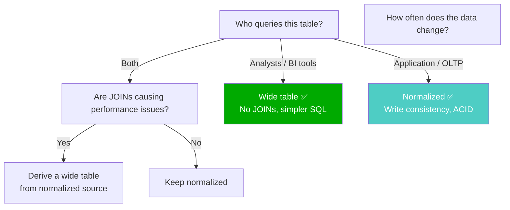

# Wide Table vs Normalized — Concept Overview & Deep Internals

> The most common schema debate in modern analytics: one wide table or normalized joins?

---

## Why This Exists

The rise of columnar engines (BigQuery, Snowflake, Databricks) has changed the calculus. Old wisdom: "normalize to save storage." New reality: columnar compression makes wide tables storage-efficient, and eliminating JOINs eliminates the biggest source of query complexity and slowness.

## Decision Framework



## Comparison

| Factor | Wide Table | Normalized |
|---|---|---|
| **Query simplicity** | ✅ No JOINs | ❌ Multiple JOINs |
| **Storage (row-store)** | ❌ Wastes space (redundancy) | ✅ Efficient |
| **Storage (columnar)** | ✅ Compression handles redundancy | ✅ Also efficient |
| **Write performance** | ❌ Updates touch many columns | ✅ Updates touch one table |
| **Schema changes** | ❌ ALTER wide table is slow | ✅ Add column to one table |
| **Data consistency** | ❌ Redundancy risk | ✅ Single source of truth |
| **BI tool compatibility** | ✅ Flat tables work everywhere | ⚠️ Some tools struggle with JOINs |

## Wide Table DDL (One Big Table — OBT)

```sql
-- The "One Big Table" (OBT) pattern for analytics
CREATE TABLE obt_sales AS
SELECT 
    f.sale_sk, f.order_date, f.quantity, f.net_amount,
    c.customer_name, c.customer_tier, c.city AS customer_city,
    p.product_name, p.category, p.subcategory, p.brand,
    s.store_name, s.store_city, s.store_state,
    d.day_of_week, d.month_name, d.quarter_name, d.year_num,
    d.is_weekend, d.is_holiday
FROM fact_sales f
JOIN dim_customer c ON f.customer_sk = c.customer_sk
JOIN dim_product p ON f.product_sk = p.product_sk
JOIN dim_store s ON f.store_sk = s.store_sk
JOIN dim_date d ON f.date_sk = d.date_sk;
-- 50 columns, 0 JOINs for any query. Analysts love it.
```

## War Story: Shopify — OBT for Merchant Analytics

Shopify moved from a normalized star schema to a wide "One Big Table" for merchant-facing analytics. Their BI tool (Looker) generated SQL with 8+ JOINs for common dashboards. After materializing an OBT in BigQuery, dashboard load times dropped from 12 seconds to 800ms. Storage increased by 30% but BigQuery columnar compression kept costs manageable.

## Pitfalls

| Pitfall | Fix |
|---|---|
| Wide table without a normalized source-of-truth | Always maintain normalized tables. OBT is a derived artifact |
| Using OBT for writes/updates | OBT is read-only. Write to normalized, materialize to OBT |
| OBT with 500+ columns | Split into domain-specific wide tables: `obt_sales`, `obt_marketing`, `obt_finance` |

## References

| Resource | Link |
|---|---|
| [BigQuery Wide Table Best Practices](https://cloud.google.com/bigquery/docs/best-practices-performance-patterns) | Google Cloud |
| Cross-ref: Denormalization | [../../07_Normalization_Theory/04_Denormalization_Trade_Offs](../../07_Normalization_Theory/04_Denormalization_Trade_Offs/) |
