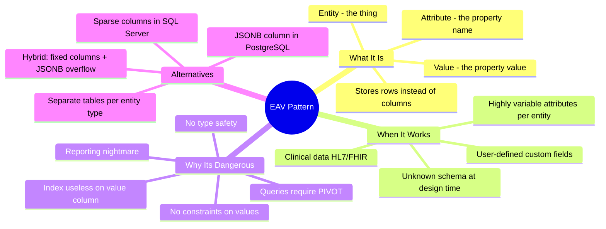

# EAV Pattern And Alternatives — Concept Overview & Deep Internals

> Entity-Attribute-Value: the most controversial schema pattern. When it's brilliant and when it's a disaster.

---

## Why This Exists

**The problem**: Some domains have entities where the set of attributes is unknown at design time and varies per entity instance. A hospital system where each test type has different result fields. A product catalog where shoes have "size" but laptops have "RAM." EAV stores attribute-value pairs as rows instead of columns.

## Mindmap



## EAV Schema

```sql
-- Classic EAV: 3 columns
CREATE TABLE entity_attributes (
    entity_id       BIGINT      NOT NULL,
    attribute_name  VARCHAR(100) NOT NULL,
    attribute_value TEXT,        -- everything is text — no type safety!
    PRIMARY KEY (entity_id, attribute_name)
);

-- Example data:
-- | entity_id | attribute_name | attribute_value |
-- |-----------|----------------|-----------------|
-- | 1         | name           | Nike Air Max    |
-- | 1         | size           | 10.5            |
-- | 1         | color          | Red             |
-- | 2         | name           | MacBook Pro     |
-- | 2         | ram_gb         | 16              |
-- | 2         | screen_size    | 14              |

-- QUERY NIGHTMARE: pivot from rows to columns
SELECT 
    entity_id,
    MAX(CASE WHEN attribute_name = 'name' THEN attribute_value END) AS name,
    MAX(CASE WHEN attribute_name = 'size' THEN attribute_value END) AS size,
    MAX(CASE WHEN attribute_name = 'color' THEN attribute_value END) AS color
FROM entity_attributes
WHERE entity_id = 1
GROUP BY entity_id;
```

## The Better Alternative: JSONB

```sql
-- PostgreSQL JSONB: schemaless with indexing and type checking
CREATE TABLE products (
    product_id  BIGINT PRIMARY KEY,
    product_type VARCHAR(50) NOT NULL,  -- 'shoe', 'laptop', etc.
    
    -- Fixed columns for common attributes
    name        VARCHAR(500) NOT NULL,
    price       DECIMAL(10,2) NOT NULL,
    
    -- JSONB for variable attributes
    attributes  JSONB DEFAULT '{}'
);

-- Shoes:   attributes = {"size": 10.5, "color": "Red", "material": "Leather"}
-- Laptops: attributes = {"ram_gb": 16, "screen_size": 14, "cpu": "M3 Pro"}

-- QUERY: simple, no PIVOT needed
SELECT name, price, attributes->>'size' AS size
FROM products
WHERE product_type = 'shoe' AND (attributes->>'size')::NUMERIC > 10;

-- GIN INDEX on JSONB for fast attribute lookups
CREATE INDEX idx_products_attrs ON products USING GIN (attributes);
```

## Comparison: EAV vs JSONB vs Separate Tables

| Factor | EAV | JSONB (PostgreSQL) | Separate Tables |
|---|---|---|---|
| Schema flexibility | ✅ Unlimited | ✅ Unlimited | ⚠️ One per type |
| Type safety | ❌ All text | ⚠️ JSON types | ✅ SQL types |
| Query simplicity | ❌ Requires PIVOT | ✅ Direct access | ✅ Direct access |
| Indexing | ❌ Poor | ✅ GIN indexes | ✅ B-tree indexes |
| Reporting | ❌ Nightmare | ⚠️ Needs extraction | ✅ Standard SQL |
| Storage efficiency | ❌ Row per attribute | ✅ Compressed JSON | ✅ Dense columns |

## War Story: Epic Systems — EAV in Healthcare

Epic (the largest US healthcare EHR vendor) uses EAV extensively for clinical data — each lab test type has different result fields, and new test types are added constantly. Their EAV tables have billions of rows. The trade-off: infinite flexibility for clinicians, but SQL reporting requires hundreds of PIVOT operations. Epic's reporting layer (Clarity) materializes the EAV into denormalized reporting tables overnight.

## Interview — Q: "A product manager wants custom fields for each customer. How do you model it?"

**Strong Answer**: "JSONB column, not EAV. A hybrid approach: fixed columns for universal attributes (name, email, created_at), and a JSONB `custom_fields` column for per-customer attributes. This gives schema flexibility without the PIVOT nightmare of EAV. GIN index on the JSONB column for queryability. If reporting needs arise, materialize JSONB fields into flat columns via dbt models."

## References

| Resource | Link |
|---|---|
| [PostgreSQL JSONB](https://www.postgresql.org/docs/current/datatype-json.html) | Official documentation |
| Cross-ref: Polymorphism Trap | [../../01_Logical_Domain_Modeling/03_Polymorphism_Trap](../../01_Logical_Domain_Modeling/03_Polymorphism_Trap/) |
| Cross-ref: NoSQL Document Model | [../../06_NoSQL_and_Document_Modeling](../../06_NoSQL_and_Document_Modeling/) |
