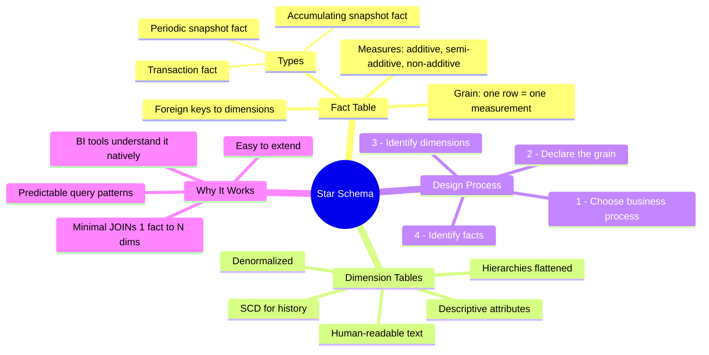
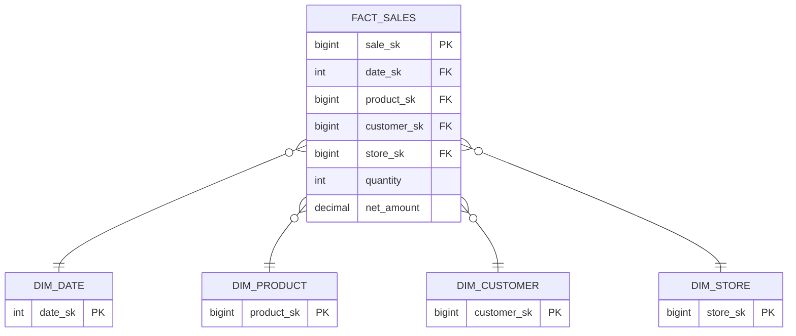

# Star Schema Fundamentals — Concept Overview & Deep Internals

> The Kimball star schema: the most successful analytical modeling pattern in history.

---

## Why This Exists

**Origin**: Ralph Kimball formalized the star schema in *The Data Warehouse Toolkit* (1996). The insight: analytical queries follow a pattern — "give me measures (SUM, COUNT, AVG) sliced by dimensions (time, geography, product, customer)." The star schema physically optimizes for exactly this pattern.

**Core anatomy**: One fact table at the center (measures/metrics) surrounded by dimension tables (context/descriptors). The fact table has foreign keys to each dimension. That's it.

## Mindmap



## Star Schema DDL

```sql
CREATE TABLE dim_date (
    date_sk         INT PRIMARY KEY,
    full_date       DATE NOT NULL,
    day_of_week     VARCHAR(10),
    month_name      VARCHAR(20),
    quarter_name    VARCHAR(5),
    year_num        INT,
    is_weekend      BOOLEAN,
    is_holiday      BOOLEAN
);

CREATE TABLE dim_product (
    product_sk      BIGINT PRIMARY KEY,
    product_id      VARCHAR(50),
    product_name    VARCHAR(500),
    category        VARCHAR(200),
    subcategory     VARCHAR(200),
    brand           VARCHAR(200)
);

CREATE TABLE fact_sales (
    sale_sk         BIGINT PRIMARY KEY,
    date_sk         INT REFERENCES dim_date(date_sk),
    product_sk      BIGINT REFERENCES dim_product(product_sk),
    customer_sk     BIGINT REFERENCES dim_customer(customer_sk),
    store_sk        BIGINT REFERENCES dim_store(store_sk),
    quantity        INT NOT NULL,
    unit_price      DECIMAL(10,2),
    net_amount      DECIMAL(12,2),
    tax_amount      DECIMAL(10,2),
    gross_amount    DECIMAL(12,2)
);
-- Any query: SELECT dim columns, AGG(fact measures) FROM fact JOIN dim GROUP BY dim
```

## ER Diagram



## Interview — Q: "Walk me through designing a star schema."

**Strong Answer**: "Kimball's 4-step process: (1) Choose the business process — e.g., retail sales. (2) Declare the grain — one row = one sale line item. (3) Identify dimensions — who (customer), what (product), where (store), when (date). (4) Identify facts — quantity, net_amount, tax, discount. The grain is the most critical decision — get it wrong and every query is ambiguous."

## References

| Resource | Link |
|---|---|
| *The Data Warehouse Toolkit* 3rd Ed. | Ralph Kimball & Margy Ross |
| Cross-ref: Snowflake Schema | [../02_Snowflake_Schema](../02_Snowflake_Schema/) |
| Cross-ref: Dimensional Modeling | [../../02_Dimensional_Modeling_Advanced](../../02_Dimensional_Modeling_Advanced/) |
