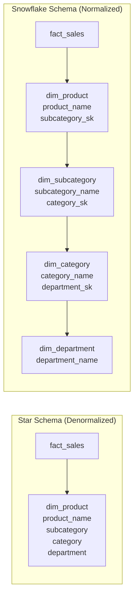

# Snowflake Schema — Concept Overview & Deep Internals

> When a star schema isn't normalized enough: splitting dimension hierarchies into sub-tables.

---

## Why This Exists

A star schema denormalizes dimensions — `dim_product` contains product, subcategory, category, and department all in one table. A snowflake schema normalizes these hierarchies: `dim_product` → `dim_subcategory` → `dim_category` → `dim_department`. Each level gets its own table.

**When to snowflake**: When a dimension hierarchy is shared, large, or frequently updated. If 100K products share 50 categories, normalizing the category avoids 100K rows of duplicated category names.

## Star vs Snowflake

## Comparison

| Factor | Star | Snowflake |
|---|---|---|
| **Query JOINs** | Fact → Dim (1 JOIN per dim) | Fact → Dim → SubDim → ... (chain) |
| **Query simplicity** | ✅ Simpler | ❌ More JOINs |
| **Storage** | ❌ Redundant hierarchy values | ✅ Normalized, less storage |
| **Update consistency** | ❌ Update category in 100K product rows | ✅ Update in 1 category row |
| **BI tool compatibility** | ✅ Most tools expect flat dims | ⚠️ Some tools struggle |
| **Kimball recommendation** | ✅ Preferred for analytics | ⚠️ Only when necessary |

## When to Snowflake

| Scenario | Snowflake? |
|---|---|
| Dimension with deep hierarchy (5+ levels) | ✅ Yes |
| Shared sub-dimension (geography shared by customer + store) | ✅ Yes — conformed sub-dimension |
| Small dimension (< 10K rows) | ❌ No — denormalize into star |
| Dimension attributes rarely change | ❌ No — star is simpler |

## Interview — Q: "When would you snowflake a dimension?"

**Strong Answer**: "Three cases: (1) Deep hierarchies (product → subcategory → category → department → line of business) where the hierarchy is independently managed. (2) Shared hierarchies — geography used by both dim_customer and dim_store. (3) Large dimensions where duplicate hierarchy values waste significant storage. For most analytics, I prefer star — the extra JOINs in snowflake add complexity without proportional benefit."

## References

| Resource | Link |
|---|---|
| *The Data Warehouse Toolkit* 3rd Ed. | Ch. 11: Snowflaking |
| Cross-ref: Star Schema | [../01_Star_Schema_Fundamentals](../01_Star_Schema_Fundamentals/) |
| Cross-ref: Galaxy Schema | [../03_Galaxy_Schema](../03_Galaxy_Schema/) |
