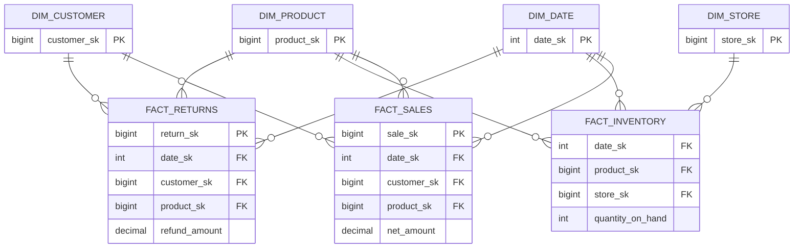

# Galaxy Schema (Fact Constellation) — Concept Overview & Deep Internals

> Multiple fact tables sharing conformed dimensions — the enterprise-scale analytical pattern.

---

## Why This Exists

A star schema has ONE fact table. A real enterprise has MANY business processes: sales, inventory, returns, marketing campaigns, customer service calls. A galaxy schema (also called fact constellation) is multiple star schemas sharing conformed dimensions (especially `dim_date`, `dim_product`, `dim_customer`).

## Architecture



## Drill-Across Query

```sql
-- GALAXY POWER: query across fact tables using shared dimensions
-- "Net revenue minus refunds by product category and month"
SELECT 
    d.month_name,
    p.category,
    COALESCE(s.total_sales, 0) - COALESCE(r.total_refunds, 0) AS net_revenue
FROM (
    SELECT date_sk, product_sk, SUM(net_amount) AS total_sales
    FROM fact_sales GROUP BY date_sk, product_sk
) s
FULL OUTER JOIN (
    SELECT date_sk, product_sk, SUM(refund_amount) AS total_refunds
    FROM fact_returns GROUP BY date_sk, product_sk
) r ON s.date_sk = r.date_sk AND s.product_sk = r.product_sk
JOIN dim_date d ON COALESCE(s.date_sk, r.date_sk) = d.date_sk
JOIN dim_product p ON COALESCE(s.product_sk, r.product_sk) = p.product_sk
ORDER BY d.month_name, p.category;
```

## War Story: Walmart — Enterprise Bus Architecture

Walmart's DW is the canonical galaxy schema: 20+ fact tables (POS sales, inventory, markdowns, labor scheduling, supply chain) all sharing conformed dimensions (`dim_date`, `dim_product`, `dim_store`, `dim_supplier`). The Kimball Bus Matrix maps which dimensions are used by which facts — enabling drill-across queries like "compare sales lift to markdown depth by store and week."

## Interview — Q: "How do you design a DW with multiple business processes?"

**Strong Answer**: "Galaxy schema with conformed dimensions. Each business process gets its own fact table (sales, inventory, returns). All share conformed dimensions — especially dim_date and dim_customer. I use Kimball's Bus Matrix to map which dimensions each fact uses. This enables drill-across queries: comparing metrics across business processes using shared dimension keys. The critical rule: conformed dimensions must have identical keys and attributes across all fact tables."

## References

| Resource | Link |
|---|---|
| *The Data Warehouse Toolkit* 3rd Ed. | Ch. 16: Enterprise Bus Architecture |
| Cross-ref: Conformed Dims | [../../02_Dimensional_Modeling_Advanced/04_Conformed_Dimensions](../../02_Dimensional_Modeling_Advanced/04_Conformed_Dimensions/) |
| Cross-ref: Star Schema | [../01_Star_Schema_Fundamentals](../01_Star_Schema_Fundamentals/) |
