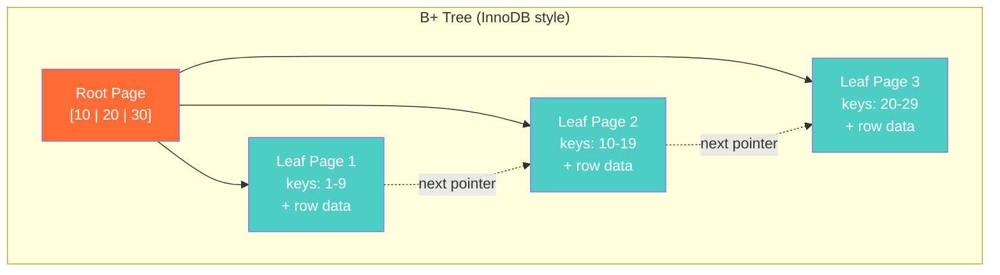
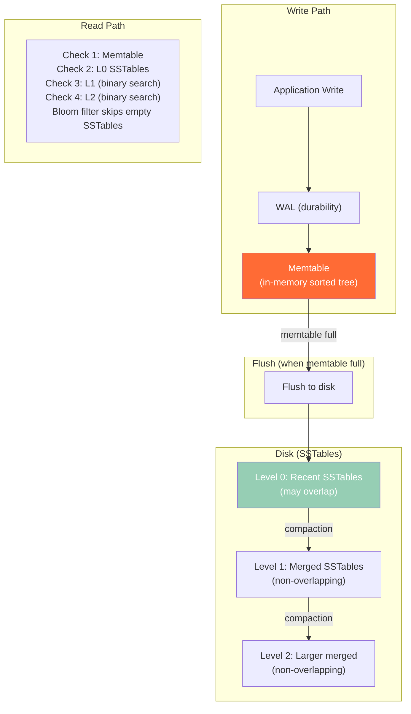

# B-Trees vs LSM-Trees — How It Works, Deep Internals, War Stories, Interview

---

## B-Tree Internals



**Read path**: Root → Internal → Leaf. O(log_B n) pages read, where B = branching factor (~500 for 8KB pages). For 1B rows: log_500(1,000,000,000) ≈ **3-4 page reads**.

**Write path**: Find the leaf page, update in-place. If the page is full, split it and update parent. Random I/O because the target page can be anywhere on disk.

## LSM-Tree Internals



**Write path**: Append to WAL (sequential) → insert into memtable (in-memory). O(1) amortized. Sequential I/O only.

**Read path**: Check memtable → check L0 SSTables → check L1 → check L2. Bloom filters on each SSTable skip unnecessary reads. Worst case: check every level.

## Performance Comparison

| Operation | B-Tree | LSM-Tree |
|---|---|---|
| **Point read** | ✅ O(log n), 3-4 disk reads | ⚠️ Check multiple levels |
| **Range scan** | ✅ Follow leaf pointers | ⚠️ Merge-sort across levels |
| **Insert** | ⚠️ Random I/O, page split risk | ✅ Sequential append, O(1) amortized |
| **Update** | ⚠️ Find page + in-place write | ✅ Append new version |
| **Delete** | ⚠️ Find page + mark deleted | ✅ Append tombstone |
| **Write amplification** | 1-2x (write page once) | 10-30x (compaction rewrites data) |
| **Read amplification** | 1x (read one page) | N (check N levels) |
| **Space amplification** | ~1x | 1.1-2x (dead versions until compacted) |

## Bloom Filter — Making LSM Reads Tolerable

```
Bloom Filter: "Is key K in this SSTable?"
┌────────────────────────────────────────────┐
│ Answer: "Definitely NOT here"  → skip      │
│ Answer: "Probably here"        → read it   │
│ False positive rate: ~1%                   │
│ False negatives: IMPOSSIBLE                │
└────────────────────────────────────────────┘

Without Bloom filter: read 5 SSTables to find key → 5 disk reads
With Bloom filter:    read 1 SSTable (skip 4)    → 1 disk read  
```

## War Story: Facebook — RocksDB at Scale

Facebook built RocksDB (LSM-based) because MySQL InnoDB (B-Tree) couldn't handle their write-heavy workload for the Messages database:

- 300TB of social messages
- Write-heavy: 500K writes/sec vs 100K reads/sec (5:1 ratio)
- B-Tree: random I/O on every write → SSD wear and latency spikes
- LSM-Tree: sequential writes → 10x better write throughput, 5x longer SSD lifespan
- Trade-off: point reads went from 1 disk read (B-Tree) to 2-3 (LSM), but Bloom filters kept 99% of reads to 1 disk read

## War Story: Percona — Write Amplification Disaster

A Percona customer ran Cassandra (LSM) for a time-series workload with 100GB of data but LSM compaction was writing 3TB/day to disk (30x write amplification). The SSD fleet was burning out in 6 months instead of the expected 5 years. The fix: switching from Size-Tiered Compaction to Leveled Compaction reduced write amplification from 30x to 10x.

## Pitfalls

| Pitfall | Fix |
|---|---|
| Using LSM-Tree for read-heavy OLTP (e.g., user profile lookups) | Use B-Tree (PostgreSQL, MySQL). LSM's read amplification hurts latency |
| Using B-Tree for write-heavy IoT ingestion | Use LSM (RocksDB, Cassandra). B-Tree's random I/O creates hotspots |
| Ignoring write amplification in SSD cost models | LSM writes 10-30x more to disk. Factor this into SSD lifespan and provisioning |
| Not tuning Bloom filter bits per key | Default may be too low. 10 bits/key → 1% FPR. 15 bits → 0.02% FPR |

## Interview

### Q: "When would you choose RocksDB over PostgreSQL?"

**Strong Answer**: "When the workload is 5:1 write-to-read ratio or higher. LSM-Trees turn random writes into sequential writes — critical for high-throughput ingestion (IoT, event logs, messaging). PostgreSQL's B-Tree shines when reads dominate: single-page lookup per query, no compaction overhead. The decision point: profile the write/read ratio. Below 2:1 → B-Tree. Above 5:1 → LSM. In between → benchmark both."

### Q: "Explain write amplification."

**Strong Answer**: "Write amplification is how many times the engine writes the same data to disk. In B-Tree: ~1-2x — write the page once (maybe twice during a split). In LSM: 10-30x — data is first written to memtable, then flushed to L0 SSTable, then compacted into L1, L2, L3... each level rewrite the data. At 100GB logical data with 30x write amplification, the engine writes 3TB/day to disk. This matters for SSD lifespan and I/O budgeting."

## References

| Resource | Link |
|---|---|
| *Designing Data-Intensive Applications* | Martin Kleppmann — Ch. 3 |
| [RocksDB Wiki](https://github.com/facebook/rocksdb/wiki) | Facebook's LSM implementation |
| [The Log-Structured Merge-Tree](https://www.cs.umb.edu/~poneil/lsmtree.pdf) | O'Neil et al. original paper |
| Cross-ref: Compaction | [../03_Compaction_Strategies](../03_Compaction_Strategies/) |
| Cross-ref: Page Architecture | [../02_Page_Architecture](../02_Page_Architecture/) |
