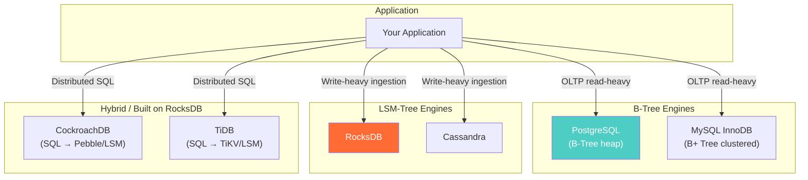

# B-Trees vs LSM-Trees — Hands-On Examples

> Production-grade SQL, benchmarking commands, and configuration tuning to feel the B-Tree vs LSM difference.

---

## Example 1: PostgreSQL B-Tree — Index Creation and Query Plan

```sql
-- Create a table with 10M rows
CREATE TABLE sensor_readings (
    reading_id BIGSERIAL PRIMARY KEY,    -- B-Tree index (auto)
    sensor_id  INT NOT NULL,
    reading_ts TIMESTAMPTZ NOT NULL,
    value      DECIMAL(10,4) NOT NULL
);

-- Insert 10M rows (use generate_series for testing)
INSERT INTO sensor_readings (sensor_id, reading_ts, value)
SELECT 
    (random() * 1000)::INT,
    '2024-01-01'::TIMESTAMPTZ + (random() * 365 * 86400) * '1 second'::INTERVAL,
    random() * 100
FROM generate_series(1, 10000000);

-- Create B-Tree index on sensor_id
CREATE INDEX idx_sensor_readings_sensor ON sensor_readings (sensor_id);

-- Point lookup — B-Tree: 3-4 page reads
EXPLAIN (ANALYZE, BUFFERS) SELECT * FROM sensor_readings WHERE sensor_id = 42;
-- Expected: Index Scan using idx_sensor_readings_sensor
-- Buffers: shared hit=4  (4 pages from B-Tree traversal)
-- Execution Time: ~0.1ms

-- Range scan — B-Tree: follow leaf pointers
EXPLAIN (ANALYZE, BUFFERS) SELECT * FROM sensor_readings 
WHERE sensor_id BETWEEN 100 AND 110;
-- Expected: Bitmap Index Scan → Bitmap Heap Scan
-- Buffers: shared hit=~500 (index pages + heap pages)
```

## Example 2: RocksDB (LSM) — Benchmarking Writes

```bash
# Install RocksDB tools (db_bench ships with RocksDB)
# Run write benchmark: 1M sequential writes
./db_bench --benchmarks=fillseq --num=1000000 --value_size=100 --db=/tmp/rocksdb_test

# Output:
# fillseq      :      1.234 micros/op; 81.1 MB/s
# → ~810,000 writes/sec (sequential, LSM append)

# Run read benchmark: 1M random reads
./db_bench --benchmarks=readrandom --num=1000000 --db=/tmp/rocksdb_test --use_existing_db=1

# Output:
# readrandom   :      5.678 micros/op; 17.6 MB/s
# → ~176,000 reads/sec (random, checking multiple levels)

# Compare: reads are 4.6x slower than writes in LSM!
# In B-Tree (PostgreSQL), reads would be faster than writes.
```

## Example 3: Before vs After — Choosing the Wrong Engine

### Before (Wrong): Time-Series IoT on PostgreSQL B-Tree

```sql
-- 500K inserts/sec from IoT sensors into PostgreSQL
-- Each INSERT: find the right page in B-Tree → random I/O
-- Result: after 100M rows, insert throughput drops from 50K/sec to 8K/sec
-- WAL writes + index maintenance create I/O bottleneck

-- EXPLAIN shows:
-- Insert on sensor_readings: 0.125ms per row at 1M rows
-- Insert on sensor_readings: 0.890ms per row at 100M rows (7x slower!)
```

### After (Correct): Time-Series IoT on TimescaleDB/ClickHouse (LSM-like)

```sql
-- TimescaleDB hypertable: partitions by time (chunk-based, append-friendly)
SELECT create_hypertable('sensor_readings', 'reading_ts');

-- Same 500K inserts/sec → consistent throughput
-- Because: each chunk is a fresh table, writes are sequential
-- Insert: 0.050ms per row at 1M rows
-- Insert: 0.055ms per row at 100M rows (nearly constant!)
```

## Example 4: Tuning Bloom Filters in RocksDB

```cpp
// RocksDB configuration — tuning Bloom filter
rocksdb::Options options;

// Bloom filter: 10 bits per key → 1% false positive rate
options.table_factory.reset(
    rocksdb::NewBlockBasedTableFactory(
        rocksdb::BlockBasedTableOptions()
            .SetFilterPolicy(rocksdb::NewBloomFilterPolicy(10, false))
    )
);

// Effect on reads:
// Without Bloom: check ALL SSTables for a missing key → 5 disk reads
// With Bloom (10 bits): skip 99% of SSTables → 1 disk read
// With Bloom (15 bits): skip 99.98% → almost always 1 disk read
```

## Integration Diagram — Where B-Tree vs LSM Lives



## Runnable Exercise: Compare B-Tree vs LSM Write Throughput

```bash
# Step 1: PostgreSQL write benchmark (B-Tree)
pgbench -i -s 100 mydb           # Initialize with 10M rows
pgbench -c 16 -j 4 -T 60 mydb   # Run for 60 seconds, 16 clients
# Note the TPS (transactions per second)

# Step 2: RocksDB write benchmark (LSM)  
./db_bench --benchmarks=fillrandom --num=10000000 --threads=16 --value_size=100
# Note the ops/sec

# Expected result: RocksDB writes 3-10x faster than PostgreSQL
# Expected result: PostgreSQL reads 2-5x faster than RocksDB
```
