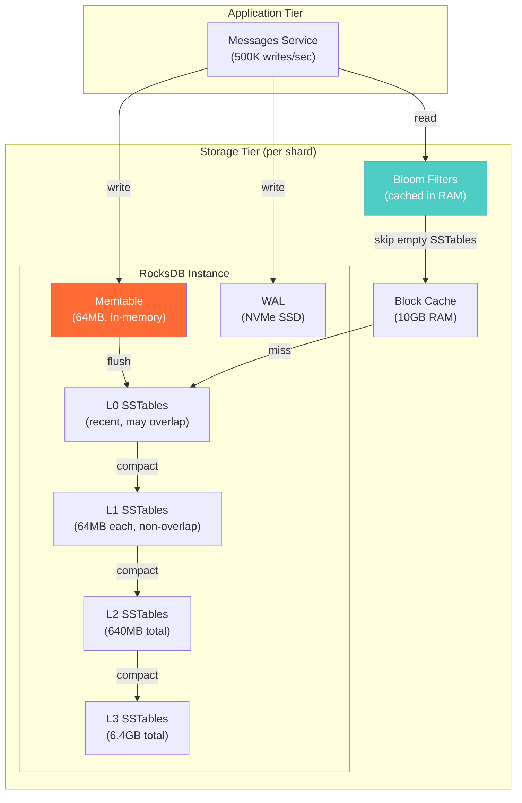

# B-Trees vs LSM-Trees — Real-World Scenarios

> FAANG-scale case studies, production numbers, and post-mortems.

---

## Case Study 1: Facebook — Building RocksDB to Replace InnoDB

**Context**: Facebook's Messages database stored 300TB of social messages on MySQL/InnoDB (B-Tree).

**The Problem**:

- Write-heavy workload: 500K writes/sec vs 100K reads/sec (5:1 ratio)
- B-Tree in-place updates → random I/O on every write
- SSD endurance: random writes degrade SSD lifespan 5-10x vs sequential writes
- InnoDB's B-Tree was spending 60% of I/O on index maintenance for updates

**The Fix**: Built RocksDB (LSM-Tree) as a drop-in storage engine.

**Production Numbers**:

- Write throughput: 10x improvement (500K → 5M writes/sec with same hardware)
- SSD lifespan: 5x longer (sequential writes instead of random)
- Read latency: 2-3 disk reads per point query (vs 1 for B-Tree) — acceptable because Bloom filters keep 99% at 1 read
- Storage footprint: 30% smaller due to compression (LSM compresses better than B-Tree pages)

**Key Lesson**: If your write-to-read ratio exceeds 3:1, LSM wins. Below that, measure first.

---

## Case Study 2: Percona — SSD Burnout from Write Amplification

**Context**: A Percona consulting customer ran Cassandra (LSM) for a 100GB time-series workload.

**The Problem**:

- LSM compaction was writing 3TB/day to disk (30x write amplification)
- SSD fleet (Samsung 850 Pro) rated for 300TB total writes over 5 years
- At 3TB/day: 300TB / 3TB = 100 days → SSDs dying in 3.3 months
- Hardware budget overrun: replacing SSDs every quarter

**Root Cause**: Size-Tiered Compaction Strategy (STCS) on a workload with frequent overwrites.

**The Fix**:

- Switched from STCS to Leveled Compaction Strategy (LCS)
- Write amplification dropped from 30x to 10x (1TB/day)
- SSD lifespan extended from 3.3 months to 10 months
- Additionally: switched to enterprise SSDs with higher endurance rating (3 DWPD vs 0.3 DWPD)

**Key Lesson**: Always factor write amplification into SSD cost models. A "100GB database" on LSM can write 1-3TB/day to disk.

---

## Case Study 3: WiredTiger (MongoDB) — Bridging Both Worlds

**Context**: MongoDB 3.2+ switched from MMAP (no real structure) to WiredTiger engine.

**The Problem**: MongoDB needed both good write throughput (document inserts) AND good read performance (document lookups by _id).

**The Solution**: WiredTiger uses a B-Tree variant with LSM-like features:

- B-Tree on disk for read performance
- In-memory buffer (journal) for write batching
- Compression at the page level (like LSM's block compression)
- Skip list in memory for writes → periodic reconciliation to B-Tree on disk

**Production Numbers** (MongoDB Atlas):

- Write throughput: 2-3x better than MMAP engine
- Read latency: same as pure B-Tree (single page lookup)
- Compression: 50-80% storage savings with Snappy/Zstd

---

## Deployment Diagram — LSM at Scale (Facebook RocksDB)

---

## What Went Wrong: LinkedIn — B-Tree Index Bloat

**Incident**: LinkedIn's PostgreSQL cluster experienced a 5x latency spike during peak hours.

**Root Cause**: A table with 500M rows had a B-Tree index that was 60% dead tuples (MVCC versions). VACUUM hadn't kept up because the table had long-running analytical queries holding snapshots.

**Timeline**:

- T+0: Latency spike from 5ms to 25ms for profile lookups
- T+2min: Engineers identify dead tuple ratio at 60% on primary index
- T+10min: Manual VACUUM FULL (locks table for 45 minutes)
- T+55min: Latency returns to normal

**Fix**:

- Tuned `autovacuum_vacuum_scale_factor` from 0.2 to 0.01 (vacuum at 1% dead tuples instead of 20%)
- Added monitoring alert for `n_dead_tup / n_live_tup > 0.1`
- Moved analytical queries to a read replica to prevent snapshot holding

**Prevention**: Monitor `pg_stat_user_tables.n_dead_tup` and set aggressive autovacuum thresholds for write-heavy tables.
